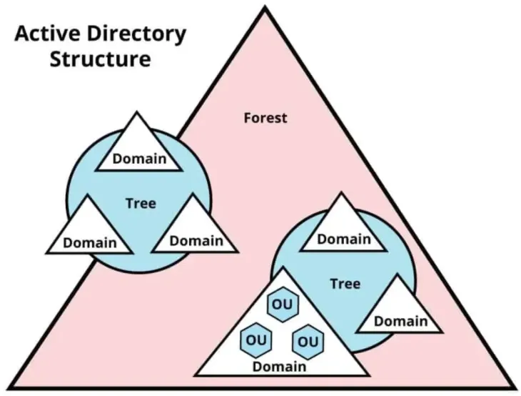
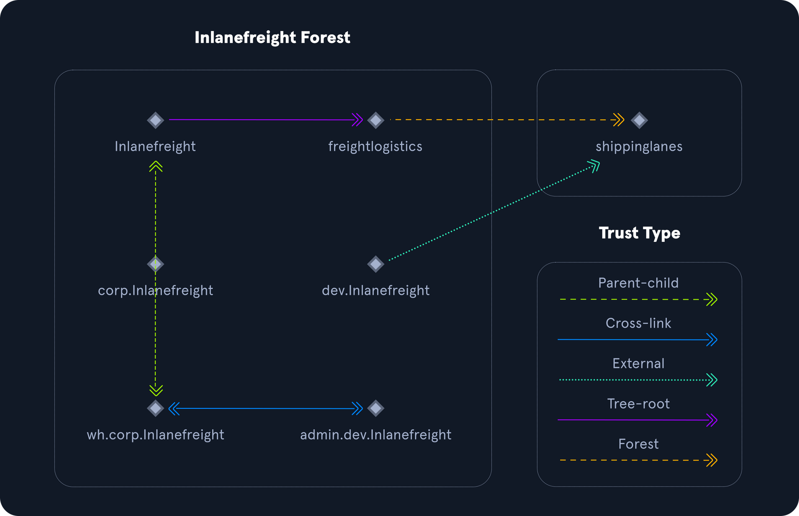
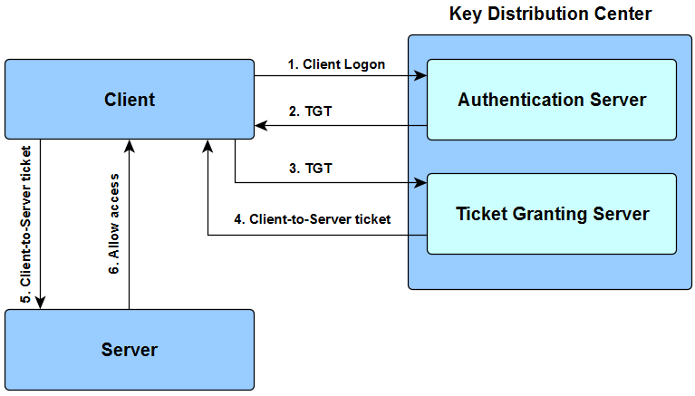
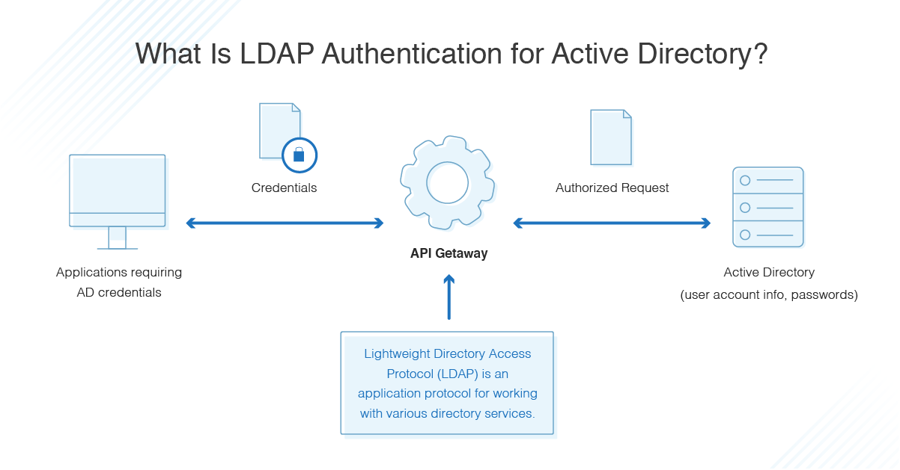
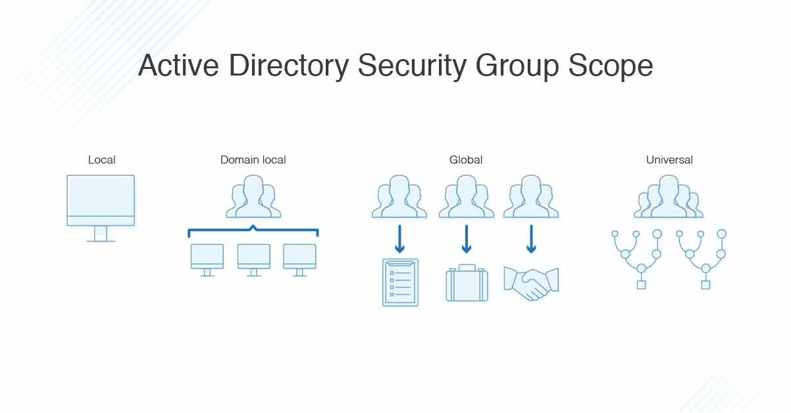
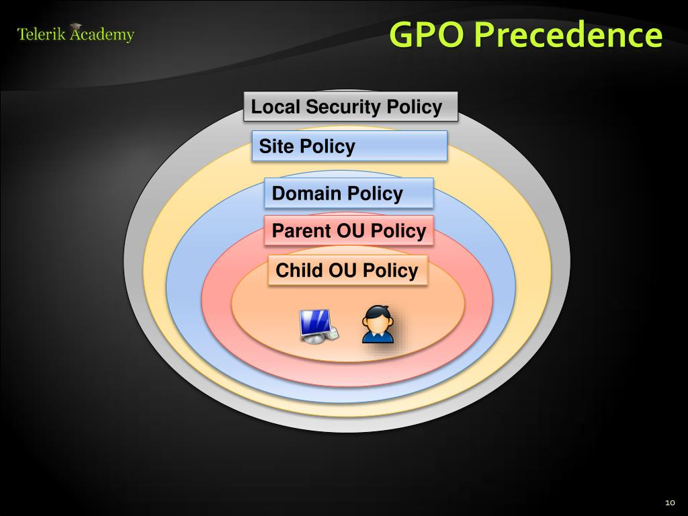

ACTIVE DIRECTORY

# DEFINITION & OVERVIEW
Active Directory is a Microsoft <u>**directory service**</u> intended for Windows Domain enviroments, giving a <u>centralized and structured service</u> for the management of resources like users, resources, groups and permissions. 
Some advantages of AD are **Access Policy**, **Scalability** and **Delegation of Authorizations**.
   

	<strong><u>HIERARCHY</u></strong>

* **<u>DOMAIN</u>** = basic logical unit of AD, contains its own policies and groups and have DNS to identify itself. Can have multiple sub-domains (child) and include **schema of objects (and attribute)**, **global catalog of all objects inside the directory** and **replication service to deliver the catalog to other domain controllers**
* **<u>TREE</u>** = <u>Structured connection</u> of a series of domains using same DNS space (ex:/ akatsuki.net &#8594; pain.akatsuki.net). Trust is created from parent to childrens but NOT viceversa
* **<u>FOREST</u>** = <u>Collection of multiple trees</u> where the latters should share same schema

   

	<strong><u>COMPONENTS</u></strong>

* <u>**Domain Controller** (DC)</u> = Server machine running AD-DS which authenticate, authorize and management of users and resources. Is the "root" of every domain
* <u>**Global Catalog** (GC)</u> = Data storage service for the Domain Controller
* <u>**Users**</u>
* <u>**Groups**</u>
* <u>**Computers**</u>
* <u>**Other Resources**</u> (ex:/ printers, contacts, shared folders)
* <u>**Organizational Units** (OU)</u> = collections of similar objects. Can be nested
* <u>**SYSVOL**</u> = Shared folder on each DC. It store information about AD and allows replication on other domains
* <u>**Group Policy Object** (GPO)</u> = Collection of policy settings to both user and computers with different level of granularity. GPO is shared via network through **SYSVOL**
* <u>**Read Only Domain Controller** (RODC)</u> = DC with just read permission for traffic replication reduction, prevent modification of SYSVOL and role separations
* <u>**Distinguished Name** (DN)</u> = full path of a object inside AD (unique in the directory)
* <u>**Relative Distinguished Name** (RDN)</u> = Component of DN that refer to an object from other objects on the same level (unique in the OU)
* <u>**NTDS.DIT**</u> = Databse inside DC which store info about groups and users. Most important is <u>where hashes are saved</u> (`C:\Windows\NTDS\`) 
* <u>**New Technology File System** (NFTS)</u> = standard library inside Windows which permite to administrator to apply permission and security measure on file and directories
* <u>**Remote Server Administration Tools** (RSAT)</u> = Collection of tools used by IT administrator to manage remotely DC (roles change,permission and other features)
 

   

	<strong><u>SERVICES</u></strong>

* <u>**Active Directory Domain Services** (AD-DS)</u> = The container that provide the hierical structure and allows objects to be stored. Every Domain Controller should have installed AD-DS
* <u>**Active Directory Certificate Services** (AD-CS)</u> = allows to create and manage **PKI** (public key infrastructure), roles and policies of <u>certificate and public keys</u>
* <u>**Active Directory Federation Services** (AD-FS)</u> = Identity management solution for accessing different platform or services with a single set of credentials (**S**ingle-**S**ign-**O**n**) like Office365
* <u>**Active Directory Rights Management Services** (AD-RMS)</u> = Data access control defining who can do what on which resources
    

	<strong><u>PROTOCOLS</u></strong>

## <u>KERBEROS</u> (PORT 88)
Kerberos is an <u>stateless authentication protocol using cryptography</u> providing authentication mechanism based on **tickets** (since Windows 2000 is default).
 

**MAIN COMPONENTS**
* <u>**Key Distribution Center**</u> (KDC) = Service, running on every DC, that issues all tickets using the <u>Authentication Service</u> (AS)
* <u>**Ticket Granting Ticket**</u> (TGT) = File used for authentication containing IP, Session Key and validity period. Is encrypted during authentication procedure adn grant ticket for other resources at autenthicated users
* <u>**Ticket Granting Service**</u> (TGS) = Service that provide TGT

1) **KRB_AS_REQ** (client logon) = Using the NTLM of the password encrypt the TGT
2) **KRB_AS_REP** (TGT) = Check auth and create the TGT
3) **KRB_TGS_REQ** (TGT) = Present the TGT and request ticket for a specific instance 
4) **KRB_TGS_REP** (Client-To-Server ticket) =TGS encrypted with NTLM of the service and deliver to the user
5) **KRB_AP_REP** (Client-To-Server ticket) = User present the TGS and is checked 
6) **KRB_AP_REP** = If TGS valid the user can access the service
 

## <u>DNS</u> (PORT 53)
DNS is widely used even outside of AD so I will not explain back the foundamental.
In AD a client should locate Domain Controller and other services in order to communicate, inside the private network they use **Active Directory DNS namespaces** for a faster retriaval. AD store all service running in form of <u>**SRV records**</u>  (nslookup is your best friend to query DNS server)
 

## <u>LDAP - Lightweight Directory Access Protocol</u> (PORT 389)
LDAP is a protocol that permits to <u>access and perform query at various directory services</u> through client-server communications and is usually combined with Kerberos. For a better understanding AD is the database and LDAP is a protocol to interract with in other words is the "language" in order to speak with AD (analogy of Apache and HTPP).
Works using special **queries** involving :
1) **Session Connection** = user connects to the server
2) **Request** = user request (usually for lookup) to the server
3) **Response** = LDAP queries the directory, find the info requested and send it back
4) **Completition** = User disconnect from the server

Also the operations allowed on the entries are **Add, Delete, Search, Compare and Modify** 

The authentication on LDAP use **BIND** operations and exist 2 different types :
* <u>**Simple Auth**</u> = Just username/password are used to create the BIND request also <u>anonymous auth is available</u>
* <u>**Simple Authentication Security Layer** (SASL)</u> =Use different auth methods (like Kerberos!) to bind with the LDAP with a series of challenge-response messages

Important to remind that LDAP auth messages are sent in **cleartext** and usually TLS encryption is used to protect from sniffing
 

## <u>**MicroSoft Remote Procedure Call** (MSRPC)</u>
The Microsoft implementation of RPC is a interprocess communication technique based on client-server architecture to request a service from a program on another machine.
This implementation simplifies the action inside the AD where a client can call the server on one of the standard interfaces, which the 4 key are :
* **LSARPC** = Local Security Authority, manages the local policy on the computer, used to perform management on domain security policies
* **NETLOGON** = Authenticate user/service in the enviroment
* **SAMR** = Remote SAM is a functionality to store info about user and group (like SAM on windows machine) and is used by admins to create, manage, read, update and delete info. Tools that interract with this protcol are **PsExec** and **Bloodhund**
* **DRSUAPI** = Microsoft API for Directory Replication Service (DRS) on different DC
 

## <u>**NTLM**</u>
NT Lan Manager is an auth mechanism using challenge/response architecture and is used in legacy enviroments where other authentication system (like Kerberos are not available). The mechanism works as it follows : 
1) client send **NEGOTIATE_MESSAGE** to the server
2) server respond with **CHALLENGE_MESSAGE** to verify the requester identity
3) The client send **AUTENTICATE_MESSAGE** which include the hash of the password and will be stored on SAM or NTDS.DIT

The protocol have 2 password to choose **LM** (Lan Manager) and **NT** which is the MD4 of the little-endian UTF-16 of the password
 

The **LM** protocol is not really safe but is still used even in AD enviroments :
1) Convert the password character in UPPERCASE
2) Pad with NULL until length of 14 is obtained
3) Split in 2 chunk of 7 characters
4) Encrypt with DES the string "KGS!@#$%" and concatenate the 2 chunks

Will not go in depth but as you can comare with other method is really not that strong, for example if the password is <=7 characters the second part of the hash will be the same for every password. LM can be disable using GPO

Retuning back to NTLM the hash will have this syntax
`[USERNAME]:[RID]:[LM_HASH]:[NT HASH]`

Attacker use this hash (especially the NT) for **pass-the-hash attack** and for what concern the challenge/response tool like **Responder** can capture the hash during the auth process, NTLM have 2 version NTLMv1 and NTLMv2 without go into details the second one is harder to crack thanks to multiple stages making it more robust.

Last thing about authentication is **Domain Cached Credentials** (also known as <u>MS cache v1/v2</u>) where hosts save the last 10 hashes for any domain that have logged in the machine succesfully. This is made for technical issues or network fault and are saved in `HKEY_LOCAL_MACHINE\SECURITY\Cache` registry. They are difficult to obtained and really hard to crack even offline.Kerberos
   

	<strong><u>AD USERS AND COMPUTERS (ADUC)</u></strong>

Users are created both locally and AD enviroments and they are <u>not joined</u>, when a user authenticate will shows his password and when checked the systems create and assign an **access token** which describe the permission to resources, access on other computers and run program on machines with defined boundaries.

For simpify the work of admin, instead of assign at each user the permissions, the **groups** feature can collect similar user with same permission. Is also usefull for remotion of user (like temporary employee) or modification.
 

## USERS
The users  should be defined carefully and with a **in-depth** security mindset, even a low-privilege user can give A LOT of information about the enviroments if over-permission are setted. This gives to the attacker a **<u>really wide attack surface</u>** (the tool Bloodhund is the right example even with a low-priv user can extract focal points of the AD)
 

### <u>Default Local Accounts</u>
* **ADMINISTRATOR** = Full controll of the system, created by default and can't be removed. (but can be disabled or renamed). The SID is **500**.
* **GUEST** = Host user with limited access right. Disabled by defaut and default password is BLANK (sort of anonymous login)
* **SYSTEM** = Account used by the OS with almost full permission, it doesn't have a profile (it doesn't appear in User Management)
* **NETWORK SERVICE** = predefined used for tunning Windows Service (by the Service Control Manager). Present the computer's credential to remote servers
* **LOCAL SERVICE** = Like network service with minimum privilege and anonymous credentials over the network
  

Unlike local accounts, **DOMAIN USERS** can access to other machine within the networks (based on the permission of the group is part of). One of the most important is **<u>KRBTGT</u>**, which act as the <u>KDC</u> service and **hold the TGT password used for the encryption of TGS** so a strong password should be provided otherwise all the process of the KDC will be broken.

The AD accounts should have a series of attributes, the most important are :
* **UserPrincipalName** = Primary logon name (the convention is to use the email)
* **ObjectGUID** = Global Unique Identifier of the users (remain unique even if removed)
* **SAMAccountName** = Logon name for previous version of Windows 
* **objectSID** = Security Identifier (user + group membership)
 

## GROUPS
Groups are like users they should be managed with precision in order to avoid to abuse overextended or wrong permissions, in addition AD came with both predefined and costum groups for the necessity of the network .

The 2 main characteristic are the **GROUP SCOPE** ("how" the group can be used in the forest) and **GROUP TYPE** (purpose)

### <u>Group Types</u>
1) **Security** = Every member will inherit any permissions assigned (or not) at the group
2) **Distribution** = Used by application to distribute messages/files through all group members (like a mailing list)
 

### <u>Group Scopes</u>
1) **Domain Local Group** = Only used to manage permission to domain resource (can contains user off-domain)
2) **Global Group** = Used to grant access to resources in another domain (only user of the domain can be added)
3) **Universal Group** = Grant the permission to any object in the forest (contain user of every domain). This is hthe only type of group which is <u>stored on the GC</u> in order to enable replication when adding/removing users

Both admin and hackers should be aware of <u>Nesting Groups</u> without enough attention a user can inherit permission even if they are not directly added to it (Bloodhund can help to visualize this).

The most important <u>attributes</u> are :
* **CN** = Common Name of the groups
* **MEMBER** = User, group or contact being part of the group
* **GROUPTYPE** = Integer that specified type and scope
* **MEMBEROF** = any groups which the subject group is a member
* **OBJECTSID** = SID of the group

We need to define what "permission" are, they are divide in 2 main categories :
1) **Rights** = permission to <u>access</u> objects
2) **Privileges** = permission to <u>perform an action</u> such executing programs. Can be assigned through the GPO (SharpGPOAbuse tool)

This 2 concepts are the basics for <u>privilege escalation</u> and gain full access of the domain.
To list the privilege we can use `whoami /priv` but the **list of privileges will change if run by a non-elevated or elevated rights** 
   

	<strong><u>MAIN SECURITY MEASURES</u></strong>

* **<u>Local Administrator Password Solution (LAPS)</u>** = Randomization and rotation of the passwords of local admin on a fixed interval. Is used to <u>prevent lateral movement</u>
* **<u>Logging and Monitoring</u>** = A effective logging logging and monitoring can prevent and react to unexpected behaviour. Attacks like password-spraying or Kerberos attack can be uneffective and uncover the attacker
* **<u>Group Policy Security Settings</u>** = GPO can be also used for security policies 
 
|&#8594; <u>Account Policies</u> = How user interact within the forest (also kerberos related)  
|&#8594; <u>Local Policies</u> = Event policies, user rights and privileges (like driver, printer or removable media install)  
|&#8594; <u>Software Restriction Policy</u> = What can be run on the computer  
|&#8594; <u>Application Control Policies</u> = Control what applications can be run by which   users. AppLocker is widely used fot this purpose  
|&#8594; <u>Update Management</u> = Windows Server Update Service (WSUS) is used to automate patching on the systems. System Center Configuration Manager is the pais solution with more features avoiding some clients miss security patches  
|&#8594; <u>Group Managed Service Accounts (gMSA)</u> = Account with 120 character password for non-interractive process  
|&#8594; <u>Security Groups</u> = Implementation of different groups for granular permission and use of resources at single users
 

## COMMON MISTAKE
1) <u>Domain Users into Local Administrator group</u> can be used by a low-priv attacker acces to gain admin access moving laterally
2) <u>Weak and reused passwords</u> nothing to explain here many organizzations use only the passwords as security solution so is a good housekeeping to add complexity at them
3) <u>Use Domain Admin for everything</u> is never a good idea, when gaining acces to one of the domain admin the attacker can do whatever he likes. Remember **granularity is key** and the principle of the least privilege is the bestfriend for sysadmin
  

## GROUP POLICIES
Group policies are a good vector attack for lateral movement, gaining privilege and persistence. If an attacker have access to write and read GP through misconfiguration or other attack can help to enumarate or target evaluation (ex:/ knowing the password policy can help hacker to introduce rules during password cracking process).

Windows perform periodic <u>GP updates every 90 minutes with randomize +/- 30 minutes</u> offsets (so changes are not applied directly) and 5 minutes for the DCs.
With the command **gpupdate / force** we can make update be refreseh directly

**GPO** follow this rule of precedence (hierarchical structure) :

1) <u>Local Group Policy</u>
2) <u>Site Policy</u> = Policies specific to the specific Enterprise Site (physical or logical)
3) <u>Domain-Wide Policy</u> = Settings applied at the whle domain (like password policy)
4) <u>Organization Unit Policiy</u> = Policy affecting specific resources which belong at specific OU (ex:/ printer, share drive or Powershell)
5) <u>OU Nested Policy</u> = Permission on sub-OU
  

<u>**Special options**</u> can be setted at GPO :
* **Link Order Number** = when more GPOs are linked togheter at the same OU they are processed in order based on their number
* **Enforced / No Override** = When setted, lower OU with other GPO cannot override the settings
* **Block Inheritance** = Higher policies will not be applied at the OU (if setted with ENFORCED, the latter have precedence)

