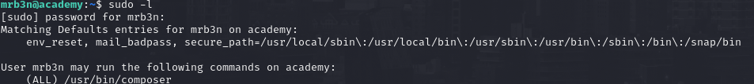

# PORT SCAN
* **22** &#8594; SSH
* **80** &#8594; HTTP (APACHE 2.4.41)
* **33060** &#8594; MYSQL(x)

   

# ENUMERATION & USER FLAG
The website is a clone of the HTB academy and there is not much we can do if not create a new accounts

After the login there is not much we can interact with, pretty bad so I decided to make some dirbusting/vhost/subdomain enumeration nd while all of this is running try to see what happen behind the curtains when we register/login since are the only thing we can interract with. Interesting the fact that there is an "hidden" field in the POST request named `roleid`

By default is setted to 0 so I create a new user but with role ID equals to 1, nothing changed when we access the academy dashboard but `dirb` found the `/admin.php` page. Wtih my default user I can't access it but with the user with role ID equals to 1 we can log successfully. This is what I have found

This subdomain looks pretty caothic lol

We have something interesting here 

I tried the credentialsboth with mysqlx and ssh but no low hanging fruit here but we know that is running Laravel just analyzing the errors we have here (debug mode) what's interesting is that we have the `APP_KEY` and usually is used to decrypt cookies but we don't have any of that. I can't find the version of laravel but I know the machine has been created in 2020 so I will keep in scope all vulnerability lower than this date.

Metasploit have 2 exploit and 1 of them is in scope called `laravel_token_unserialize_exec`

We just have to set the usual options and the APP_KEY to get RCE

We need to get access with a valid user to grab the flag but this machine have multiple user so we need to understand which is valid and which not.
Inside `/var/www/html/academy` I found the `.env` file where I found a password

I collected all the username in a file and use hydra to check if there is a user with this password

Now we can login and grab the user flag!

   

# PRIVILEGE ESCALATION

Nothing that we can do with this user but we are inside `adm` group, pretty good that I never worked with ths group before bcause I learned something new. As part of this group we can perform some log auditing and the fastet way is to use `aureport --tty` which can lead to some credentias exfiltration

Here we can see all the inputs of a TTy sessions owned by **<u>mrb3n</u>** user and we exfiltrate the password, I used on SSH and see if there is something more we can do to gain root permissions.
We are in the right way here because we can run composer as `root`

Using GTFO bins I found the way to exploit this permissions and gain access as root!

