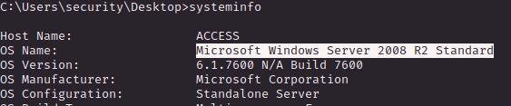

# PORT SCAN
* **21** &#8594; FTP
* **23** &#8594; TELNET
* **80** &#8594; HTTP

   

# ENUMERATION & USER FLAG
The port 80 is prettty naked we just have an image with **<u>LON-MC6</u>** as title

I searched the image with google but nothing related just somne wirteup ofthis machine. I run another instance of nmap but trying to enumerate telnet and apparently we are dealing with a windows XP OS

Telnet require <u>username</u> and <u>password</u> so I can't go further is a good idea to make a try on FTP that accept anonymous login.

We have downloaded 2 directories `Engineer` and `Backup`. The first one contain a zip file which need to be decrypted with a password 

In the latter we have a `ackup.dbm` file, I run strings and I have found something that look like a password

Cool, I used on the zipped file and it worked!
Inside the archive there was the `Access Control.pst`, the `pst` stand for **<u>Personal Storage Table</u>** and is Microsoft proprietary format which is used for Calendars, Messages and other stuff used by the Microsoft Suite

`lspst` is used to list the data inside this file format

That's cool! now we can use `readpst` to translate the pst in `mbox` file format which is human-readable

We have credentials now and the flag is ready for us

   

# PRIVILEGE ESCALATION
Inside the security user folder we hae an "hidden" directory called `.yawcam` which is a software called **<u>Yet Another Webcam Software</u>**

I enumerate as much as I can but actually nothing usefull but fortunately we have apretty outdate Microsoft Server machine 

WIth some simple CMD command I am able to discover that Admnistrator have an active sessions and his credentials are stored inside the box

We can do different things like using mimikatz to retriev the credentials or just us `runas` to retrieve the root flag. I havejust created a powershell reverse shell saved locally, run a python http server and use the following line to retrieve and execute it

Than just wait a few seconds (telnet is really not performant as ssh) and the Administrator shell will pop up!

> The image on the HTTP server was bugging me what was the point of that? Checking the machine information and other writeup I quote "[...]highlights how machines associated with the physical security of an environment may not themselves be secure[...]"
