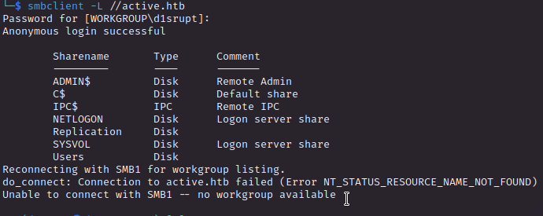
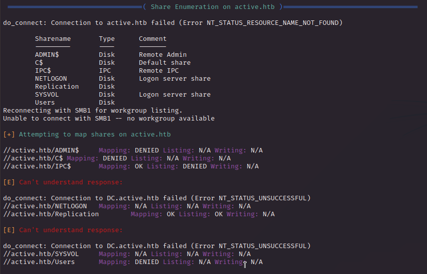
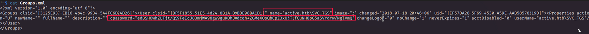
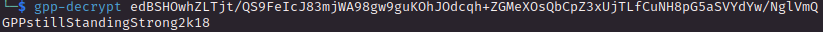
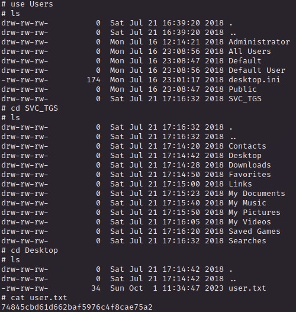
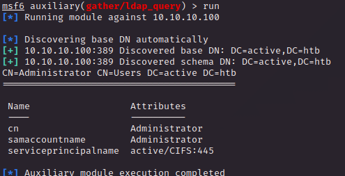
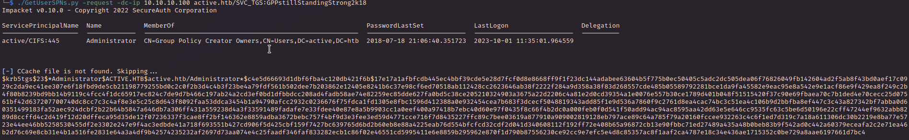
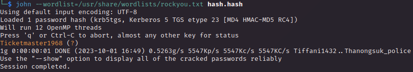
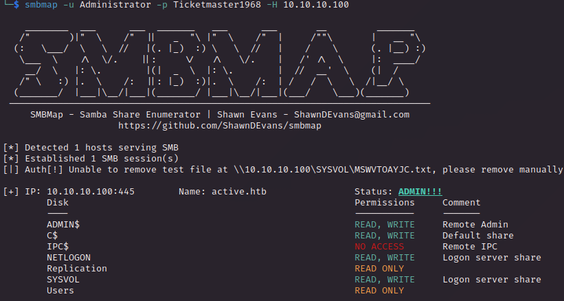
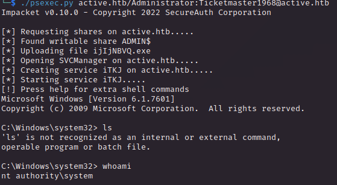

# PORT SCAN
* **53** &#8594; Microsoft DNS
* **135** &#8594; Windows RPC
* **139** &#8594; NetBios
* **389** &#8594; LDAP
* **445** &#8594; SMB
* **464** &#8594; Kerberos (Set/Chang Password)
* **593** &#8594; RPC over HTTP
* **636** &#8594; LDAP over TLS/SSL
* **3268** &#8594; LDAP (Active Directory Catalog)

   

# ENUMERATION & USER FLAG
This apper to be a Domain Controller (Windows Server 2008 from the nmap scan), as expected given the machine name

As always, let's start with **<u>SMB</u>** and try with anonymous login

Cool let's check which directories can be accessed with `enum4linux`

Cool let's check `/Replication`. A good finding here, the `Groups.xml` file contains interesting stuff

We have credentials for the `SVC_TGS` user, TGS in Active Directory enviroment is the **<u>Ticket Granting Service</u>** so would be cool to get foothold as him

The password is not in plain-text with some research we can easily decrypt with the <u>ruby script `gpp decrypt`</u>. Let's stop a second to understand why is so easy to decrypt this type of passwords

  

***
**<u>Group Policy Preferences</u>** (GPP) is an Active Directory feature that to manage and configure different settings inside the domain, usually used for automating tasks and can contain <u>sensitive informations</u> like set local user/group (and this is our case!)

Th encryption used is **AES-256** but [Microsoft published the 32-bit encryption key](https://learn.microsoft.com/en-us/openspecs/windows_protocols/ms-gppref/2c15cbf0-f086-4c74-8b70-1f2fa45dd4be?redirectedfrom=MSDN) so this is why we can "crack" it very fast
***

  

Here's the plaintext password

Now I tried to get some shell connection but no way to spawn it, so I return back to the SMB shares (using `smbclient.py`) and I can acces Users folder, go in the SVC_TGS directory, find and retrieve the user flag

   

# PRIVILEGE ESCALATION

We are back to some more enumeration with user privilege, let's try to find a way. Using the `auxiliary/gather/ldap_query` we can enumerate through LDAP, cool stuff!

I've started with a simple user enumeration and doesn't seems we need to make some lateral movement so I can diectly aim to the Administrator account

Changing the action with the `ENUM_USER_SPNS_KERBEROAST` we can retrive SPN wich are vulnerable to **<u>Kerberoasting</u>**

Cool, we have a SPN with Administrator priviliges so if our attack will have a successfull outcome we will root the box

  

We need to request our ticket in order to get the NTLM hash of Administrator vut we have no shell, we have to do it remotely. `GetUsersSPNs.py` with the `-request` flag can assist us

Now I saved the hash in a new file and use john the ripper to get what we need

COOL STUFF! We have done kerboroasting really smooth and clean now we have the plaintext credentials of Administrator

We can get a shell with `psexec.py` where we can grab the root flag

