# PORT SCAN
* **443** &#8594; HTTPS 


<br><br><br>

# ENUMERATION & USER FLAG
From the NMAP scan we know that the CommonName of the certificate is `atsserver.acute.local`

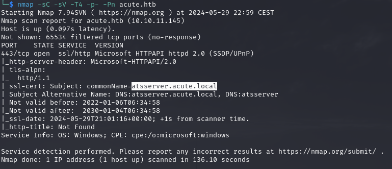

Looking further the certificate we have the domain FQDN which is **<u>acute.local</u>** (well pretty obvious loool)

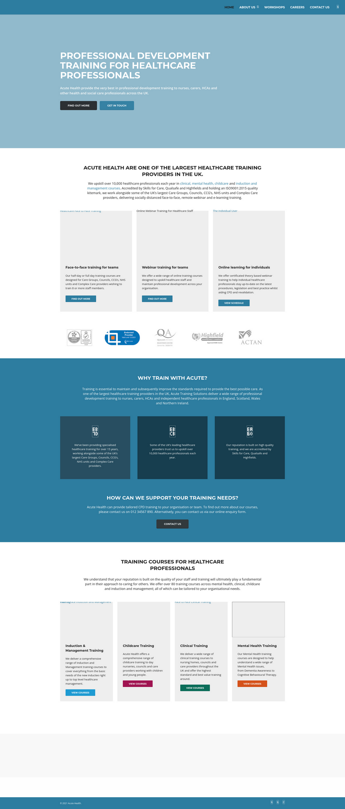

Allright, first of all the website sucks and is glitchy as fuck omg. Regardless this no interesting information can be found with a general overview but things changed when I pressed `New Starter Forms` into the **<u>/about.html</u>** page.


Here we have something interesting first of all a default passwords that needs to changed manually so maybe we can still use it on some accounts

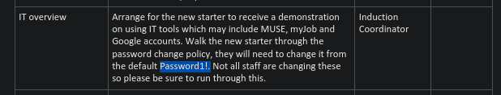

Moreover we have an interesting link that point to `https://atsserver.acute.local/Acute_Staff_Access` where PowerShell Web Access service rely, cool!

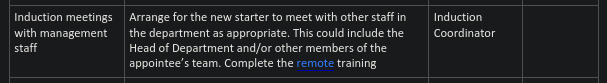

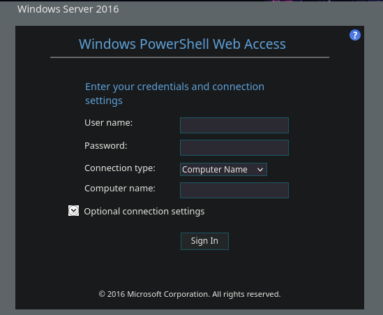

Cool we alsoknow the machine OS is **<u>Windows Server 2016</u>**. before moving on we can see the really last line on the docx file which highlights someting interesting

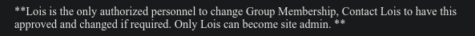

This username is not enough and I want to create a list with [usernamer](https://github.com/jseidl/usernamer) (I love this tool but probably is worth using only on CTF lol), well we have some names and surnames under the **WHO WE WORK WITH** section

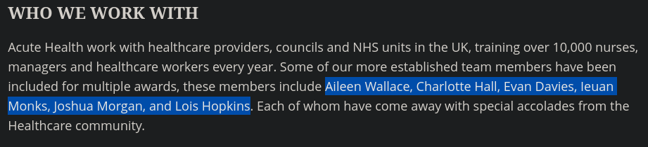

But what are we missing? Well the PC name, without this we cannot login into the powershell web access panel (also let's do some roleplay, in a real engagement if someone try to bruteforce computernames will not look legit ah?). I re-read the docx, than re-read every page of the website but nothing. Wait a sec, we actually read ALL the docx? What about metadata? TA-DA `exiftool` time!

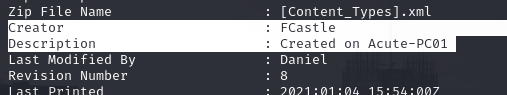

**<u>Acute-PC01</u>** looks as valid candidate and we have the template of the users, First letter of the name + surname...come on this is a child game! No need to fire up usernamer and I manually tried every useranme with the default password, we will discover who won the dumbest employee of the month prize.

> Ok wait a sec, I'm acting like this just for the sake of having fun while I write my report. "we will discover who won the dumbest employee of the month prize" is obviously a joke, I have really clear in my mind that we don't have to blame single users. The problem here is not the laziness of <u>edavies</u> but the whole password policy needs to be blamed. I don't have an audience that read my reports but since I write for myself at first I liketo clear even this small details. Automatic mechanism should be used to change default credentials to fill this security gap, a small

Allright, `edavies` didn't cahnge the dafault password and we finally have a powershell sessions on the **<u>Acute-PC01 machine</u>**

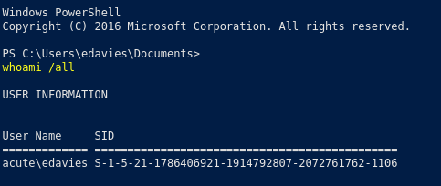

Ok I check the `ipconfig` output and the internal address is **172.16.22.2**, probably the DC IP is **172.16.22.1**, pinging that IP ADDRESS result active (yeah I saw it later it was under default gateway, I'm an idiot AHAHA)

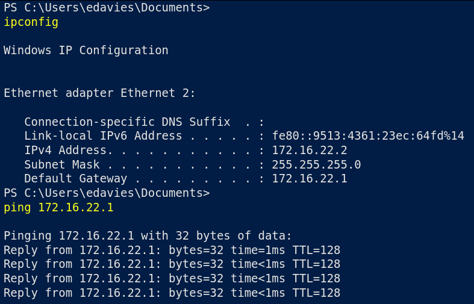

Ok time to pivot but no way (for now) to spawn a meterpeter shell because would be marked as virus by AMSI. No rest for the wicked, manual enumeration with PowerShell (soon or later I need to learn this lol). With `QWINSTA` we have something cool

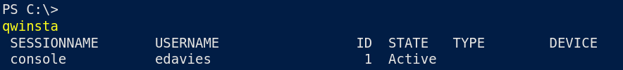

The user we are logged in have another session active right now, maybe we can get the key is pressing with the keylogger utility into meterpeter...but we still need a meterpeter ;(
Inside **C:\Utils** we have something strange a `desktop.ini` file (**dir -Force** to see it in powershell) with interesting content.

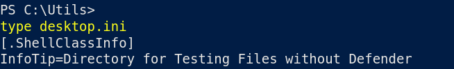

Obviously the web delivery module doesn't work anymore but without a fileless approach we can finally get a meterpeter session, let's try with **msfvenom** and **multi handler** in metasploit (boring stuff no need to put every single move here).

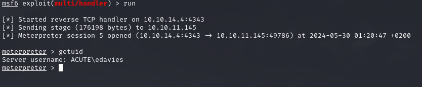

Finally a turf where I'm comfortable with! Now let's do this small Red Team task eheheeh. We need to list the processes with the `ps` command and take a look at the Session collumn that must be equal to 1 (so we know is used by the legit **edavies remote session**).

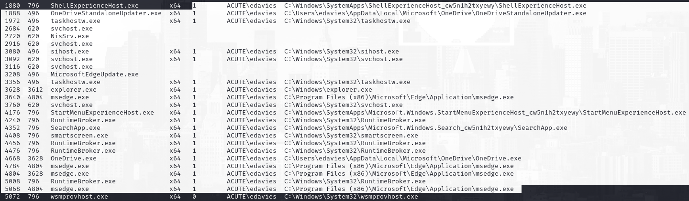

Cool, we can migrate on whatever other process under the **session with ID=1**. Then I have started a keylogger with `keyscan_start`, go to take a drink and finally hit `keyscan_dump` highlight a **password for the user <u>imonks</u>**

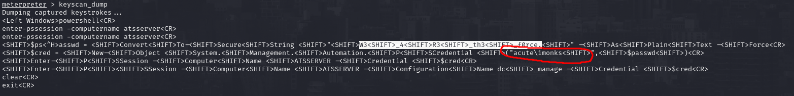

**W3_4R3_th3_f0rce.** ... no you are not, ;)
Checking further this credentials where used to login into the **<u>ATSSERVER</u>** machine...cool! Let's try to execute a command into that machine following the keylogger results

```
$pass = convertto-securestring "W3_4R3_th3_f0rce." -asplaintext -force

$creds = New-Object System.Management.Automation.PSCredential ("acute\imonks", $pass)

Invoke-Command -ScriptBlock {whoami} -ComputerName ATSSERVER -ConfigurationName dc_manage -credential $creds
```

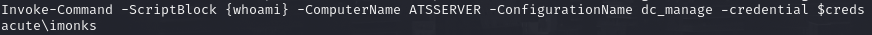

When I tried to execute a simple command like `dir`, strange thing right? I tried some alternatives `Get-Childitem` worked smoothly!

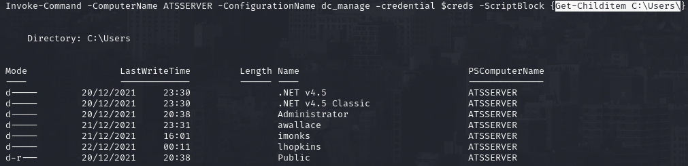

Let's see if the flag is here....IT IS!

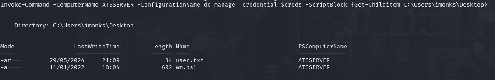

Fine but `type` don't work as well, online I found that the `Get-Content` command works the same way

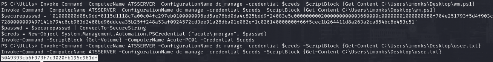

We have the flag! We wil cover the **<u>wm.ps1</u>** content in the PE section

<br><br><br>

# PRIVILEGE ESCALATION
Well inside the **<u>wm.ps1</u>** we have hardcoded password for `jmorgan` on the machine **Acute-PC01**, looking with some basic powershell command I now know that this specific user is inside the **<u>Administrators</u>** group. JUICY!

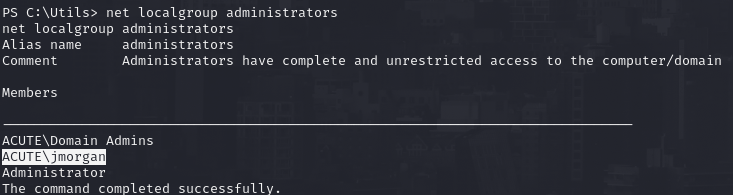

We can execute command inside the localhost (Acute-PC01), somehow when I try to create a new PSSession the terminal go idle so no way to execute command here directly, we need to work with the script located remotely.
We can execute the script and would output the `Get-Volume` command, let me try to change it to `whoami`. I am still learning powershell but online I found this [stackoverflow](https://code.whatever.social/questions/17144355/how-can-i-replace-every-occurrence-of-a-string-in-a-file-with-powershell) thread and we can use this command to change the script contents with what we like

```
(Get-Content C:\Users\imonks\Desktop\wm.ps1).Replace('Get-Volume', 'whoami /all') | Set-Content C:\Users\imonks\Desktop\wm.ps1
```

Cool now if we reuse the script directly we have the out we wanted!

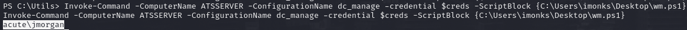

Cool, since the user **jmorgan** is a (local) administrator I can add **edavies** into the group and finally get full privileges into the machine with the traditional `net localgroup administrators edavies /add`. After running the script we are finally a local admin!

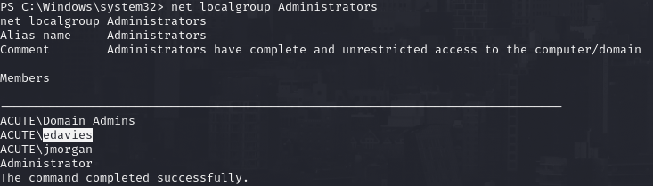

My idea here was to use mimikatz but still insufficent permission, well no worries because to make the changes effective we just need to re-login back to the Powershell Web Access and respawn a shell for us! After that from the meterpeter I get system simply sing `getsystem`, pretty easy when you are into the Administrator group right? Well now we can use mimikatz and with `lsadump::sam` we have Administrator hash!

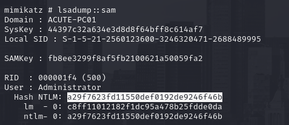

After cracking it I was able to retrieve the pre-image which is **Password@123**. No need to say it didn't work lol, I have uploaded RunAsCS just for simplify the work but even with he other user (Natasha) didn't work as expected. Maybe on the other machine will work, after some trial and error I found that this password was valid for the user `awallace`.

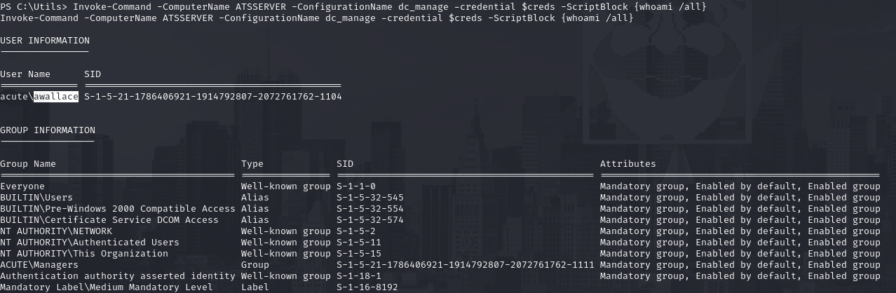

Inside **<u>awallace</u>** directory there is nothing, litteraly. Manual enumeration and let's go, inside `C:\Program Files` we have a non-standard directory 

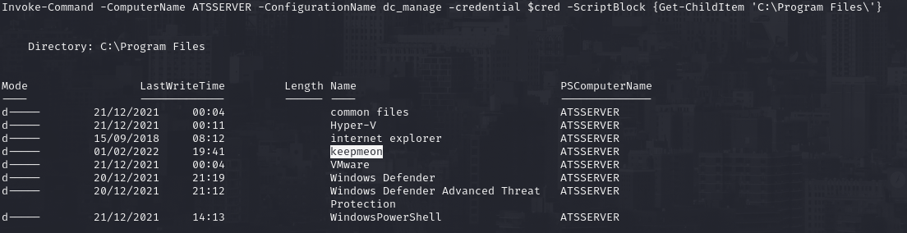

Inside rely a **.bat** file, let's see it's content!

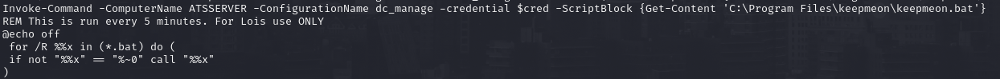

This would run (as Lois) every bat file stored in this specific path, cool stuff! Remember what we saw in the first docx we found that Lois could add people to other group (group membership permissions). Using `net group` I saw the group **<u>Site_Admin</u>** let's get more info about

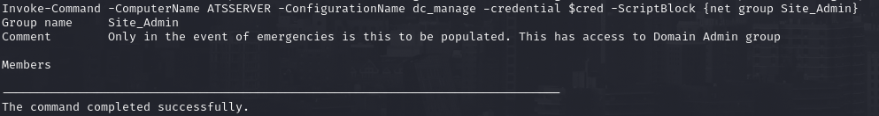

Now we can try to add `awallace` inside this group which I suppose have full access to **Domain Admins** one. Just add a bat file that excuted this task and wait for 5 minutes

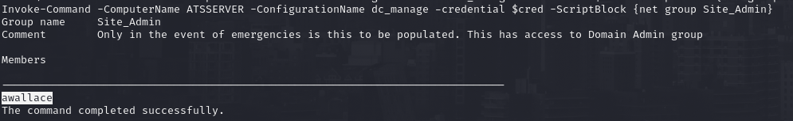

Hell yeah! Now we can do the samething but adding ourselves into the Domain Admins group and well game over! We have our last flag!


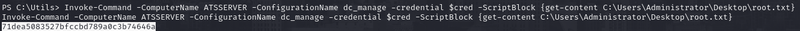
