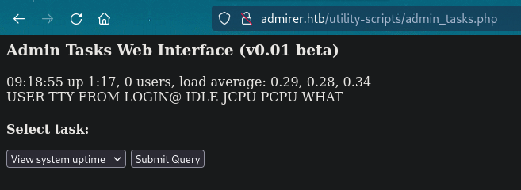

# PORT SCAN
* **21** &#8594; FTP
* **22** &#8594; SSH
* **80** &#8594; HTTP (APACHE 2.4.25)

<br><br><br>

# ENUMERATION & USER FLAG


The webpage is a simple image galley, `/robots.txt` is pretty interesting


DirBusting on the `/admin-dir` reveals an interesting file called `/contacts.txt`


Cool we have a good set of email (and consecutevely potential username), after a little bit of time I get another more interesting file called `credentials.txt` here things are juicy!


Cool, I have no clue of Wordpress (at least on this domain) nor the internal mail login but we can use the creds to login in FTP and downloads whatever we have inside there


Inside the tar archive I have found an upodated version of **<u>credentials.txt</u>** with a bank account creds


Other credentials have been found in `index.php`, this time MySQL user


Dig further on this PHP code I have notedthat image are not static but retrieved on the database (dump.sql contains the records) and than putted on the homepage, other credentials can be found inside the **<u>utility-scripts</u>** where a `db_admin.php` is present


 We have a  `admin_tasks.php` file that is used for simple tasks and can be used on the live server
 
 
 
 Makes sense to enumerate this directory nad found something else that maybe is available, if we are lucky enough something here can turn be usefull. Now I have searched "Admirer php" online (I tought was a stupid thing and actually it is, lol) and the first result I get was [Adminer](https://www.adminer.org/) which is "_Database management in a single PHP file_", all makes sense with all the SQL credentials  I have found.
 So while dirusting didn't show results yet I tried to visit `/utility-scripts/adminer.php`, guess what? It worked
 
 > Being stupid sometimes pays more than be logical and technical!
 
 
 
This specific version is vulnerable to [CVE-2021-43008](https://github.com/p0dalirius/CVE-2021-43008-AdminerRead/blob/master/README.md) that allows attackers to read files on the target directory. Now things became complicated and I tried all the credentials I found but none of them worked on the target host. I was pretty lost so I looked at HTB hint and they suggest to build our own SQL database and used as dummy system just to establish a connection with Adminer. On my Kali machine I have **MariaDB** which is supported by Adminer. I have created a new user for the remote machine and a dummy database to connect to


This is not enough I have to add a UFW rule to allows incomin connection from the target with `ufw allow from 10.10.10.187 to any port 3306` and a quick change on **bind-address** of `50-server.cnf`


Now we can access with the credentials we have created and get access to the **Adminer dashboard**


Gotcch'a, now we can insert inside the dummy table we have created some local files and than retrieve the results with

```{sql}
USE dummyyummy;
LOAD DATA LOCAL INFILE '/var/www/html/index.php' INTO TABLE yummy;
SELECT * FROM yummy;
```


On `index.php` we have credentials and since they are on the live website they probably work with SSH


First objective has been grabbed, let's move on!

<br><br><br>

# PRIVILEGE ESCALATION
Using `sudo -l` we can execute a bash script that is a **<u>System Administration Menu</u>**


We can look at the contents of the bash script and a python script is executed when a backup of the web data is requested


What I tought at first was to put a symbolic link to the root.txt flag inside `/var/www/html` since it will be used to create an archive but we are not able to navigate iside the directory and no way to append files, good idea but unavailable. What I miss here is the `SETENV` option on **sudo**. I tried at first to abuse the [PYTHONSTARTUP](http://www.witkowskibartosz.com/blog/pythonstartup_what_it_is_and_how_to_use_it.html) variable but works only with interactive python console. Looking at [official python documentation](https://docs.python.org/3/using/cmdline.html#environment-variables) on enviroment variables I found the `PYTHONPATH` that change the pointer to python libraries in a location we decided. The scripts import a library that we can hijack to a malicious one!

I created a new `shutil.py` which set a SUID bit to the bash and specified his path on the variable discovered above. After the execution we can impersonate **root**!


