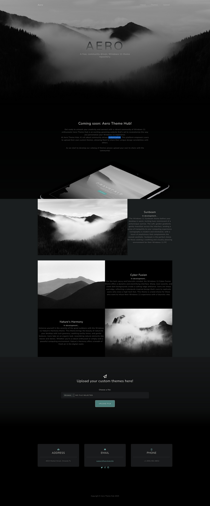
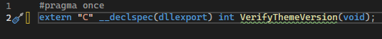
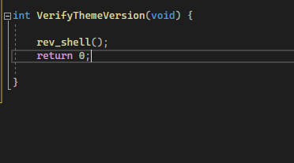
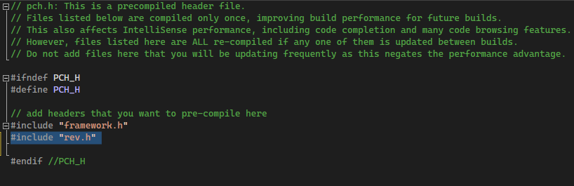
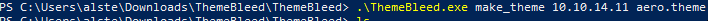
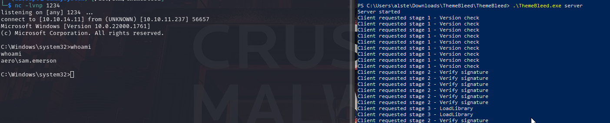
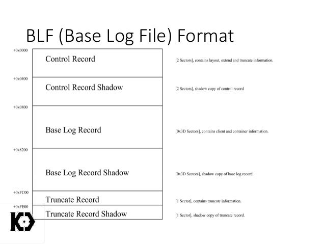
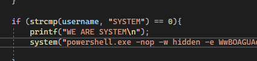
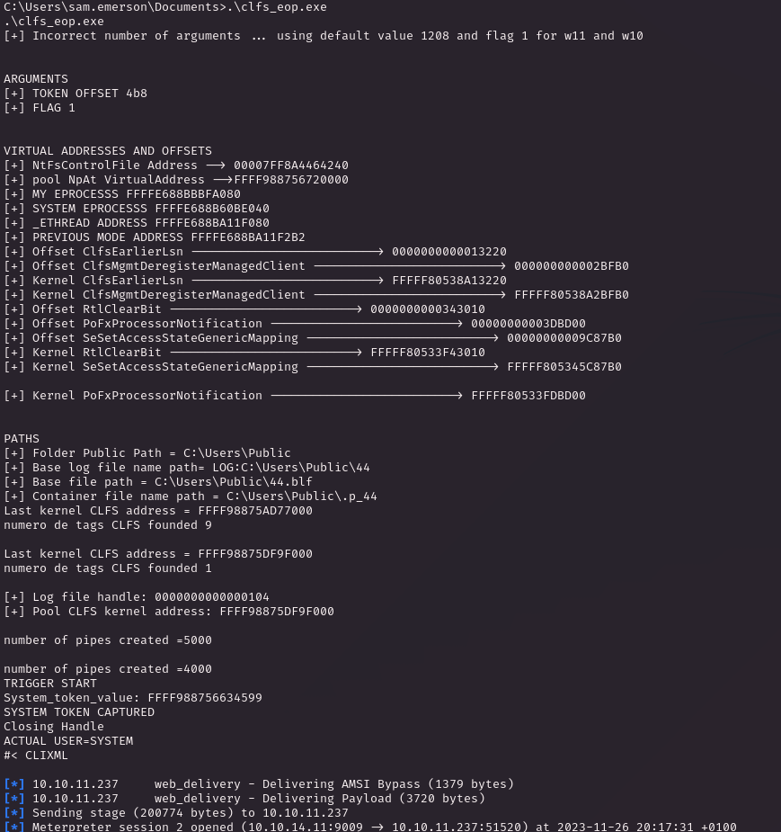
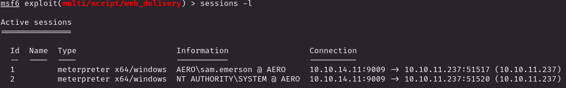

# PORT SCAN
* **80** &#8594; HTTP (IIS 10.0)

   

# ENUMERATION & USER FLAG
Say welcome to <u>one of the best looking website on HTB!</u>

Well the concept is a Community focused on creating and sharing theme for Windows 11 (maybe a hint of the underlying OS) allowing users to upload their own creation that has to be in `.theme` or `.themepack` extension, never heard them before.

The .theme file, as it sounds obvious, that describe the windows theme and have been implemented starting from Windows 98 with the possibility to be used even on higher version of the OS. The slight difference about them and themepack is the latter define a collection of icons, colours, sounds, ecc... in a CAB archive(implemented starting from Windows 7)

Some research about some well known vulnerability concerning this file types returned [ThemeBleed](https://www.bleepingcomputer.com/news/security/windows-11-themebleed-rce-bug-gets-proof-of-concept-exploit/) is a good candidate.

The `.theme` extension in particular contains reference to `.msstyles` that SHOULD NOT contains code and are loaded when theme file is opened, if the version "999" is used a race condition occuring between the DLL signature is checked and when is loaded. The exploit consist on loading a malicious DLL abusing the race condition.

`themepack` can leverage the attacker to a stelthiness attack avoiding [Mark-of-the-web technolgy](https://attack.mitre.org/techniques/T1553/005/) by is archive nature

[Here](https://github.com/gabe-k/themebleed) we have a really well done exploit which can be used to test the security from this bug on the box. Now this is not a simple Proof-Of-Concept that just needs to be run from terminal we have to build it, let's move on windows and check every steps we need to weaponize the theme

> "To make your own payload, create a DLL with an export named VerifyThemeVersion containing your code, and replace stage_3 with your newly created DLL."

Cool we know what to do first, I get the compiled exe tool described from the repository

1) In Visual Studio create a new DLL project
2) Create a header file importing the `VerifyThemeVersion`, is a good rule to use the `__declspec(dllexport)` directive so the export data will add the directive into the DLL without the support of a `.def` files
 

 
3) Grab a template of your choice for a reverseshell in C++ (I used [this](https://github.com/tudorthe1ntruder/reverse-shell-poc/blob/master/rs.c) because I used for the Napper machine), here you need to make some changes, add the right header and transform the main in a functions and inject it on the `VerifyThemeVersion`
 

 
4) Add the rev.h on the `pch.h` file
 

 
5) Than create the DLL and use the PoC to build the `.theme` file (the DLL should be renamed stage_3 and placed on the **data** directory)
 

 
6) Use the PoC and start a server, than use `socat` to redirect all the request on port 445 directed to the kali machine on the windows machine and upload the malicious theme, enjoy the view!
 

 

   

Now we are free to go, take me a long to understand and implement the PoC but was cool to get in touch with some windows and DLL creation, coding is not my hing actually ouch!

The potential of this exploit is quite affascinating and stealthy for a RCE, btw I spawned a meterpeter shell and we have access to the user flag! Rewarding!

   

# PRIVILEGE ESCALATION
As user we don't have particular permissions or group membership but doesn't need to much enumeration before discovery something intresting, in `Documents` we have two things : The watchdog script used to open the theme files when upload and trigger the reverse shell and a pdf called **<u>CVE-2023-28252_Summary.pdf</u>** interesting I think is a inequivocable hint.

The [exploit](https://securityonline.info/poc-released-for-windows-common-log-file-system-0-day-cve-2023-28252/?expand_article=1) rely on the **<u>Common Log File System</u> (CLFS)** and was discovered on the ransomware of Nokoyawa Group. Everything is based on how [CLSF](https://learn.microsoft.com/en-us/windows-hardware/drivers/kernel/introduction-to-the-common-log-file-system) driver handles the **.blf** format

What's wrong here is on the kernel structure of the **.bfl** files which allow to store in specific fields memory pointers, when system attempt to extend a metadata block the **bfl** file is manipulated in both `CONTROL` and `CONTROL_SHADOW` metadata blocks allowing a out-of-bound access leading to obtain kernel privileges (pretty complicated and not all info are shared at the time I am writing this but [this article](https://securelist.com/nokoyawa-ransomware-attacks-with-windows-zero-day/109483/) is worth to check out for full explanation)

Now we can use the [PoC made by Fortra](https://github.com/fortra/CVE-2022-37969), just change the command to execute for a reverse shell rather than the traditional calculator, in my case I used the reverse shell for `web delivery` module

Than we just have to build the executable file and uploaded on the box. You can execute it and will trigger the whole attack chain

The brand new sessions impersonate the root user and we have now full controll of the victim

> This machine was released as no-competitive and makes sense, even if is medium we are just talking to get in touch with 2 PoC of known but recent vulnerability. I think the non-technical lessons here is to stay update with new exploit and threat and how to use more complicated POC. "Complicated" for me, need to get in touch with DLL creation and Visual Studio in a Windows enviroment which I am not really keen and happy to use but the little trick with `socat` is something never used before which helped me to use windows the less possibile making the exploit work! 
