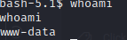

# PORT SCAN

* **22** [SSH]
* **80** [HTTP]

 

# ENUMERATION & FOOTHOLD

This is the website (look at the bottom left the "agile development" section can be a reference about the machine name).
We got a **Login Page** (`/account/login`) and when we press **Get Started** we are redirected at the login page

We can register so I created a new account and we get a new section of the site **/vault**

We can create a new password using three parameters Site, Username and obviously the password. After you save this record you can export it in csv format

Now we can probably play with the request in order to obtain password of other user (maybe) or other results playing with the (few) input we can manually insert

Playing with the request made the webapp shows an error page

The `Werkzeug powered traceback interpreter` trick my sixth sense so I decide to use internet and search info about this interpeter ([1](https://gauravsachdev.github.io/2020/07/29/HactivityCon-2020-CTF.html) and [2](https://book.hacktricks.xyz/network-services-pentesting/pentesting-web/werkzeug))

So **Werkzeug** interpeter provide us a live shell where we can gain RCE but....we need a PIN

We can lead to **<u>path traversal</u>** using the `fn` parameter within the link to export the passwords `http://superpass.htb/download?fn=` this is an example

So maybe we can retrieve the PIN in a file placed somehow in the filesystem also looking at the `__inti.py__` of **[Werkzeug debugger](https://github.com/pallets/werkzeug/blob/main/src/werkzeug/debug/__init__.py)** the PIN is saved on an enviroment variable

The error message leaked the application path

And at the default (in a virtual enviroment) path of the debugger we have the source code

Now I can try to follow [this guide](https://github.com/grav3m1nd-byte/werkzeug-pin) to reverse the PIN and we need:

1) Username running the webserver (**www-data**)
2) modname (**flask.app** we can assume that looking the error page)
3) `getattr(app, '__name__', getattr (app .__ class__, '__name__'))` (in this case **Flask**)
4) Path of python Flask app (`/app/venv/lib/python3.10/site-packages/flask/app.py`)
5) MAC address of the host computer (hacktricks link give us a way to get it), in this case **00:50:56:b9:29:6c** but need to be conerted in decimal (`345052359020`)

6) Machine id looking inside `/etc/machine-id`

I've run the script in hacktricks and we have the pin **735-401-116** I used trying to get the debugger shell but nothing 

I've followed [this guide](https://www.bengrewell.com/cracking-flask-werkzeug-console-pin/) in order to make a "cracking" of the PIN based on multiple values and this one was the right one

Now with this we can pop out the reverse shell

  

# PRIVILEGE ESCALATION #1

Inside `config_prod.json` we got the credentials of MySql **superpass** database

Now this simple shell have some problem with the mysql interactive output so I used this syntax to bypass this and get the shema information

We have the credential for **corum** user and out user.txt flag

  

# PRIVILEGE ESCALATION #2
WIth the basic user I fund this cool output on linpeas 

So the user **runner** is running (lol) an instance of [gunicorn](https://gunicorn.org/) on port 5555 running **app(.py)** 

We need to make a tunnel between us and this instance on port 5555 good opportunity to use [chisel](https://github.com/jpillora/chisel#install)

In the victim

Locally

Now just use curl on `127.0.0.1:5555` to check the tunnel

Now we got access to the instance of runner of the website and retake a look at the linpeas output we can notice this 

The instance of **runner** have a debug port open (41829) this is the exact port to make a tunnel with than after fixing the chipsel tunnel we need to have a google chrome instance on **chrome://inspect** and on `Discover network targets` add the value **127.0.0.1:41829**

And automatically we can get the runner's instance on **Remote Target** we can press inspect and have a mirror of the instance....COOOL! We can get the password of the edwards user

d07867c6267dcb5df0af

  

# PRIVILEGE ESCALATION #3

With user edwards we can use sudo in this ways

This is my first time dealing with sudoedit actually and open a nano interface so I decide first to check the sudo version

**Sudo 1.9.9** is vulnerable to `CVE-2023-22089` [[1](https://www.synacktiv.com/sites/default/files/2023-01/sudo-CVE-2023-22809.pdf)] but while I was trying to figure it out how to to fit in my victim machine I use `find` to ceck SUID binaries and we got something easy (that we could use before lol)

Just run `bash -p` and get the root flag!

  

# EXTRA

Looking back at the CVE in order to use the default example is to change the `EDITOR` variable in this case `export EDITOR="nano /app/venv/bin/activate"` (used by root as cronjob)

When you run **sudoedit** on one of the two possible files you force sudoedit to write on `/app/venv/bin/activate`, you write **chmod u+x+s /bin/bash**, quit and go in the lecit files. When you done with the lecit file you can you can use `bash -p` to impersonate root 
