# PORT SCAN
* **22** &#8594; SSH
* **80** &#8594; HTTP
* **3000** &#8594; GRAFANA (ppp?)
* **3306** &#8594; MYSQL

  

# ENUMERATION & USER FLAG
The webpage is a sort of blog with a single article describing what is the purpose of the server

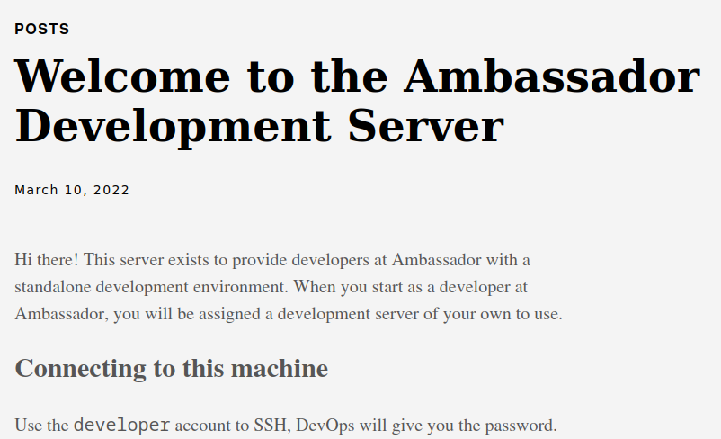

Ok cool, obv I tried some default credentials on ssh with username `developer` but is not that easy lol

 

The port `3306` is running `MySQL 8.0.30-0ubuntu0.20.04.2` and while I enumerate I run a session of Hydra using the username **developer** and bruteforce the password and check the port **3000**

Checking some vulnerability for the Grafana version running (**8.2.0**) and found this [CVE](https://nvd.nist.gov/vuln/detail/CVE-2021-43798).

With searchsploit we have a python script ready for us!

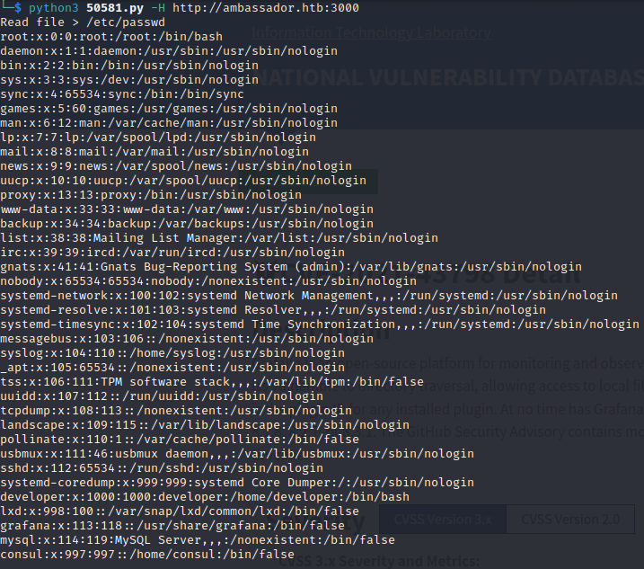

With some research I found that is a god practice to check the contents of `etc/grafana/grafana.ini` and I found the credentials

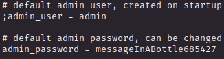

Cool now I have access in the Grafana Dashboard and I can enumerate more, probably I need to find something tohelp me get into the MySQL service. We have a `mysql.yaml` file on the dashboard

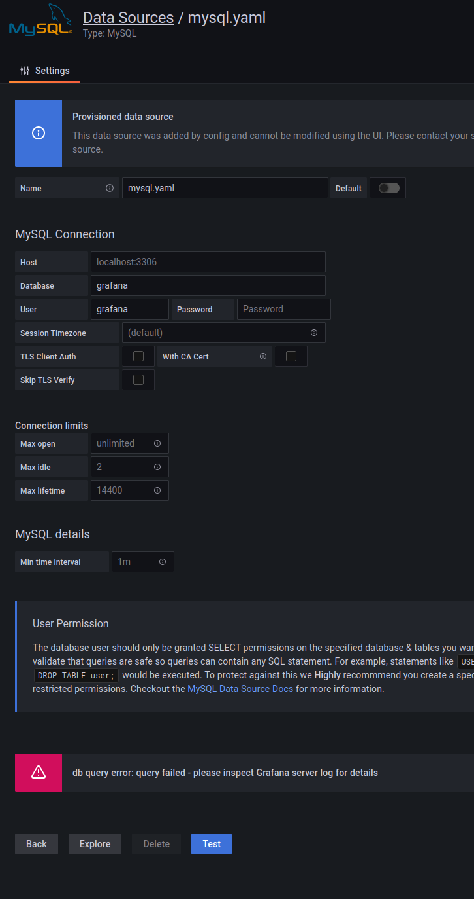

But as you can see when I press **TEST** return an error, maybe the credentials on the dashboard are wrong but if I know the location of the yaml file we can have the right set of credentials

With some research on the documentation I found this about provisioning MySQL service

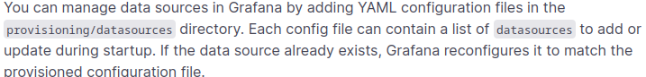

So `/etc/grafana/provisioning/datasources/mysql.yaml` should be our target

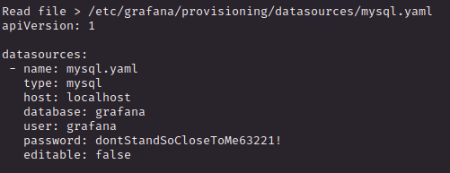

Gotcha we have it!

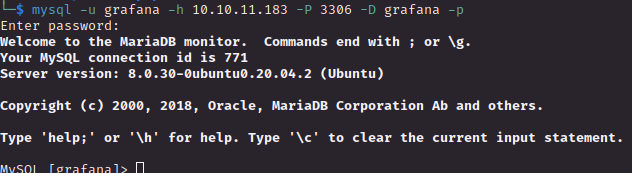

In the `whackywidget` database we have `users` table with the password for our guy developer 

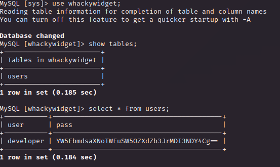

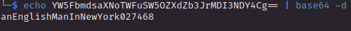

Let's get the flag login through SSH!

   

# PRIVILEGE ESCALATION
The user developer is in **developer group** and looking at the output of linpeas the pah is pretty clear

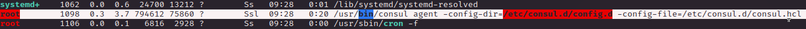

And this are file that are writable to us

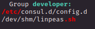

[Consul](https://developer.hashicorp.com/consul/docs/intro) is a networking solution to secure connection between service and other enviroment (like cloud) and more like trafice management, service mesh and automated action

There is CVE for PE using consul so I will note that and continue to enumerate

 

Linpeas found `/opt/my-app/.git` cool let's check it. Nothing usefull there but on `/app/my-app` we have this **<u>whackywidget</u>**

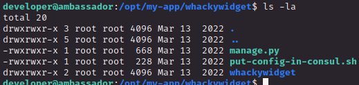

TA-DA we have the proof that consul is what we need

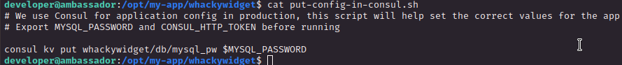

Now using `git checkout` on a different branch and looking back at the script we have a token

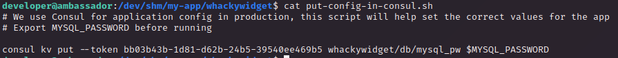

Cool stuff with some research online I found that (if we have the token) we can make a OS injection. I used this [PoC](https://github.com/owalid/consul-rce) which is very clear, the vulnerability allow to register (and unregister) a service in **<u>Consul</u>** and inject a OS command which we know will run as root

Cool I uploaded the script, create a reverse shell and call it using the PoC. We get root fag ;)

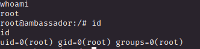

