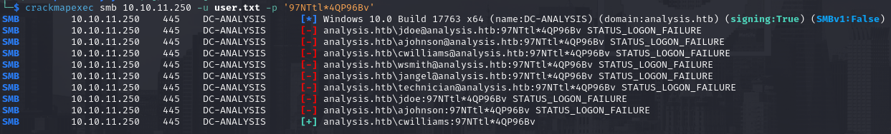
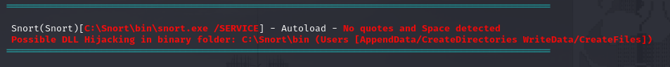

# PORT SCAN
* **53** &#8594; DNS
* **80** &#8594; Microsoft HTTPAPI httpds 2.0
* **88 / 464** &#8594; KERBEROS
* **135 / 593** &#8594; MSRPC
* **139 /  445** &#8594; SMB
* **389 / 636** &#8594; LDAP
* **3306** &#8594; MySQL
* **5985 / 47001** &#8594; WinRM
* **9389** &#8594; AD RECYCLE BIN
* **33060** &#8594; MYSQLX

   

# ENUMERATION & USER FLAG
The box looks like an Active Directory Domain Controller (`dc-analysis.htb`) of the `analysis.htb` domain. Port 80 is pretty strange have the same version of WinRM port, never saw something like that before. By the way the website run on IIS 10.0 and is pretty empty...

I make some enumeration on the subdomains and `internal.analysis.htb` looks valid but when we access it gives error 403. Even if we cannot access it I was able to perform some dirbusting and I found some path like `/employees` and `/users`, on the latter I recursevely perfrom directory busting and found a interesting PHP file

It requiered a parameter to work and with some intuition I was able to retrieve a user

To be sure this user exist in the AD I user `GetNPUsers`, et voila' we have a valid username now!

I am not sure why we can access this part of the website but is worth to check if `/employees` have something too and actually `/login.php` exist

Now, let's jump back at `/users/list.php`, believe me ornot but just with my intuition I use **name** as parameter and `*` to retrieve all the possibile records like SQLi but is not SQL (I ty some injection) but LDAP. I tought about that becuase return the same information as Domain Controller user list .
We can try some LDAP injection but how? Well with `ffuf` I was able to recover another parameter other than name called **<u>description</u>** so I try to perform the injection like this `?name=*)(description=9*`

This is cool it means that the description start with `9` so I can iterate this process with a python script 

What we have back is the string `97NTtl*4QP96Bv`, this sounds like a pasword so I used directly on the dashboard found before

Here we have a list of user so I create a user list (traditional thing like first letter of name and surname and blablabla) and I tried the password found checking if someone reused it! 

Yeah, nice thing but SMB is empty, we can't login with WinRM and other things (kerberoast,ASREProasting,ecc...) don't work but on RPC I get an exahustive list of user

Inside the dashboard we can upload file through the appropiate section

Here I uploaded the Ivan Sincek reverse shell and voi'la

In this shell I run **winpeas** and found AutoLogon password of `jdoe`

Cool stuff now we can use this credentials on EvilWinRM and get the first flag!

   

# PRIVILEGE ESCALATION
The `jdoe` user have no special permission but we can note there is Snort installed in hte system

The version of Snort is `2.9.7` and is vulnerable to [DLL HIJACKING](https://packetstormsecurity.com/files/138915/).
With some trial and error I was able to find the gap where this vulnerability rely, in `/snort_dynamicpreprocessor` if we add a DLL called `sf_engine.dll` (made with **msfvenom**) after a few seconds we will receive a shell back as SYTEM

