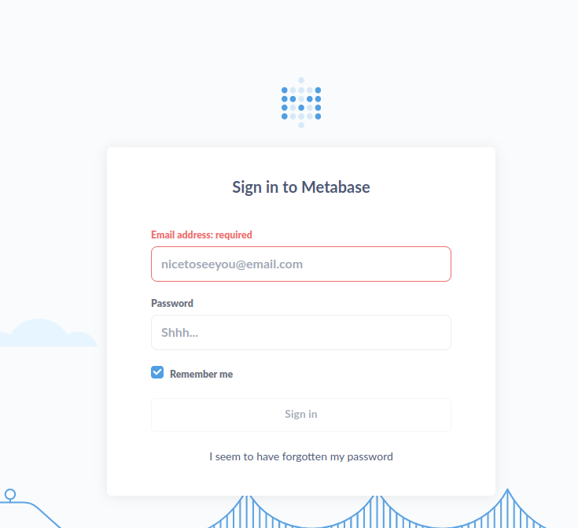
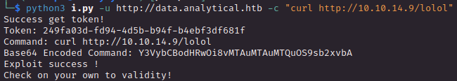
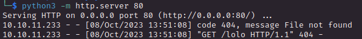
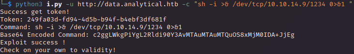
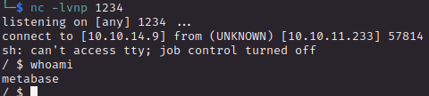
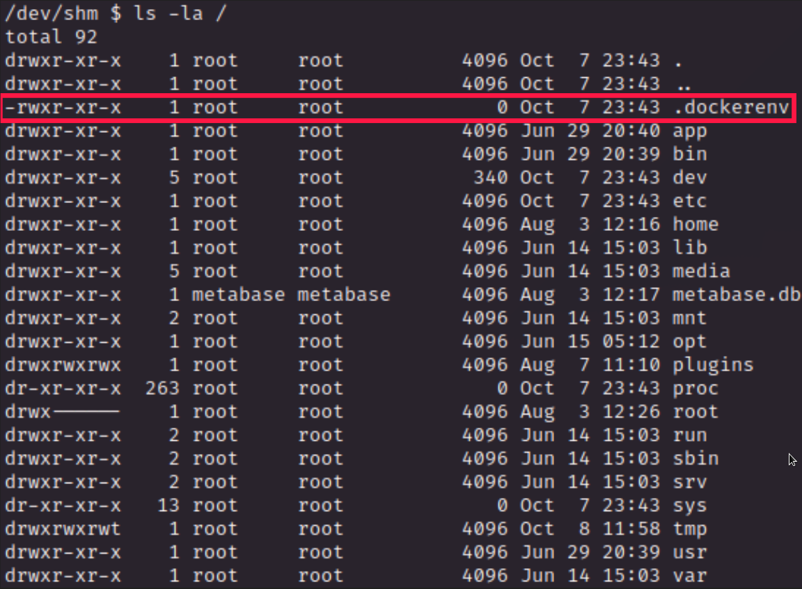
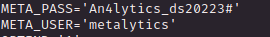
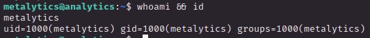
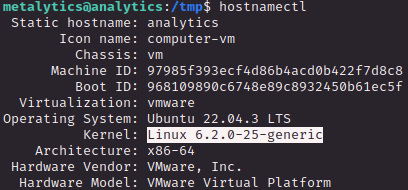

# PORT SCAN
* **22** &#8594; SSH
* **80** &#8594; HTTP (nginx 1.18.0)

   

# ENUMERATION & USER FLAG

This is the webpage and I am gonna start to enumerate that to find a crak in the wall since no other protocols are available

This is a static page with nothing usefull but when I press to `login` we are redirecto to `data.analytical.htb`. I add it to the host files and check what we have here, this is a **<u>metabase</u>** login page

MetaBase is vulnerable to [CVE-2023-38646](https://nvd.nist.gov/vuln/detail/CVE-2023-38646) which is an unauthenticated RCE, cool!

I used this PoC to test the exploit and is a success

Just run a reverse shell and enjoy our exploit!

Inside we have no user flag, seems bad but I found why in a few minutes. We are inside a docker enviroment as we can see on the root directory we the placeholder file for docker containers

No need to escape just take a look at the enviroment variables and we have some credentials that can be used on the SSH ports

Now we are inside the machine and we can get our flag

   

# PRIVILEGE ESCALATION
Linpeas and further enumeration return me nothing usefull so I decide to getsome information about some kernel exploit

After some research (and a waste of time trying useless CVE) the right vulnerability to exploit is [CVE-2023-2640](https://github.com/luanoliveira350/GameOverlayFS), just change the id command with a bash spawn and we are good to go!

Really easy machine!
