# PORT SCAN
* **80** &#8594; HTTP (IIS)
* **443** &#8594; HTTPS
* **5985** &#8594; WinRM

   

# ENUMERATION & USER FLAG
With surprise, we are not dealing with AD (apparently) so let's give a look at port 80 and 443 both pointing to `meddigi.htb`

The homepage is a the same static brochure in this case acting like a sanity service what's cool is the `/signin` page 

We can sign up an account so I'm gonna create it one and see what can be accomplished being authenticated

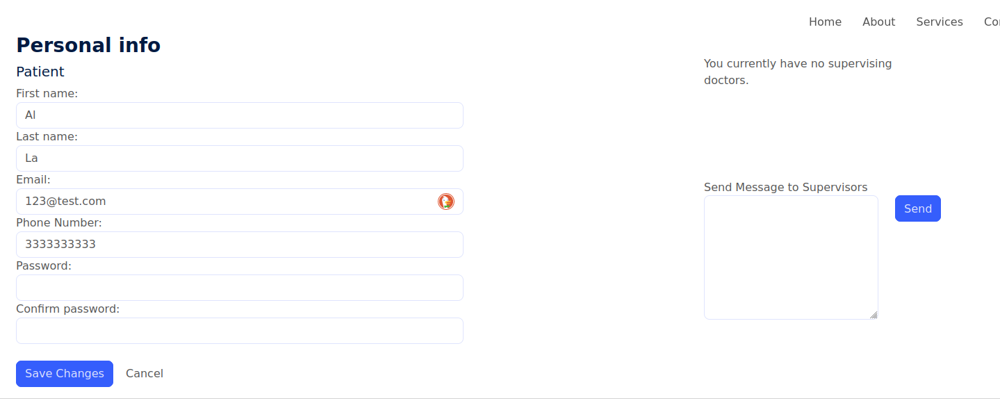

Cool on the right we can change our information and on the right we should be able to send a message, let's jump in using Burp Suite.
When sending the message a POST request is sent to `/Profile/SendMessage` and in the body we have a JWT cookie called `access_token`. The token is constructed as it follows

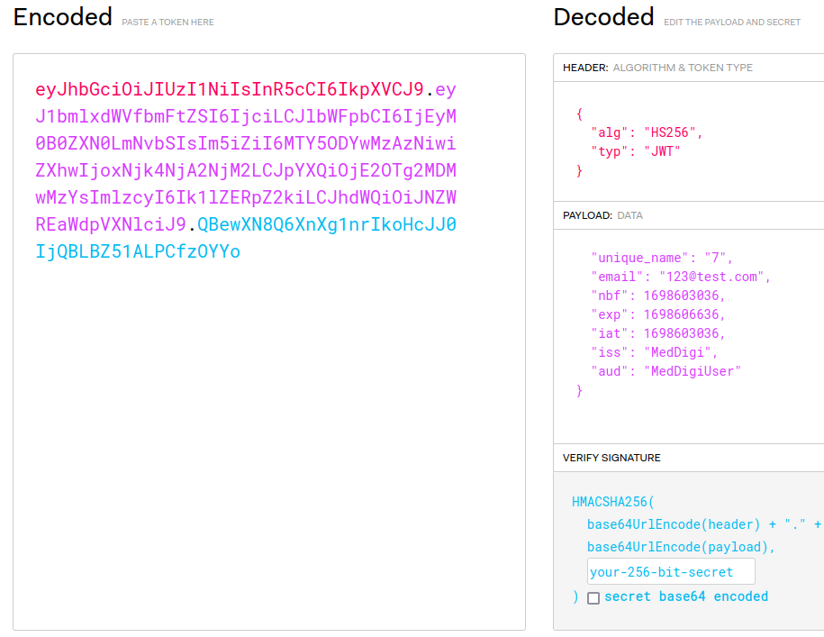

Plus it seems to use .NET on the backend at least for cookie setup

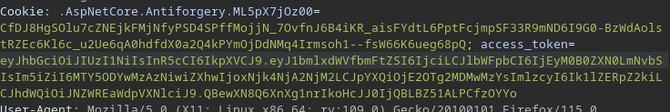

What bugs me is the `aud` field telling me that I have been authenticated as simple user so I creted new account but intercept the request with Burp and what interesting is the `Acctype=1`

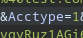

So I changed that to 2 and col we are doctor now!

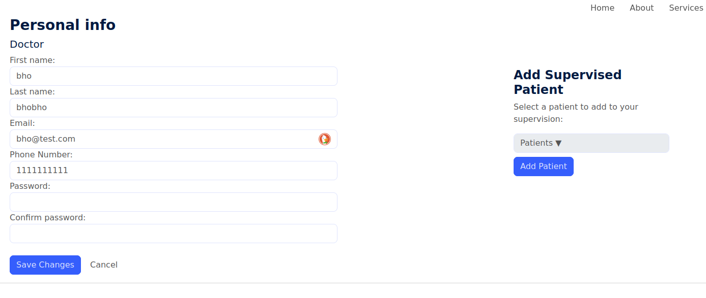

When we add a supervide patient we make a `POST` at `Profile/AddPatient` indicating the profile ID of the patient. I've played a bit with it but no results at all.

While I was playing with the request I have run a subdomain bruteforce in the background and ended up with `portal.meddigi.htb` as results, I added it to the hosts file and here is what we have 

I tried to login injecting the `access_token` on the standard doamin and I received this error when injectin on the login request

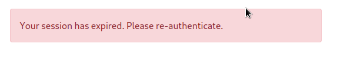

Not so cool actually but is something, I tried copy'n'paste the whole Cookie section and this time it worked!

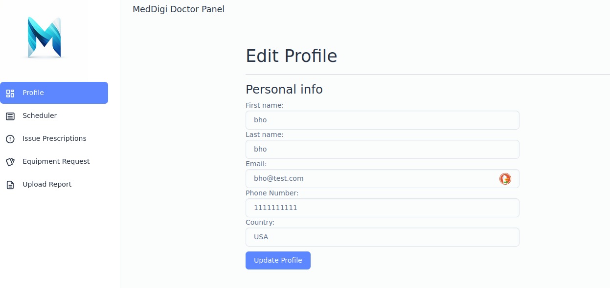

Now will be not so comfy going around the different panels cuz we need to inject the cookie everytime (fixed using the match and replace rules of burp), by the way we have a file upload right here...don't have to say much!

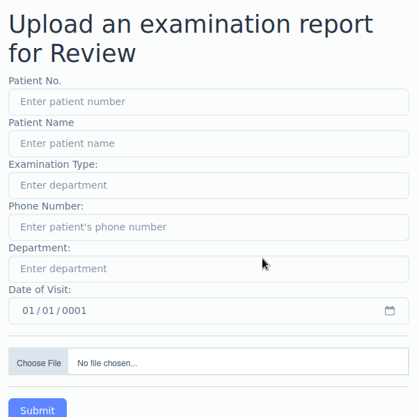

The format accepted is only PDF so we need to do some magic byte injection in order to perform a reverse shell but I'm not going to rush too much since is actually te first time I perform an upload reverse shell on a windows target so let's make a few step back.

As already noted before on the Cookie section we are dealing with a `ASP.Net` website, so a aspx reverse shell should be very usefull to us. But we have a issue, where is the file stored or how can be accessed after the upload? 

After some enumeration and real boring research on the `Issue Prescription` tab we can send an email with the link of a prescription, nothing special if this would not lead to a link preview o if we set a localhost on a specific port we can see what we have locally

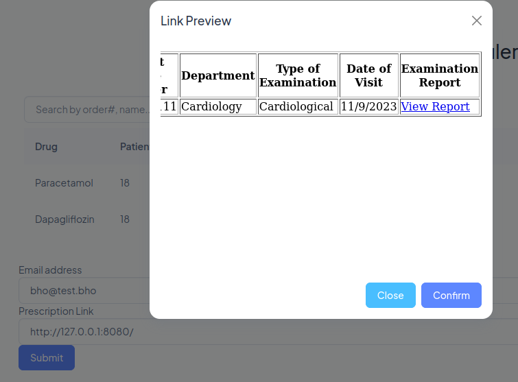

Surprise surprise we have the list of all the report and the link to view it

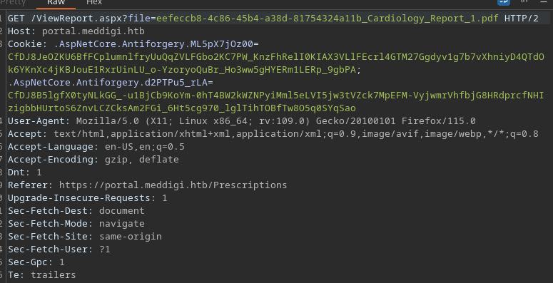

This is huge now that we have it we can now craft our malicious payload and than trigger it in order to get the shell (because of the continously injection of the cookie everything is a bit glitchy). To get access to the PDF file we need to do it through with the same SSRF (I have spent a lot of time copy and paste it raw without no output so good to know)

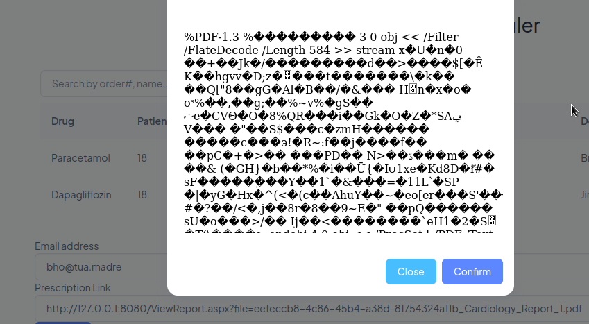

Smooth as it should be, now we know how to access uploaded file.
Talking about uploading I continue have an issue with Burp Suite when I press upload

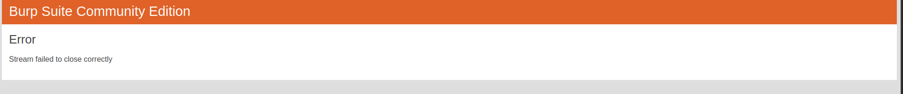

I am pretty sure is all about SSL/TTL certificate and I need to solve it somehow.
After sometry I was able to successfuly upload a legit PDF

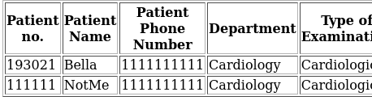

What I have was an error based on the PDF version, the right one is 1.4, than was pretty easy to get the shell I change the whole content of the PDF (mantaining the `%PDF-1.4` tag) with the [aspx shell](https://github.com/borjmz/aspx-reverse-shell), changed the filename to something like "rev.aspx".

After the upload reusing the SSRF to trigger the reverse shell

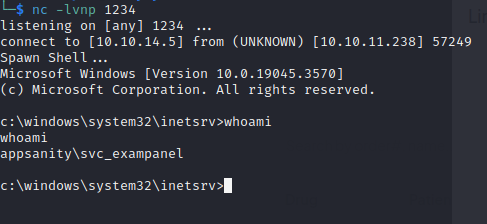

Inside the `svc_exampanel` user directory we have the user flag

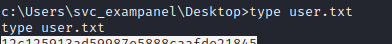

Hard but fun, now let's see what the user have for us

   

# PRIVILEGE ESCALATION
I think there should be a way to get a user that can connect to WinRM and actually exist and is called `devdoc`

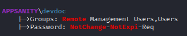

There are no clue or hints on how to leverage our position so I decided to take a look inside the `inetpub`

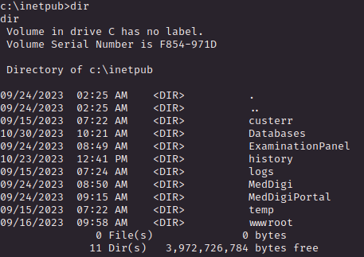

Ok here there is some cool stuff that act behind the curtains of the webapp and I should keep my attention to something that need the user `devdoc` or similar.

With winpeas we have an interesting registry with weak permissions

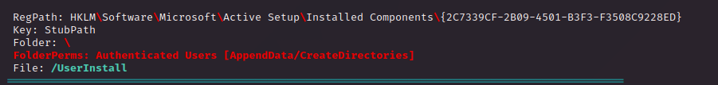

So I decided to query it and we have some credentials

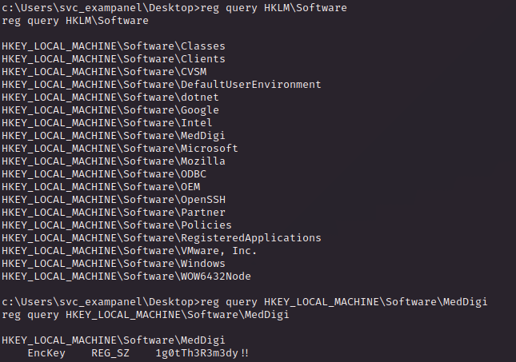

Finally we have a stable PowerShell through Evil-WinRM

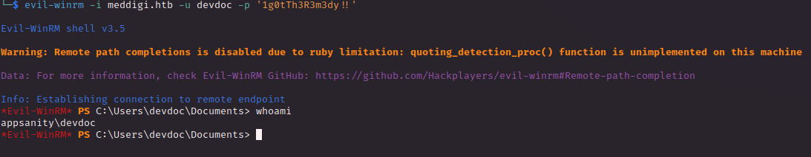

Cool, what I saw earlier from winpeas were the open doors, especially the **<u>port 100</u>** called `ReportManagement` pretty uncommon and can hide something usefull for PE

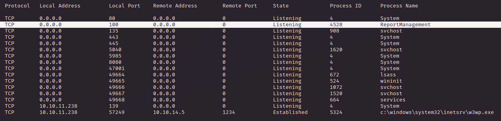

Chisel kicks in!

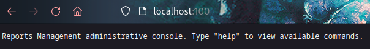

Administrative console, interesting. In `Program Files` we have the directory `ReportManagemenet`

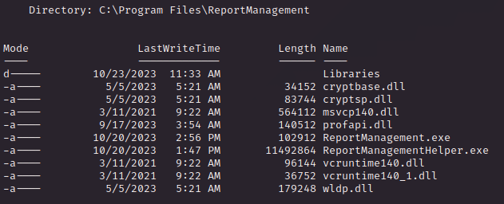

I'm gonna take the executable and some reverse engineering but first I want to find a way to interract with the console, netcat is what I need

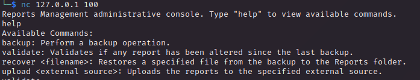

Cool se we will find something like a switch case in the reversed code but first thing first a simple `strings` on the .exe file

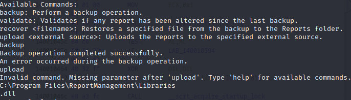

Inside the `Libraries` there is nothing at all and this bugs me plus the string `.dll` is directly after this directory. UHMMM interesting because is related with the "UPLOAD" feature

I'm pretty sure that we need to perform a DLL hijacking somehow but I am not sure which DLL is used, how can be hijacked and how the whole process is correlated with the Mangement Console

The `Libraries` directory can be written by the `devdoc` user so we can put some file, in the previous image we have `.dll` string s probably we need to inject a malicious dll (makes sens with the name of the directory).

So I uploaded a malicious dll, run the mnagement console and use every command but no results at all

When I try to upload a file I received an error and doesn't make sense to me 

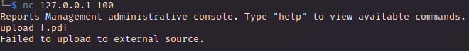

This because probaly is not reading the DLL is expecting, rechecking the `strings` command output below the ".dll" we have `externalupload`

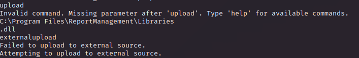

And after that we have 2 strings, the one we received is for failure so the other one should be for success, I try the same process as before but using the name `externalupload.dll`.

After the upload I just run the upload command in order to trigger the shell and get administrator privileges

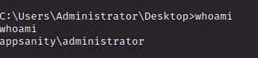

The moral of this machine is that I need to sharp reverse engineering skills, I have done that just using the intuition and this will not help me that much in the future 

