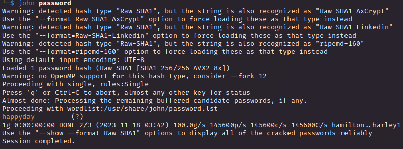

# PORT SCAN
* **135** &#8594; MSRPC
* **8500** &#8594; Cold Fusion MX Server

   

# ENUMERATION & USER FLAG
Before starting out I want to note this machine have a really low reviews stars (w.6 out of 5), the reviews are complaint about how much unstable this box is so let's take into account that some exploit or scan can return some inconsistent results.

Well the port 8500 is the most interesting because is strictly related to the box name : **<u>Cold Fusion</u>** which deceloped by Adobe and described as it follows

> Adobe ColdFusion is a battle-proven and high-performing application server that makes web development easy for every coder.
Bring your vision of a scalable, game-changing and reliable product to life.

I look at the official website and this service is all about versatility, thri-party integration and cloud using **<u>ColdFusion Markup Language</u> (CFML)**

I try to access on RPC client but failed so I took a look directly at port 8500

I read a few articles about pentest this service and explored the webapp I encountered the administrator login panel which tell us the version of coldfusion

Lokking at [this page](https://pentest.mxhx.org/04-webapps/coldfusion) I have been able to extract the password hash of the admin user through this LFI

`/CFIDE/administrator/enter.cfm?locale=../../../../../../../../../../ColdFusion8/lib/password.properties%00en`

Cool I used john and retrieve it easily (we are talking of a SHA1 password)

Great, we are in!

To get access we can abuse the `Scheduled Task` feature to upload a remote file (that will be a `JSP` reverse shell)

Than just run the scheduled task

Just visit the file in order to trigger it, the user flag is owned

   

# PRIVILEGE ESCALATION
As usual we have `SeImpersonatePrivilege` enabled and we are inside a Windows Server 2008 this means there are probably a lot of exploit that can be run in order to get **SYSTEM**.

We have our old friend `reflection` and `reflection juicy` so I will rely on the latter, effective and smooth!

> Windows easy machine can be really boring after a while but since I started as a total ignorant of this OS now everything start to compose togheter and I now what to check, where to check and what to do at least for obvious privilege escalation flaws, which is not much I know that but is something I new I have embraced and learned, cool stuff!
