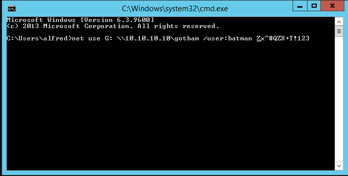

# PORT SCAN
* **80** &#8594; HTTP (IIS 10.0)
* **135** &#8594; MSRPC
* **139/445** &#8594; SMB
* **8080** &#8594; HTTP (Apache Tomcat 8.5.37)

   

# ENUMERATION & USER FLAG
This is a pretty cool ports configuration, port 80 host the default IIS homepage so will be pretty useless at least for now.
Port `8080` is more juicy

I tried some VHOST and directory busting but nothing usefull at all, luckly SMB accept anonymous access!

I have spend a few minutes on the `Users` durectory (with the **tree** command was pretty easy to have an overview) but nothing usefull has been found, the `BatShare` (shoutout to batman lol) is our only hope. Inside we have `appserver.zip` which include 2 file

* **<u>IMPORTANT.txt</u>**
<bt>

* **<u>backup.img</u>** which is a LUKS () encrypted file
 

I have found a really well done [blog post about LUKS Cracking](https://irq5.io/2014/11/19/bruteforcing-luks-volumes-explained/?source=post_page-----832d5543101f--------------------------------) it explains very well how this encryption method is done and how to perfrorm bruteforcing on it.
The file header is enough to retrieve the plaintext password

Now we can use hashcat with the `-m 14600` and `-w 3` (suggested by hashcat itself to set host memory to 3MB), it will take a lot even with my **GTX 1080** so I will make a break while the cat will work on it. 

Ok maybe is taking too much time and the estimated time is 4 days so I don't want to wait all this time, I look around the web and discover the tool `bruteforce-luks` with a 20 cuncurrent threads but again is still not enough. 
Since we have a lot of reference about Batman I have searched online if there is a pre-built wordlist on this theme but no results so we can still use rockyou.txt but reducing the wordlist grepping words like **batman**, **alfred** and **joker**, much much much better now!

Cool now we can access the `backup.img` file and mount it on our local machine

Finally we have access to the Wayne's secret...which doesn't contains nothing if not some default configuration tomcat files and a PDF with all the dialogue of batman begis (really, WTF). The only information we have in our pocket is the password for now.

I have took a look around the webapp and we have something that I have never seen, at `/userSubscribe.faces` we have a form using to send the email and signup to the subscription program

A quick search on duckduckgo taught me that `.faces` pages means they are using **<u>JavaServer Faces</u>** a technology which use java to create Web Pages with reusable components, cool something new!

[HackTricks](https://book.hacktricks.xyz/pentesting-web/deserialization/java-jsf-viewstate-.faces-deserialization) was one of the first results searching on how this type of pages can be attacked and **<u>deserialization</u>** is the most common. JSF implement sessions with **<u>ViewState</u>** and usually is stored in a hidden input field

Exist 2 variance of JSF `MyFaces` and `Mojarra`, is important to detect which implementations is the server hosting because in case of the former the ViewState is encrypted by default with a password. Well maybe the tomcat files can turn really usefull now especially the file `web.xml.bak` which tell us the JSF implementation running is **<u>MyFaces</u>** with plaintext password inside the XML tag

That's cool, HackTricks provide a script that will use the exfiltrated password to crypt the payload, using that return that the naive plaintext password found was base64 encoded (I am pretty stupid sometimes ehehe) so just a simple decoding is fine to take the plaintext password

Reeally good, we have the first component needed to attack now we need to create a payload and when you say Java deserialization I scream [ysoserial](https://github.com/frohoff/ysoserial), the gadget that HackTricks suggest to start with is the `common collection` one

As you can see I am saving the output of **ysoserial** in a file called `pay1` which will be used as input of the script and write the crypto version of it in `pay2` which can be used when intereceptin the request when we try to subscribe at `/userSubscribe.faces` cahnging the value of ViewState. I tried to fetch a file hosted throug an HTTP server on my local machine and we achieve RCE finally!

I have used this methof to upload and execute a reverse shell through netcat and we have access as `alfred` which his home directory contains the user flag

   

# PRIVILEGE ESCALATION

Now that we are inside the batcave let's see if we can find a crack to leverage more and escalate the privileges. Since we have a `batman` user we can try to get his credentials, In the downloads directory we have a `backup.zip` which I have tried to download it on my local machine through SMB but there is a policy restricting the procedure 

Hope is not lost there are a lot of ways to download files from a remote machine and the fact that we can't use driectly the SMB share will not demoralize me at all. The error highlight the problem, the policies doesnt accept unauthentcated SMB access but we can set a username and password and check some documentation online on how to autenticate on sMB share from windows

Cool, good stuff! Unzipping the file we know that it contains a OST (Outlook Offline Storage) file 

With a little research we have a cool set of tools under `pst-utils` which can help us to read and investigate this type of files

The tool found a Drafts file (and save it in `Drafts.mbox`), maybe we will extract it and get something right there . I have discovered **<u>MUTT</u>** a CLI email viewer. I used `mutt -f Drafts.mbox`, than I selected the only email presented

The email is just an attachment and the destination is to `batman`, v can press `v` to view the list of attachments and select the only one available

Cool this screenshoot is valuable we can try that password to execute a reverse shell as `batman`

Credentials work, now  we just need to call a reverse shell and we finally become a superhero!

The box is pwned becasue this user is part of Administrator group and we can now retrieve the root flag!

> I am pretty happy about the skills I have gained in 1/2 month, with this done I have done all easy and medium box of windows. I am more ken with this OS and I can navigate pretty easily without been lost and confused with the powershell. Pretty good if I think I start hating attack this OS and now looking back all the progresses I made in a (relative) short amount of time. I can now take the BatCar and drive to my next adventure!
