# PORT SCAN
* **22** &#8594; SSH
* **80** &#8594; HTTP (APACHE 2.4.6)

   

# ENUMERATION & USER FLAG

The nmap output highlights that port 80 is using **<u>Drupal 7.56</u>** (`/CHANGELOG.txt` can give us same information)

There was a few pages more but no helpfull at all (like `/web.config` and `/robots.txt`) so we can try to find if the drupal version which is pretty hold (the current as the time I am writing this is 10). Pretty quickly I found the [CVE-2018-7600](https://nvd.nist.gov/vuln/detail/CVE-2018-7600) a vulnerability that can be exploited through basic drupal modules which are not sanitazing the input with a RCE as outcome (this is the [PoC](https://github.com/pimps/CVE-2018-7600) I used)

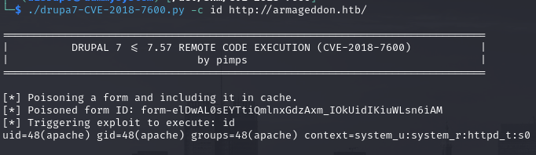

Cool Stuff but I was not able to retrieve a reverse shell, probably is not stable enough or idk what else happened. A run of searchsploit with `drupal 7` as parameter and we have the right solution which is the suggestion of the box title **<u>DRUPALGEDDON2</u>** (LOOKS LIKE A MOVIE TITLE LOL). Metasploit have a module just for that and I wanna stay in my comfort zone so this time msfconsole will save the day!

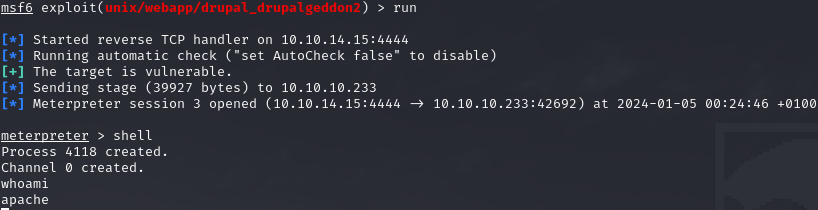

The webuser is not able to reach the `/home` directory (not even spawn a stable shell, that's why I was not able to pop up a reverse shell) so we need some horizontal movement. Pretty easy we can take a look at drupal configuration file and credentials will spawn in a blink of an eye

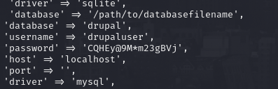

Now with this pretty bad "shell" we can use the credentials to exfiltrate all the rows in the `users` table

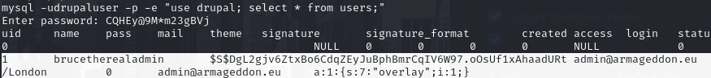

Now hashcat can help us to retrieve the plaintext

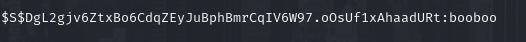

...and we have access to the user flag using the credentials to SSH into the machine, finally we have a stable shell!

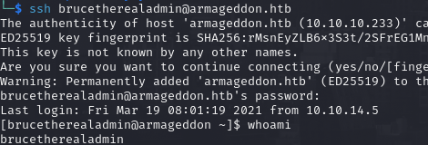

   

# PRIVILEGE ESCALATION
Ouch, we can run as sudo `snap install`

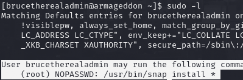

We can PE through a malicious crafted snap package thanks to **<u>fpm</u>** and the **install hook** of snap packages where we can inject the command we want to inject

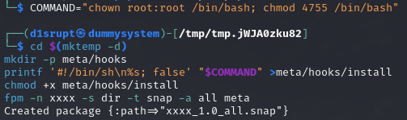

Cool now we can uploaded on the target amchine and execute the `snap install`

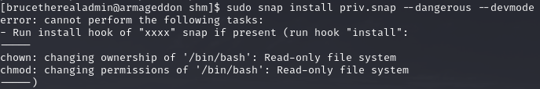

Ok cool is working but can't change the permission of the `bash` binary because is in read-only. I copied a the binary on the home folder cross the fingers...

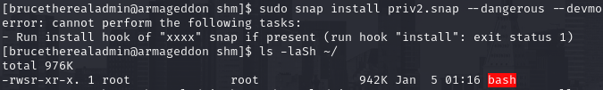

Uauuu amazing root!

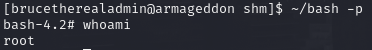
