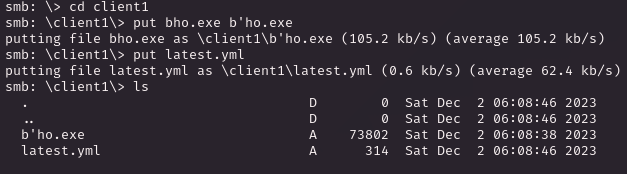

# PORT SCAN
* **80** &#8594; HTTP (Apache 2.4.46)
* **135** &#8594; MSRPC
* **443** &#8594; HTTPS (Apache 2.4.46)
* **445** &#8594; SMB
* **6378** &#8594; REDIS 

   

# ENUMERATION & USER FLAG
Pretty heterogeneous machine here, I like it!

The port 80 and 443 are the same (certificate doesn't have nothing important for us)

Well I have downloaded the file which is nothing less than an executable that we can run with `wine` and well was not pretty usefull

**<u>Error in auto-updater</u>** uhm interesting time to reverse the executable with `Ghidra` but actually nothing really clear (at least with my poor knowledge lol)

At least, SMB will give use some satisfaction back 

Inside we have a PDF with interesting info about the software telling that the current version is just a client with no other implementation plus give us this step-by-step guide on how the product release works

Cool stuff becuase the SMB share have 3 distinct (empty) **client folders**

I am starting to see how to start an attack here but what we mean with "update"? That's the point now so re-read the PDF and we have something

Atom...Electron...all makes sense now and we can start research things like [this](https://blog.doyensec.com/2020/02/24/electron-updater-update-signature-bypass.html) which would allow RCE on the target, we gotta it!

So first of all we haveour answer to what is intended as "update" which is a combo of `yml + actual exe file`.

Now what's wrong with electron is how the yml is parsed allowing attackers to bypass signatures and at the same time execute costum executable, all that we need

1) Create a reverse shell exe file with msfvenomen
2) Create a costum signature with 

3) Create the malicious yml file changing the signature with the new one and the executable/path like it follows

4) Use SMB to put this 2 files (remember the name of the exe file should be changed)

After few minutes I have received my shell back (I have lost time trying with a meterpeter shell but after going for the simplest one everything was way more smooth)

Uau cool, we have our first flag!

   

# PRIVILEGE ESCALATION
No special privileges to save the day this time (thanks god I was tired of the amount of boxes with `SeImpersonatePrivilege`), what we have is inside the **Downloads** folder which contains **<u>node_modules</u>** and **<u>PortableKanban</u>**.

The latter is a Calendar Organizer and [ExploitDB have a PoC](https://www.exploit-db.com/exploits/49409) to extract password given a `.pk3` file, actaully we have a file like that but with an additional `.lock` extension

We also have a `PortableKanban.cfg` file which is a JSON blob but, with an online JSON Beautify, I was able to understand his connection with the Redis server in order to send automatic notification via email

The encryption is useless for us but checking the redis configuration file we have the plaintext password

Now we can use the credentials to unlock the redis realm to us and we ca read an interesting KEY

At first I tought I was blocked again but with a quick look at writeups this is exactly the password we can retrieve with the ExploitDB script, the IV and the key are the ones hardcoded so cool stuff.

So I just changed the PoC so can decrypt an hardcoded value and we have what we deserve, the Administrator password

We are good to go with `PSEXEC`

