First time after a while in a Windows machine let's se what we can do here

# PORT SCAN

<u></u>

* **53** [DNS] &#8594; Simple DNS Plus
* **90** [HTTP] &#8594; Microsoft IIS httpd 10.0 

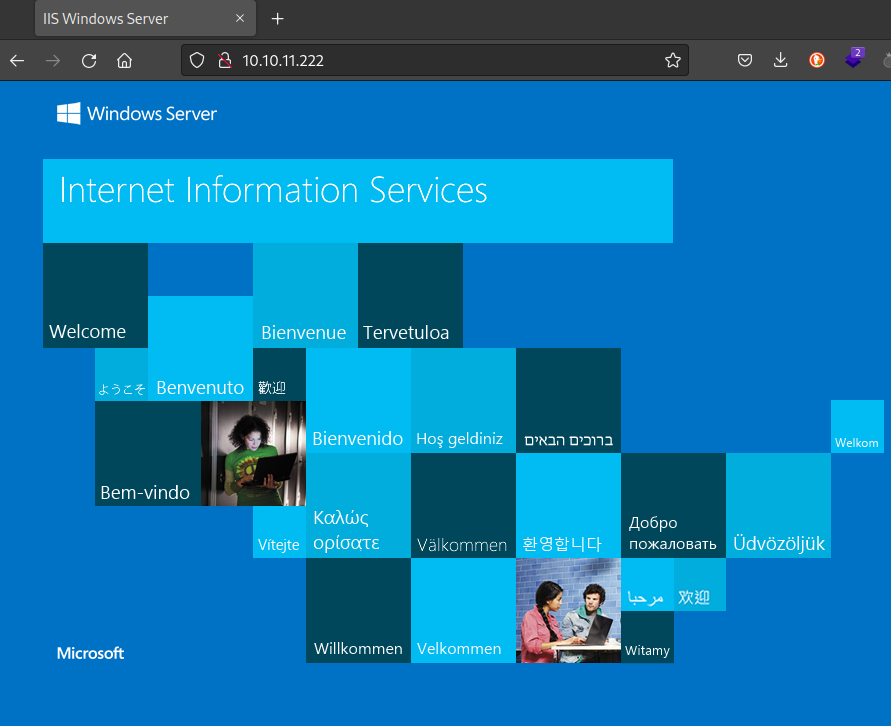

* **88** &#8594; Kerberos
* **135** &#8594; msRPC
* **139** &#8594; netBIOS
* **389** &#8594; LDAP
* **445** &#8594; Microsoft-DS
* **464** &#8594; kpasswd5 
* **593** &#8594; msRPC over HTTP 1.0
* **636** &#8594; Active Directory LDAP (**authority.htb**)
* **3052** &#8594; powerchute
* **3268**/**3269** &#8594; like 636
* **6646** &#8594; UKNOWN
* **8087** &#8594; SimplifyMedia
* **8443** &#8594; ssl
* **50839** &#8594; unknow (filtered)

<u>smb signing is enabled and **REQUIRED**</u>

 

I used **eum4linux** and here's the output

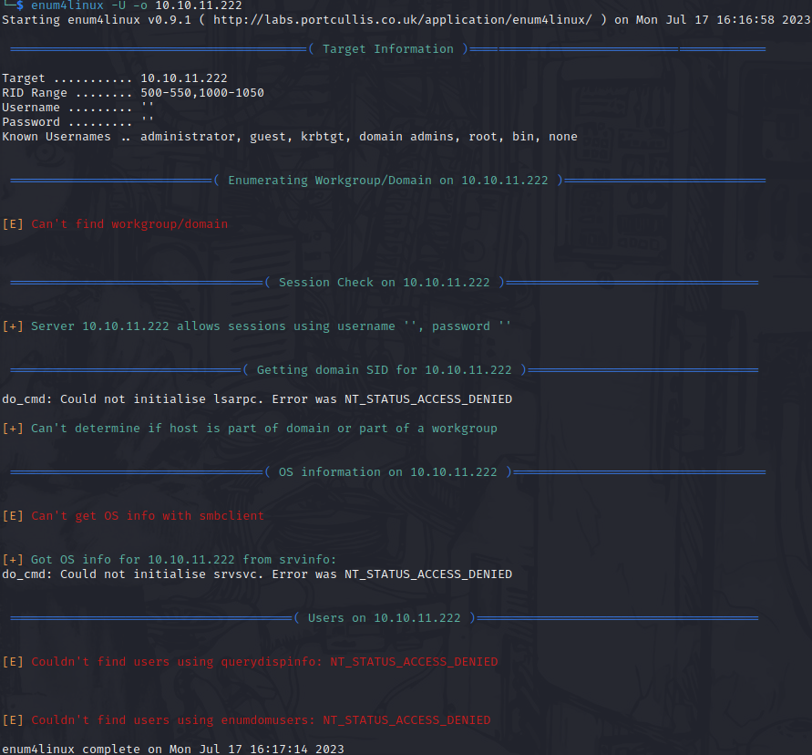

Note the `Server 10.10.11.222 allows sessions using username '', password ''`

We can try using **smbclient** with the anonymous login to access and here we have something especially the "**Department Shares**" and "**Development**"

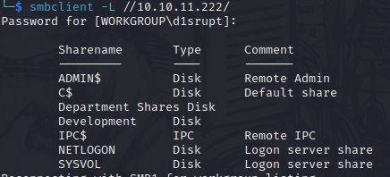

 

I will made a series of screen of the relevant discovery made 

* `\Automation\Ansible\` probably they used ansible to create the machine and inside we have `ADCS` (Active Directory Certificate Service), `LDAP`, `SHARE` and `PWM`.

I have a little knowledge in Ansible but I'm pretty sur no info would be scraped from **ADCS** and **LDAP** so I will focus on the last 2.

On **<u>/SHARE</u>** there is just `main.yml` but nothing juicy just instruction on how to setup the share directory

On **<u>/PWM</u>** we got something starting on `README.md`

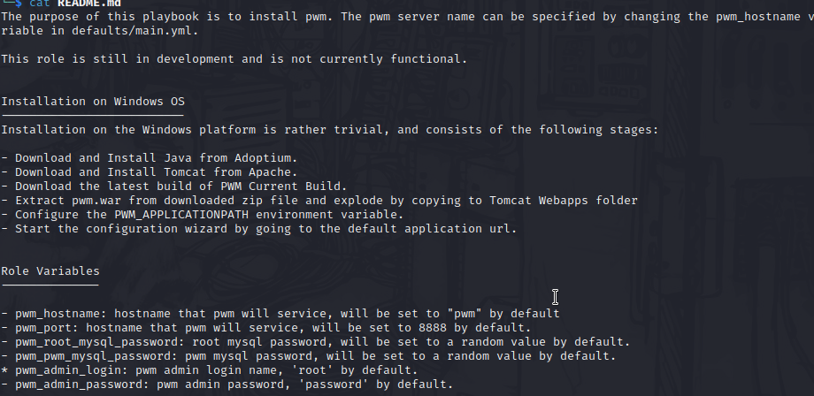

We can see that the credential **root:password** are setted by default in [PWM](https://github.com/pwm-project/pwm) which is a <u>open source password self-service application</u> for LDAP (in short is app that allows users to reset their passwords without contact the helpdesk)

 

`/defaults/main.yml` give us something interesting (at first sight)

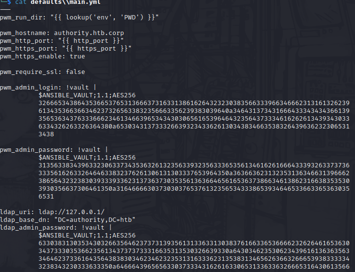

With `/tasks/main.yml` we can have some software installed on the machine (maybe) like Tomcat and Java

We have some credential of the tomcat service on `/templates/tomcat-users.xml`

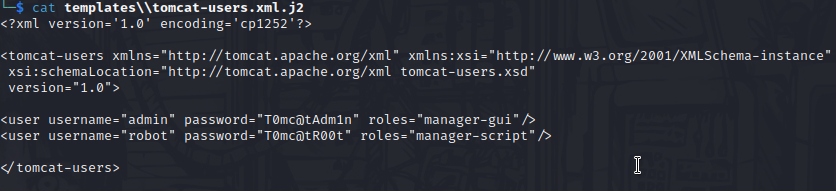

In `/LDAP/TODO.md` was a checklit indicating the LDAP admin password was changed

  

I tried do something with **RPClient** but the permission were to low to enumerate users and groups so I decide to make further investigation on the Ansible folder

  

In `Ansible/PWM` found the file **ansible_inventory** 

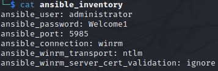

Tried to access on port 5985 but **ERROR 404** occured o I gave up on this pretty soon

  

After a while I had some potential good credentials inside `/Ansible/PWM/defaults/main.yml` I have found a file identical at the one located in `Ansible/LDAP/defaults/main.yml` and I have decided to focus here (also we have the account named **authority** which can be an hint since the name of this box is the same)

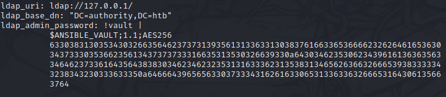

With some research it's obvious that the password is encrypted with **ansible-vault** and we would need the passphrase in order to retrieve it, I searched everywhere but no trace of it.

Than I found this [site](https://www.onlinehashcrack.com/tools-ansible-vault-hash-extractor.php) (but we can do the same with the tool **ansible2john**) to convert the ansible vault file to hashes so we can crack it with johntheripper.

The cracking success in no time and we have **!@#$%^&*** as password 

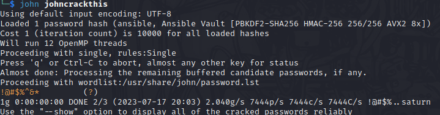

It get me huge time to understand that this password was not a part of a credential set but instead was a passwod used by **ansible-vault** to decrypt every <u>vault</u> (for "vault" it means every string encrypted using ansible-vault)

Now we can simply decrypt the 3 vaults resulting in

* **<u>pwm_admin_login</u>** = svc_pwm
* **<u>pwm_admin_password</u>** = pWm_@dm!N_!23
* **<u>ldap_admin_password:</u>** = DevT3st@123

  

From this point I was pretty lost but re-looking at the enumaration nothing helped me.

With a few hints gave me by some member of the community suggested me to red the nmap scan and here things changed

I used the `-A -T4` flags but more than one told me this was too fast and I can miss something so I tried with something basic and slow

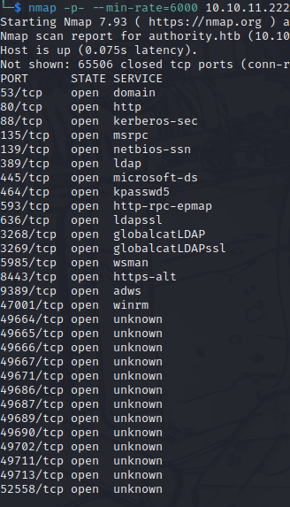

I have not explicitly said that but we are inside an Active Directory machine and 2 ports are really really strange to see in a AD machine
* **port 80** &#8594; HTTP
* **port 8443** &#8594; HTTPS-ALT

As more than one people and resources explained is not a good security practice to use some webapp in an AD machine

Btw the point here is that I've lost in the first scan the port **8443** let's go there and find what we have to play with

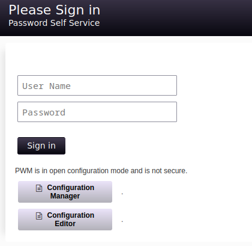

Cool this is the interface of PWM which we have enumerated, note that even if PWM ask us credentials we can interract with **Configuration Manager** and **Configuration Editor** just using a password....and we have 3

The password **pWm_@dm!N_!23** let me get inside

  

As always is not get in but **what you do after you get in** and here is no different. Obviously I've spend a lot of time smashing my head on the wall before get something but was really usefull because I've learned something brand new!

Never heard about **pass-back attack**? If not you can start [here](https://www.mindpointgroup.com/blog/how-to-hack-through-a-pass-back-attack) but will be easier reading through this document.

In Configuration Editor we have the following UI and in 
`LDAP --> LDAP directories --> default --> connection`

We have the following page

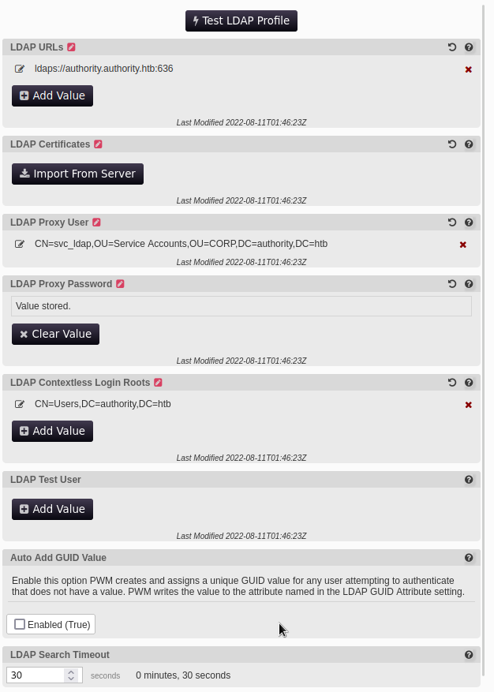

In the **LDAP URLs** we see an ldap url with the name of the machine and if we test it we are rturned with an error.
When we are talking about LDAP in a windows enviroment we can't ignore `RESPONDER` which have a preinstalled LDAP server ready for us. so know what if we replace the standard LDAP URL with something like `ldap://[ATTACKER_IP]:389`?

Let's try!

I used LDAP and not LDAPS to have the payload in clear obv, now run RESPONDER, change the URL as said before and press "Test LDAP Profile"

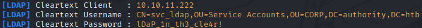

Yes we got the password and in cleartext, cool! Let's use this credential on Evil-winRM to check if they are right and yes we got it!

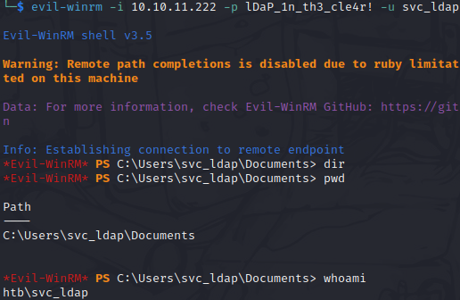

Took the user flag as fast as I could and we can move in Privilege Escalation

 

# PRIVILEGE ESCALATION

This is my first time after a while playing on a Windows machine so I get my time and try to enumarate how much I can starting with **WINpeas** the windows version of linpeas

Actually nothing from the WINpeas output but was good to refresh my mind a little. Inside the Desktop directory togheter with the flag we have **Certify.exe** which the description of this tool is `Find information about all registered Certificate Authorities`, uhm the name of the box is Authority so maybe this is the right way. In addition this tool was there like a jewel on the other side of a glass ready for us. The version is **v1.0.0**

In github the developer describe this tool as `Certify is a C# tool to enumerate and abuse misconfigurations in Active Directory Certificate Services (AD CS).` so is actually a pentest tool (maybe another player left it there without deleting it)

 
So let's use it with `find /vulnarable` and will return us a vulnerable certificate which can be abused

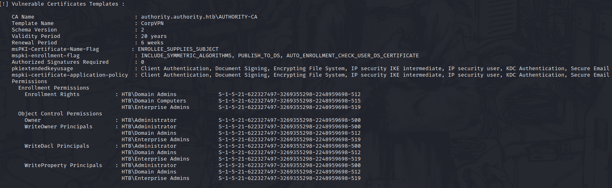

But if we use `find /vulnerable/currentuser` we have no certificate that can be abused in a group which the current user is member of

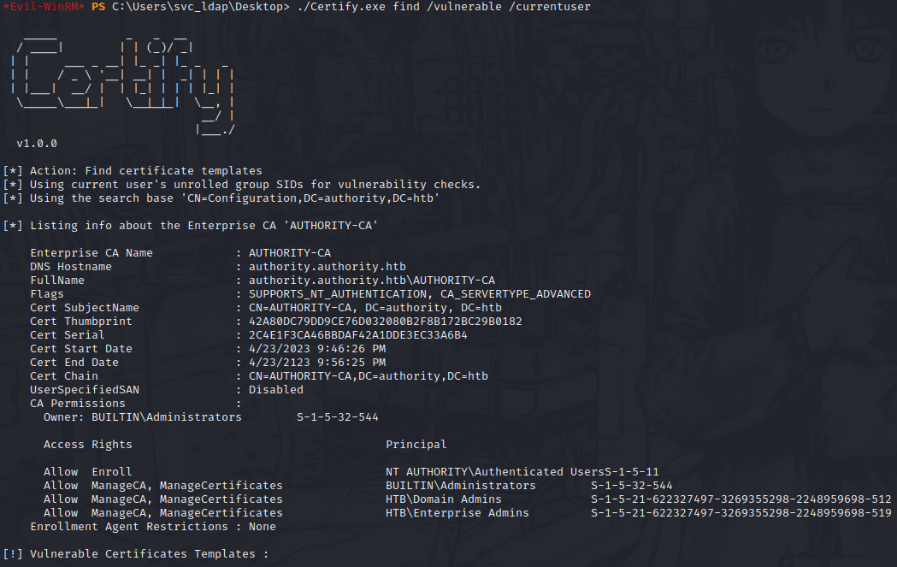

I take some time to understand what this output mean to me first of all we have the certificate authority which full name is **authority.authority.htb\AUTHORITY-CA**. Looking at the permission every authenticated user can Enroll

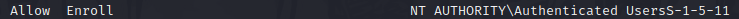

So yeah we can interract with this AUTHORITY until we are logged in

 

The template called **CorpVPN** is vulnerable because a low-priv group can ask for enrollment despite or not the role of the user logged in 

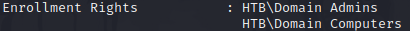

I have tried (using Certify.exe) to ask the template and it gave me error

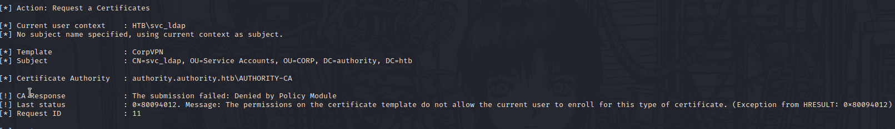

This is why the machine we are in is not part of the Domain so we have to be part of that group

I have loaded and imported Poverview to get some enumaration and we have the privilege to add computers to the domain, cool stuff!

I used `addcomputer.py` from impacket and we are successfully part of the AD domain. Now we can abuse the low permission of the certificate.

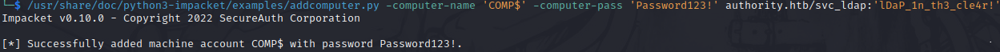

Than we can use **certipy** to request the DC to get the vulnerable certificate found before called **certipy**

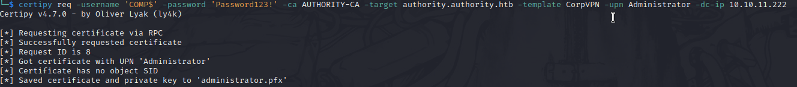

I tought everything was ready and use **auth** option on certipy buuuuut

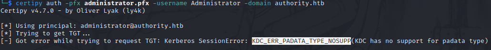

# PASS-THE-CERTIFICATE

Let's focus on how kerberos authentication work

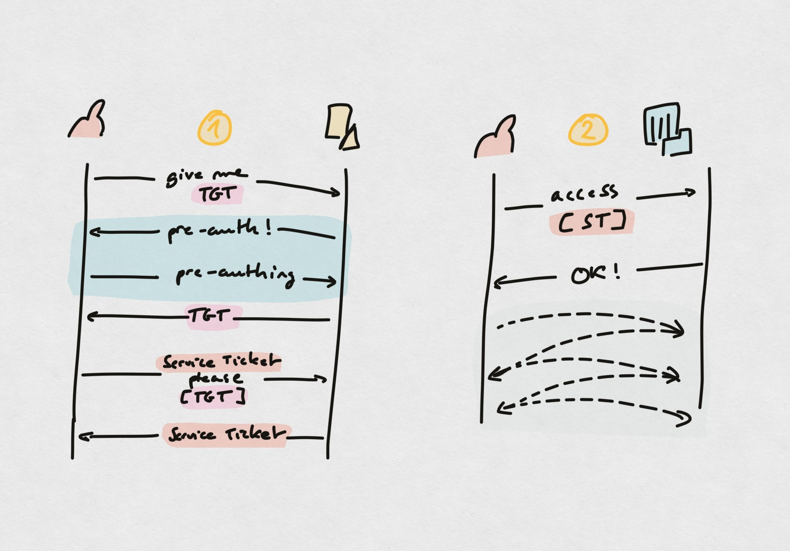

As you can see we have a **pre-auth** section called  (light-blue section) and can happen in 2 ways after the DC required this pre-auth :
1) Timestamp encrypted with user Kerbros key (symmetric, usually RC4 key)
2) Certificate = public key **<u>signed</u>** with private key (asymmetric, no need for a third party) &#8594; **<u>PKINIT</u>**

Obviously we are talking about the 2nd method, we need to understand what that error mean and how to bypass it.

The error occur `KDC_ERR_PADATA_TYPE_NOSUPP` when a DC doesn't have  the certificate installed for PKINIT or the CA cannoct be contacted to get Domain Controller....in short we can't use this vulnerable certificate to authenticate directly with kerberos

As far, we know the certificate (that we have obtained before with certipy) so we can do something called **pass-the-certificate**, really similar to pass-the-ticket or pass-the-hash but with certificate. 

Pass to who?  
Neverd heard of **Schannel**? Me neither, is a Support Provider Interface backing on TLS/SSL (which use certificate to authenticate).
There are different added feature including **DC authentication** providing a SSL/TLS connection using LDAP or LDAPS and this are the guy which our certificate can be passed!

Using certipy we can extract the certificate and the key from the **pfx file** and use [this PoC](https://github.com/AlmondOffSec/PassTheCert) to exploit this situation

The way I decide to use it is to change the administrator password and get access through Evil-winRM

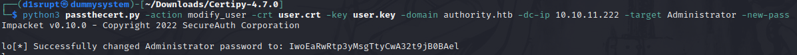

But you can also elevate your low-priv account if you prefer to be stealthy

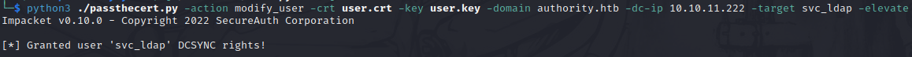

ROOTED!

