# PORT SCAN
* **22** &#8594; SSH
* **80** &#8594; HTTP (APACHE 2.4.41)
* **1337** &#8594; UNKNOWN

   

# ENUMERATION & USER FLAG
Port 80 is running `Wordpress 5.8.1`, good sign

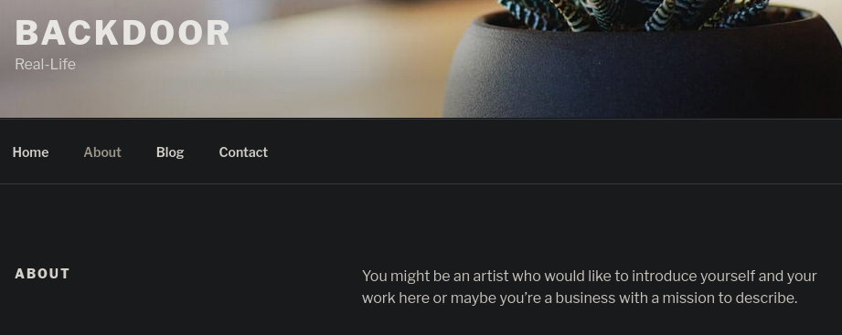

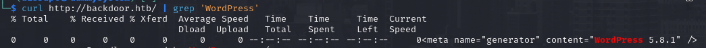

Enumeration found nothing but a plugin called **<u>Ebook-Download</u>** inside `/wp-contents/plugin`. ExploitDB have an [exploit](https://www.exploit-db.com/exploits/39575) just for this specific version (**1.1** that can be checked on the readme.txt inside the plugin directory). As you can see we are able to download file on the target

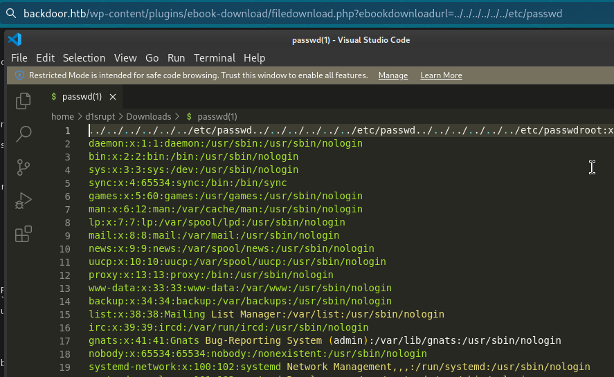

Now we can use the `/proc` filesystem directory to get some info about what is running on the target side. I have already tried to do some cache poisoning on the `apache log file` and `/proc/self/environ` but apparently we have no permission to access that files. Look at this example

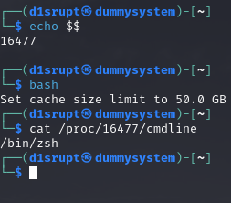

At first I have just echoed the PID of the current shell, than we are spawning a shell and we are visiting the PID directory inside proc, the cmdline file is interesting. It contains what actually the process is running which is the bash!
The idea now is to bruteforce the PID on that specific path and maybe find something similar that can help us to get inside.

To accomplish this I used the **<u>Burp intruder</u>** and `842` looks pretty interesting...

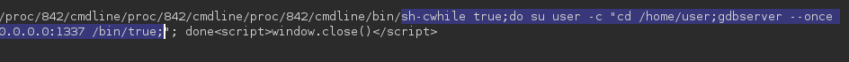

Finally I know what is running on port <u>1337</u> and [this](https://book.hacktricks.xyz/network-services-pentesting/pentesting-remote-gdbserver#exploitation) appears to be the way to get a reverse shell now

First we create a **<u>msfvenom</u>** payload with the `PrependFork=true` (essential for the attack) as `elf` file and we extend a gdeb session with the target GDB port as debugger

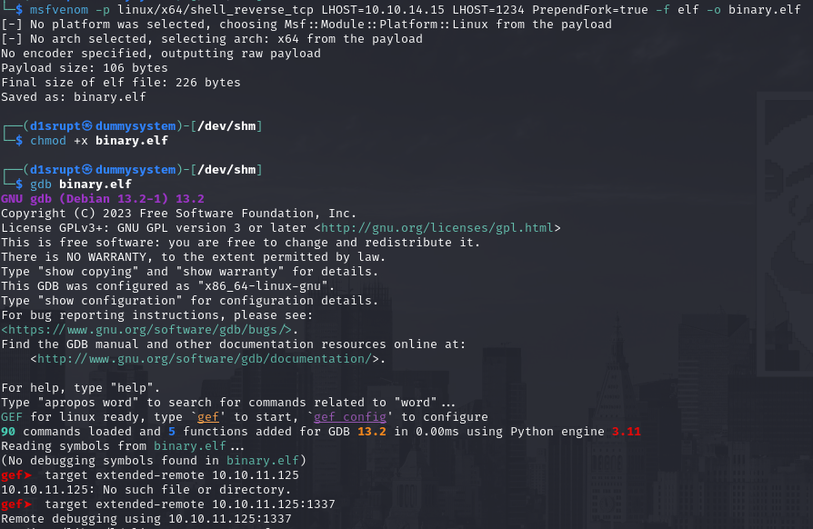

now we just nee to put the local file remotely and than point to it as executable

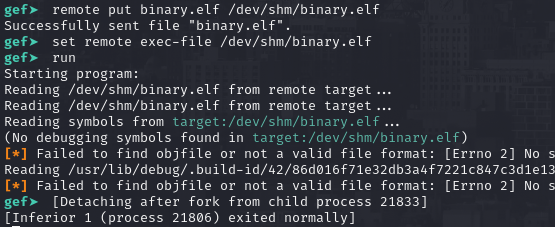

As you can se a child process has been created and is our reverse shell!

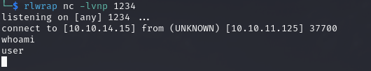

Finally we can grab the suer flag now!

   

# PRIVILEGE ESCALATION
No `sudo` without password and no SUID so is time to enumerate, usually `/var/www/html/wp-config.php` sounds cool when wordpress is running

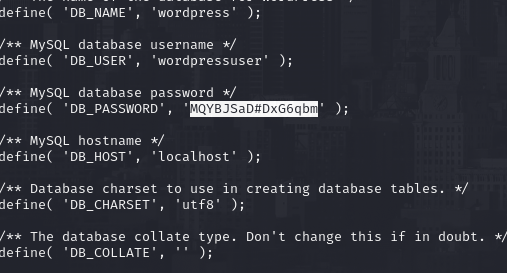

Cool mysql credentials that is pretty cool and inside I found a password for the admin user 

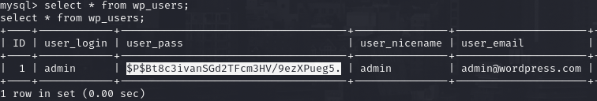

phpass take quite a good amount of time to crack so meanwhile hashcat is running we can go through and check something else. We have an interesting process run by root involving `screen`

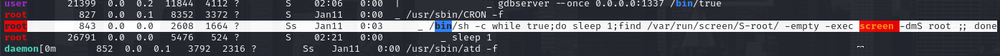

Interesting stuff, we need to do a sort of hijacking (similar to TMUX) but I don't have access to others screen sessions and [here I found a cool answer](https://unix.stackexchange.com/questions/219851/how-to-access-screen-created-by-other-users) that maybe can help me to get over it

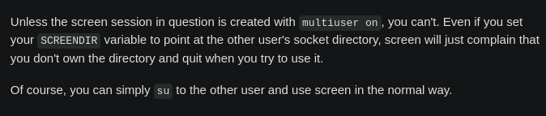

I don't know how the file is configuredinside root but we know that run in deteached mode (`-dmS`) and we can use the `-x root/root` flag to attach on that session and luckly it worked. We are impersonating admn right now! (yeah the admin hash was a hole in the water ehehe)

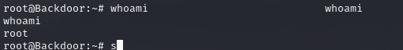
