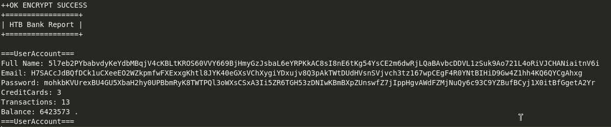

# PORT SCAN

* **22** &#8594; SSH
* **53** &#8594; DNS (ISC BIND 9.9.5)
* **80** &#8594; HTTP (APACHE 2.4.7)

   

# PRIVILEGE ESCALATION

This bank is just waitig to be robbed, I am the thief!
Port 80 is a login form

It can be all here, in fact `ffuf` found the **<u>cryptix</u>** subdomain which just have a default Apache2 page

The directory busting on the base domain found `/balance-transfer` with a huge number of file listed

This is a random file that I have picked

I looked closely at the size of each file and there was 1 really low respect to others

The motivation of why is extremely low is because is not encrypted at all and have some hardcoded credentials

Obviously they are the key to open the chris bank account

We have a `Support` section inside the account dashboard which permits to attach a file on a ticket system which will be posted and give a link to to view the attachment (`/uploads/[file_name])` . The bank system is not a total dumb, it permitts only image file to be uploaded so we have to bypass it and if we are successfull we will achieve RCE through a PHP webshell!

The first thing I tried was **Poison Null Bye Inject** but somehow it did not worked as is suppossed to also different methods like the one listed [here](https://null-byte.wonderhowto.com/how-to/bypass-file-upload-restrictions-web-apps-get-shell-0323454/) and on HackTricks but the answer was in front of us (actually I don't like this CTF stuff I don't feel their usefull enough but remember HTB BOXES ARE A GAME!) because on the source code there is a interesting comment...

Oh god....Well we can achieve RCE throgh this extension

Good, I used the **Ivan Sincek** PHP reverse shell to have a stable shell on my netcat listener. After that we can take the first wave of money we found in this bank :)

   

# PRIVILEGE ESCALATION
We aregreedy and we are here to steal, we don't have enough money yet. WE WANT TO HOLE THE BIG SAFEBOX!

This was pretty quick and a piece of cake after all. I searched for some SUID binaries and found  `/var/htb/bin/emergency`. I was not sure of the behaviour of the binary....so I jut ran it and we get a shell as root!

> Yeah very disappointing and not challenging, maybe is the message the box wants to communicate is that bank are (strongly) understimating computer security
