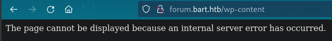

# PORT SCAN
* **80** &#8594; HTTP (IIS 10.0)

   

# ENUMERATION & USER FLAG
Port 80 redrect to the subdomain `forum.bart.htb` so let's add it to the hosts file and start enumeration 

A simple static brochure of a fictional company, on the footer we know is made by **<u>WordPress</u>** (this is good news for us). No other subdomain discovered as much as directory busting but seems strange because a `wp-content` directory should exist according to the source code

But when I try to access it an error raise (also `wpscan` say he can't find this directory)

By the way I have found some potential usernames (`d.simmons` and `h.potter`) in the source code looking at all the email present and always on the source code we can find the wordpress version

Another scan retrieve that `monitor.bart.htb` exist

Interesting stuff here we can make some bruteforce, I collected all username and used `cupp` to create a list, Hydra can't be used because every request will be considered valid (every request end with status `200`). Probably I need to make some tuningon hydra but I consider `burp intruder` a faster solution. I tried with the username list (**Cluster Bomb** attack) and the rockyou wordlist but nothing cool happen. So I will do something more tedious using the same list as password payload with some tuning on the `Resource Pool` to make it faster.

After a while the `harvey:potter` credential give us a unusual results

With this credentials we can get inside the dashboard

The dashboard monitor the status of `internal-01.bart.htb` which point to another login form

This doesn't look like a well done web-application looking at the poor style and bad graphics, I have come from the `StreamIO` machine so I have a good training on enumeration stuff

FFUF found the `register.php` page, we know from the login page source code that the 2 paramters are **uname** and **passwd**, with this information we can force a registration

I had some problemt just because the **content length** and **content type** headers need to be added after that we are inside the development chat

If we intercept the request when we press the `Log` button we can notice that the request is asking for a specific file and username

I tried with exfiltrate `/windows/wuin.ini`, it didn't not worked but raise an error telling us that we don't have enough permissions

Good news is that we can attack the application through `RFI`, I have checked asking for a resource hosted on my SMB server so I tried to host a PHP code with a RCE calling back to metasploit. It didn't worked but something curios happened...

The username and the `User-Agent` are appended in the PHP file, this is the behaviour of the **<u>log.php</u>** file.
Well the User-Agent can become a very strong poison since we can use it to inject PHP code inside it, a new php file can be created which will contain the PHP code

After that we can access the file and the RCE will be triggered!

Unfortunately the metasploit listener will not work (it happens since reliability as C2 of metasploit is not one of the best in the market) but we can use it for a simple **NC reverse shell**

Since there are no trails of the user flag  (obviously **seImpersonate** abuse will be skipped) we needto make some movement.
Defender is blocking the upload of **WinPEAS**, this explain why the metasploit payload was not working. Something different is needed, I used the [powerup](https://github.com/PowerShellMafia/PowerSploit/blob/master/Privesc/PowerUp.ps1) powershell script, I have appended at the end of the file `Invoke-AllChecks` and use **IEX** to execute it directly in memory

Well was worth trying this little trick I think we need to make some manual enumeration in order to find something and the IIS directory is a good place to start. We have some harcoded database credetials in the `include` directory of the `internal-01` subdomain

With some quick MySQL commands we are able to identify some precious hashes

Duting webapp enumeration I saw that anPHP file in `includes` are used on the password to validate, maybe it will not just validate the length of the password

Gottch'a some salt has been added before hash the plaintext this is good to know! I added the salt in the hash file and the first one (`harvey` user) has been successfully cracked with **-m 1410**

Harvey in the windows machine should be `h.potter` so we can create a new Powershell Session with this password

Now we can use a base64 encoded powershell reverse shell to impersonate this user which own the user flag

   

# PRIVILEGE ESCALATION
Since I have prepared **<u>PowerUp.ps1</u>** for the previous user is still worth trying for `h.potter`, maybe he have enough permissions to look further. This time will not be so innocent :)

We have credentials in the **<u>Autologon registry</u>** we can spawn another PowerShell instance and use it to call a reverse shell but this time as `Administrator` but before let's check if the password is still in use

Cool, we are free to grab the root flag right now!

