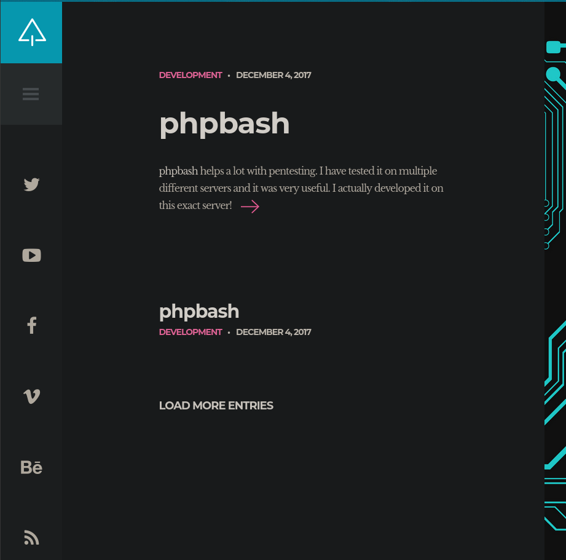
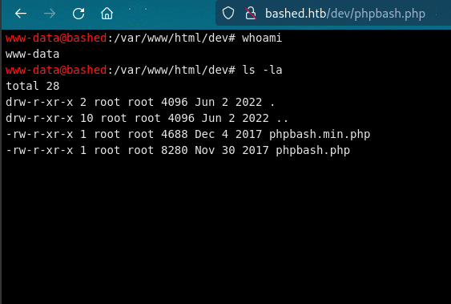
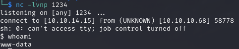
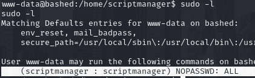
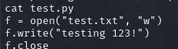
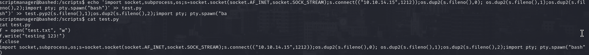
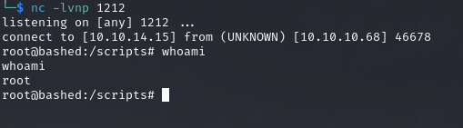

# PORT SCAN
* **80**&#8594; HTTP (Apache 2.4.18)

   

# ENUMERATION & USER FLAG
Just webapp exploitation path right here, let's get started!

The `phpbash` anchor points to a [github repostory owned by the author](https://github.com/Arrexel/phpbash) of theb box containig a PHP reverse shell " to assist in penetration tests where traditional reverse shells are not possible".

Well I tought I have to access some admin panel or find a way to perform RFI but actuallyu to use this webshell was easier than exprected, after some fuzzing I was able to locate the `/dev` directory containing the webshell of the author!

LOL! This webshell is able to reach my local machine (test it with `ping`) so I used to get a reverse shell on my local machine

On `/home/arrexel/user.txt` is where our flag is waiting to be grabbed!

   

# PRIVILEGE ESCALATION

We can use sudo to impersonate `scriptmanager` user without the password,so I used to spawn a shell as that user. in the root directory we have a uncommon directory called `scripts` which contain a `test.py` and `test.txt` the former is owned by the user we are impersonating and the latter by root. About every minute the `test.txt` results modified and looking at the content of the python file everything is clear

We can assume that root every minute execute the `test.py` script. We can replace it with a reverse shell uploading from the local machine or injecting directly in the script, I opted for the second choice 

within a minute we see the root shell popout!

