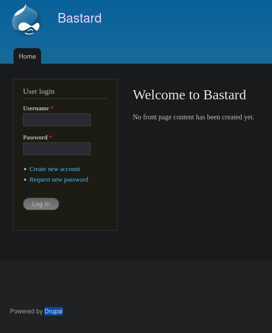
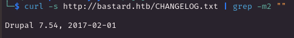
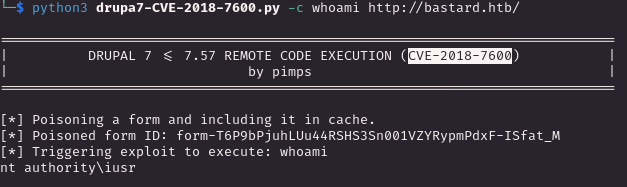
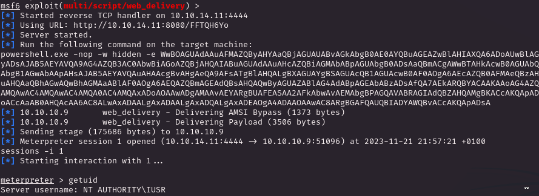
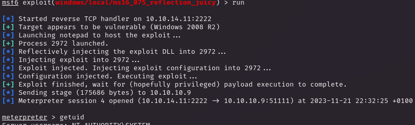

# PORT SCAN 
* **80** &#8594; HTTP (IIS 7.5)
* **135** &#8594; RPC

   

# ENUMERATION & USER FLAG
This first part is focused only on web pentest and PHP, the webpage is made in Drupal

Checking the `/CHANGELOG.txt` we have the drupal version which is **7.54**

I made some enumeration trying to bruteforce nodes and user using the Burp Intruder, dirbusting and subdomain bruteforcing (was not expecting much but good try can't hurt that much).

The drupal version is vulnerable to RCE through form poisoning and there are multiple public exploit for this [CVE-2018-7600](https://github.com/pimps/CVE-2018-7600)

Cool it worked! Now I have injected the powershell command given by the `exploit/multi/script/web_delivery` module on metasploit

Cool, this user have enough privileges to get the user flag

   

# PRIVILEGE ESCALATION
The OS is WIndows 2008 R2 with `SeImpersonatePrivileges` on the user we have jumped into it, I tried with the Juicy module on metasploit but it we flip the tables changing the CLSID using [this](https://ohpe.it/juicy-potato/CLSID/Windows_Server_2008_R2_Enterprise/) as reference

The first CLSID on the list was enough to trigger the high privilege reverse shell

