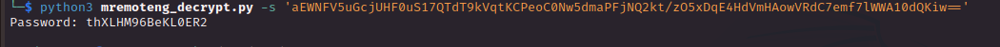

# PORT SCAN
* **22** &#8594; SSH
* **135** &#8594; MSRPC
* **139 / 445** &#8594; SMB
* **5985** &#8594;WinRM

   

# ENUMERATION & USER FLAG
SMB, as always good thing to start and we can login as anonymous

We have some txt files and a directory 

Inside we have a backup directory which contain a `VHD` file (Virtual Hard Disk). Time to learn how to approach this file and maybe retrieve something usefull

1) I have mounted the remote directory 

2) Now we have the VHD file ready to be mounted (if I just downloaded it as normal SMB files they will be empty but here is not the case)

3) To mount a remote filesystem linux have ready for us a command called `guestmount`

 

Now we are inside the virtual hard disk let's search for a SAM file. On the default location `Windows\System32\config` we have what we need

Now we need to take both **<u>SAM</u>** and **<u>SYSTEM</u>** file in order to use `samdump2` and retrieve the L4mpje hash

The <u>**SYSTEM**</u> file store information abut windows registry and is needed to access the crypto used to decrypt the hashes inisde SAM

Using hashcat we have the plaintext password we can use on ssh and grab the user flag

   

# PRIVILEGE ESCALATION
Inside `Program Files (x86)` I note we have a software called **<u>mRemoteNG</u>** which is a manager of different remote location (like VNC). Would be cool to check the version
Reading the file `Changelog.txt` we have the version 

This is vulnerable to plaintext password retrival

There a lot of method to retrieve it I decide to retrive manually the Administrator passwrod stored inside `L4mpje/AppData/mRemoteNG/confCons.xml`

Than I found [this PoC](https://github.com/haseebT/mRemoteNG-Decrypt) online so we just need to copy and paste the strings and will be decrypted

Essentially, the password is encrypted with a costum password but if is not decided a standard one is used which is the case here.

Cool we have the Administrator password to use on SSH and we are free to grab the flag

