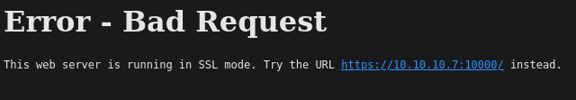
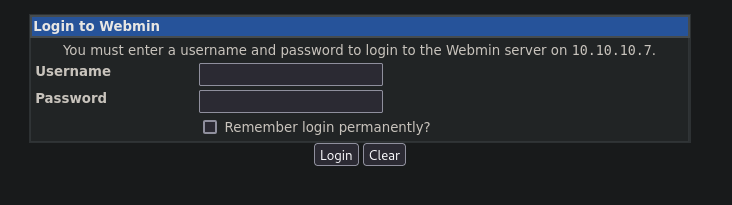
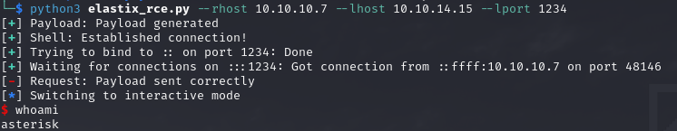

# PORT SCAN
* **22** &#8594; SSH
* **25** &#8594; SMTP
* **80** &#8594; APACHE (HTTP 2.2.3)
* **110** &#8594; POP3 (CYRUS 2.3.7)
* **111** &#8594; RPC
* **143** &#8594; IMAP (CYRUS 2.3.7)
* **443** &#8594; HTTPS (APACHE 2.2.3)
* **993** &#8594; SSL
* **3306** &#8594; MYSQL
* **4559** &#8594; HYLAFAX (4.3.10)
* **5038** &#8594; ASTERISK CALL MANAGER (1.1)
* **10000** &#8594; MINISERV (1.570)

   

# ENUMERATION & USER FLAG
Uau a lot of services running, pretty overwhelming but this is just a good thing, we have a lot of place to get info from. Is also possible that a more than one way is possible to compromise this box.

We start simple from HTTP service which redirect to HTTPS and a strange error pop up...

It appears that the SSL version used by the server is lower than 1.2 the minimum required by firefox (I also tried Brave and Chrome with no different outcomes), same thng happen when we try to access port 10000 which ask to use the HTTPS protocol rather the standard one

We can easily put the minimum version of TLS supported on FireFox going to `about:config` and set `security.tls.version.min` to **1**. Now we can access the services provided on the box! On port 10000 we have a `webmin` login form

While on standard HTPPS port we have an `Elastix` login page

This specific service is vulnerable to a [RCE vulnerability](https://www.exploit-db.com/exploits/18650),  I used this [well done PoC](https://github.com/k4miyo/FreePBX-Elastix-RCE-exploit) to get a reverse shell

> I saw the different methods to gain foothold of the machine and this one is the only one where you spawn as non-root user this is why the other paths are not present here

   

# PRIVILEGE ESCALATION
Even for the PE section seems to be multiple ways to root the machine, especially with `sudo -l`

nmap is always a good choice thanks the **interactive mode**

Also `chmod` is a dangerous binary to give SUDO permission without password....

Really easy machine, piece of cake!
