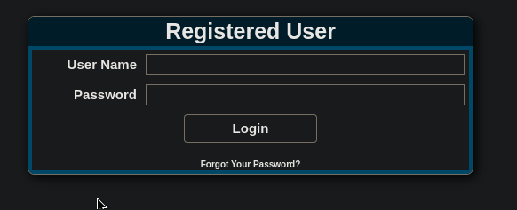
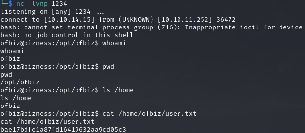
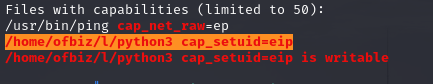
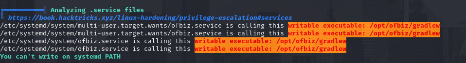
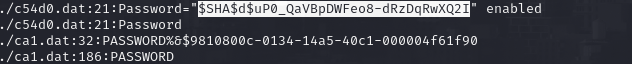

# PORT SCAN
* **22** &#8594; SSH
* **80** &#8594; HTTP (NGINX 1.18)
* **443** &#8594;HTTPS (NGINX 1.18) 
* **35741** &#8594;


<br><br><br>

# ENUMERATION & USER FLAG

The https site is a general business company brochure made with **<u>Apache OFBiz</u>**. Some dirbusting show up the `/accounting` path that redirecto to a login form



**admin** is a valid user and some weak password was not usefull at all. On the bottom the version is `18.12` and apparently is vulnerable to pre auth RCE using cgi-bin and java deserialization. [This PoC](https://github.com/abdoghazy2015/ofbiz-CVE-2023-49070-RCE-POC) prepare everything in order to get a shel and the following flag!



<br><br><br>

# PRIVILEGE ESCALATION

Here is where the "hard" part kicks in especially because a lot of false positive are triggered by linpeas like the following 2 images which cost me a lot of time





That's actually fine, the way to root was to investigate the directory we have spawned when triggering the reverse shell which is `/opt/ofbiz`. Thanks to the documentation and a lot of patience I was able to discover that ofbiz use **<u>Derby</u>** as DBMS and now the confusing part is coming.

I used `grep -arin -o -E '(\w+\W+){0,5}password(\W+\w+){0,5}'` inside `/opt/ofbiz/runtime/data/derby/ofbiz/seg0` (a lot of file contained here) and I foun a SHA hash



Now the offcial github of ApacheOFBiz we can find the [class which is used to encrypt the passwords](https://github.com/apache/ofbiz/blob/trunk/framework/base/src/main/java/org/apache/ofbiz/base/crypto/HashCrypt.java) and we know the password is salted with `d`. With some patience and the help with some GPT I was able to crack it using the rockyou wordlist

```{python}
import hashlib
import base64
import os

def cryptBytes(hash_type, salt, value):
    hash_obj = hashlib.new(hash_type)
    hash_obj.update(salt.encode('utf-8'))
    hash_obj.update(value)
    hashed_bytes = hash_obj.digest()
    result = f"${hash_type}${salt}${base64.urlsafe_b64encode(hashed_bytes).decode('utf-8').replace('+', '.')}"
    return result


search = "$SHA1$d$uP0_QaVBpDWFeo8-dRzDqRwXQ2I="

with open('/usr/share/wordlists/rockyou.txt','r',encoding='latin-1') as password_list:
    for password in password_list:
        value = password.strip()
        hashed_password = cryptBytes("SHA1", "d", value.encode('utf-8'))
        # print(hashed_password)
        if hashed_password == search:
            print(f'Found Password:{value}')
```


With this password we can just use `su` and be root!
