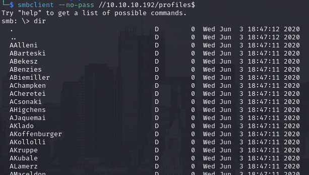
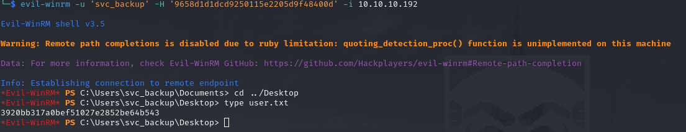
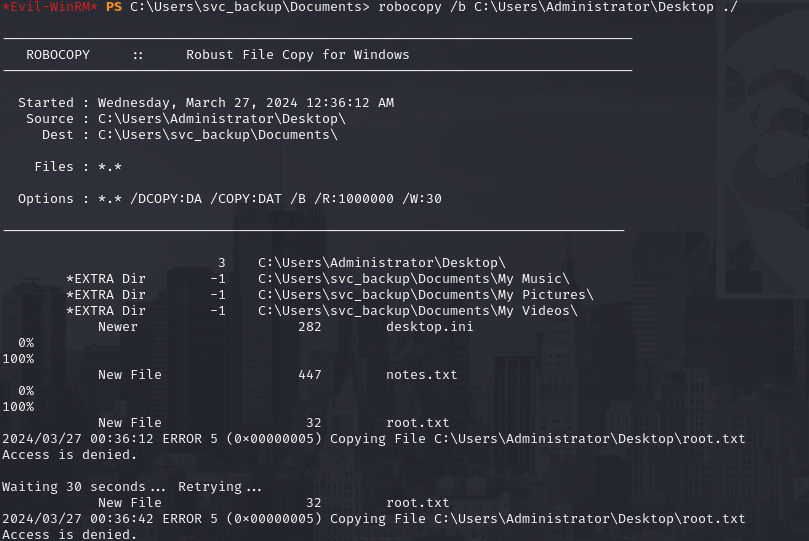
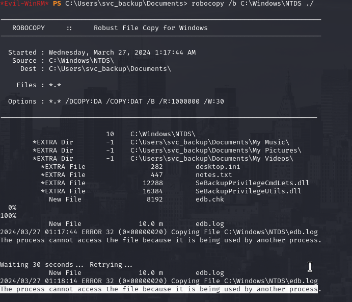
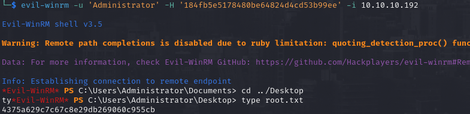

# PORT SCAN
* **53** &#8594; DNS
* **88** &#8594; KERBEROS
* **135** &#8594; RPC
* **389** &#8594; LDAP
* **445** &#8594; SMB
* **5985** &#8594; WinRM

   

# ENUMERATION & USER FLAG
A simple Domain Controller with nothing web-related (slay!) so we can start from SMB or LDAP checking for null sessions, the former is fine to accept anonymous login!

The `profiles$` folder contains a long list of hidden directory with what seems to be usernames (forensic's folder contents cannot be retrieved because we don't have the permissions)

Well is not that bad to have a list of username in AD so I took the list and use `cut` utility to take just the username and have a clean username list

Now we can have fun, I always like to start with a old trick of use `impacket-getNPUsers` to check if this usernames are valid or not inside the domain (blackfield.local) , well we filter the majority of the users in the list

We also have an hash of the user `support` that we can use to perform **<u>ASREPRoasting</u>**, it required just a few minutes but was worth it because now we have a plaintext password!

I tried to check if we can get inside the SMB share called forensincs but we don't have enough permissions right now, my intuition push me to think that the user `audit2020` is the one with such permissions but is just an hypothesis and we don't hack using hypothesis we need information! Well we have some valid credentials so we can retrieve information for bloodhound with `bloofhound-python`!
After firing up bloodhound I choose the `support` node and use the **<u>First Degree Object Control</u>** query that highlights a powerful action can be performed, we can change the password of `audit2020` 

We can do this using `net` command like the following line

`net rpc password "audit2020" "newP@ssword123" -U "BLACKFIELD.local"/"support"%"#00^BlackKnight" -S 10.10.10.192`

Now we can finally access the `forensic` folder and I use mount to get the contents of the folder localy (using **mget** on smbclient is too much heacy and get broken after the first 2 files), without listing all the contents of the 3 direcotry inside this share I have found a zip file that contains a **dump of the lsass process**

LSASS process store hashed credentials for SSO purpose and having a dump of it is really really rare and powerfull, in order to extract information from a DMP file in linux we can use the python version of mimikatz **<u>pypykatz</u>**. We have the plaintext of the machine account but is not working (keep in mind the change of this password should occur at least 1 time per year so no surprise that is invalid the one in the dump file), what's new is the <u>`svc_backup` **NT hash**</u>!

Easy and smooth we can log in as this account through winRM and get the first flag

   

# PRIVILEGE ESCALATION
Noiw is game over! The `svc_backup` user is a member of the **<u>BACKUP OPERATORS</u>** group, this means we can create a copy of every file in the domain controller for backup purpose. The first thing I tried was to copy the SAM, SYSTEM and SECURITY registry locally 

Unlucky when I use secretsdump on these file locally nothing return back so we need to go a little further

Well be part of this group also means that we have `SeDebugPrivilege` available so we can use **<u>robocopy</u>** to copy the desktop of the Administrator user

Pretty strange we cannot retrieve the contents of `root.txt` because of a denied access but we have `notes.txt` which maybe can help us!

Ok so the root flag is encrypted and maybe this is why we cannot backup it. But there are other methods that can abuse the backups privilege like you can see [here](https://book.hacktricks.xyz/windows-hardening/active-directory-methodology/privileged-groups-and-token-privileges#a-d-attack). We failed with the register credentials dump but don't lose the hope there are other tricks that can be done especially with this strong privilege. Now the plan is pretty clear we can try to dump the NTDS.dit file and try to dump it but we cannot simply copy it because is used by windows processes

Well this is pretty bad but we can circumnavigate that with **<u>shadow-copies</u>**, if we create a shadow copy of the C drive we would be able to retrieve the file we are targetting, So first thing first I create the text file that you can find below acting as configuration file for the creation of the shadow disk that would be created on the Z drive with `diskshadow.exe`

Now that the setup is done we can play with the built-in windows utility and get a copy of the NTDS.dit from the Z drive and put it on the C drive temp folder

Now we can download this file and use it with the **<u>SYSTEM</u>** file in order to dump all the hashes, including the administrator one

No need to mention what I have done after that, a simple pass the hash on EvilWin-RM and the read of the root flag!

