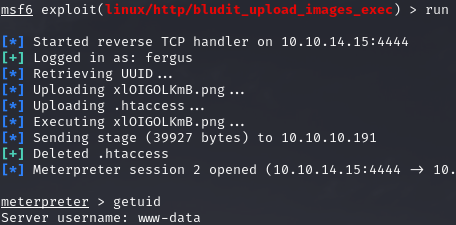

# PORT SCAN
* **22** &#8594; SSH
* **80** &#8594; HTTP (HTTP 2.4.41)

   

# ENUMERATION & USER FLAG
The website is a simple blog that collect different fact on different topics.
We have an `/admin` page that highlight the **CMS** used is [BLUDIT](https://www.bludit.com/)

Without crdentials there is not much we can do here (obviously I tried some weak credentials first)
The source code reveal the version of the CMS which is `3.9.2` where we can accomplish RCE but we need to be authenticated as first, uhm...

Here some patience and enumeration are required to discover the `TODO.txt` file as result of a dirbusting session 

Interesting there is the name `fergus` here but no password at all, that's fine because thi version of Bludit can be easily brute-forced 

I opted for the ruby script and make it work with the **rockyou.txt** file and an instance with `cewl`. The latter return something

Cool now we have some working credentials this means we can try to work for the RCE combining the info I searched will bruteforcing and the info inside the stupid text file we found. The `bludit_upload_images_exec` sounds resonable to use, this [exploit](https://github.com/bludit/bludit/issues/1079) abuse the lack of constraint when we upload an image cahnging the filetype and uploading a `.htaccess` file allows to uplaod a PHP webshell

Cool, but we can't read the the user flag for now so is time horizzontaly. Inside `/var/www` we have 2 different version of blaudit, the currently used in the site and the newer one. In the newer one we have a file called `users.php` containing an hash for the user hugo (the one with the user flag in the home directory)

The password is hashed with SHA1 but surprislying hashcat did'nt work, at least with **rockyou.txt** but an online cracker tool found the password very easily

(Yeah rockyou doesn't have `Password120` in the records, ooooook)

Now we can login using `su` (somehow SSH can't be reached but no problem at all) and grab the user flag!

   

# PRIVILEGE ESCALATION

Sudo is pretty interesting now because allow to impersonate user via `bash` but not root

Interesting stuff first time I see something like this so we can ty to move again to the other user on the home directory `shaun` but actually nothing chaned, no special permission no new file, absolutely nothing!

The sudo version is `1.8.25` which at first I tough was vulnerable to [pwnfeedback](https://dylankatz.com/Analysis-of-CVE-2019-18634/) but testing it is not.

Another CVE here was the answer, [CVE-2019-14827](https://www.cvedetails.com/cve/CVE-2019-14287) allows to bypass blacklist policy (in our case `!root`)

