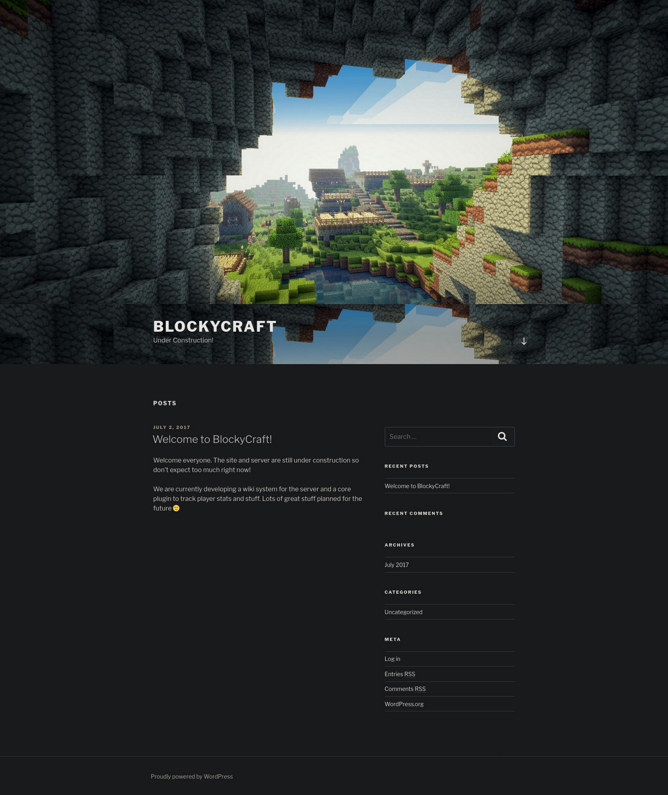

# PORT SCAN
* **21** &#8594; FTP
* **22** &#8594; SSH
* **80** &#8594; HTTP (APACHE 2.4.18)
* **8192** &#8594; SOPHOS (closed)
* **25565** &#8594; Minecraft Server 1.11.2 

   

# ENUMERATION & USER FLAG

What the hell? A open port for a minecraft server? This looks fun let's jump into the port 80!

This site is powerde by **WordPress**, with a little fuzzing I found `/dev`

Obviously `/wp-content` and `/wp-login.php` are present on the webapp but without credentials there is not much we can do. `/plugins` is more more interesting...

Some `.jar` files which are related to minecraft (I suppose), I download them and use `jd-gui` to decompile the jar files and `BlockyCore.jar` have some harcoded credentials

I try to use it on the WP login form but failed, luckly the gobuster instance found `/phpmyadmin` and right there the credentials worked! We have free access to the MySQL database which include a goood number of DataBase and Tables. In **Wordpress** database we have the table **wp_users** which contains a username and password hash!

The password is hashed using the `PHPass` algorithm and the hashcat module for that is `-m 400` but is taking a good amount of time so was worth to do some password guessing since we have a username we can reuse the hardcoded password discovered. Old tricks are always reliable!

We can grab the user flag and move on privilege escalation

   

# PRIVILEGE ESCALATION

Inside the notch's home directory we have a folder called **<u>minecraft</u>**

I spend some time investigating the directory] and enumerate the full system. At first I tought to exploit some well-known minecraft vulnerability but after a few minutes it was easier than expected. We are inside the `sudo` group without restriction, in addition we have the plaintext password so we can simply use `sudo su` to spawn a root shell!

We need a little patience with this first easy machie especially with linux because they are really easy!

> This machine was based on a real machine found in the wild exposing some problems with hosting a minecraft server without proper security (if you think about the average target of minecraft not everyone have enough netwrok knowleadge to undesrand the risk behid it!)
