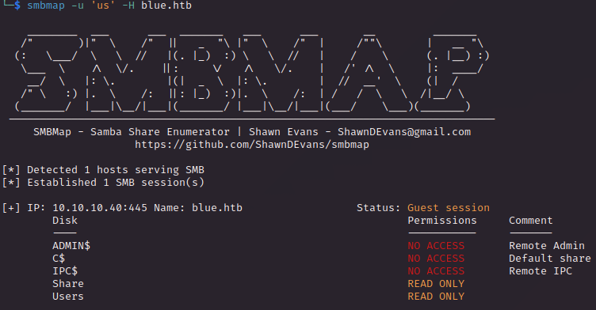
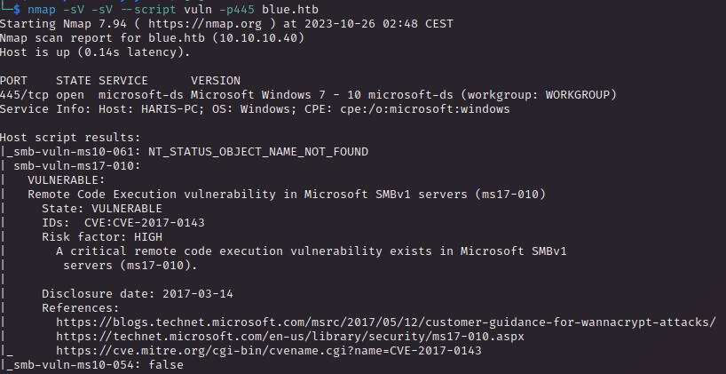
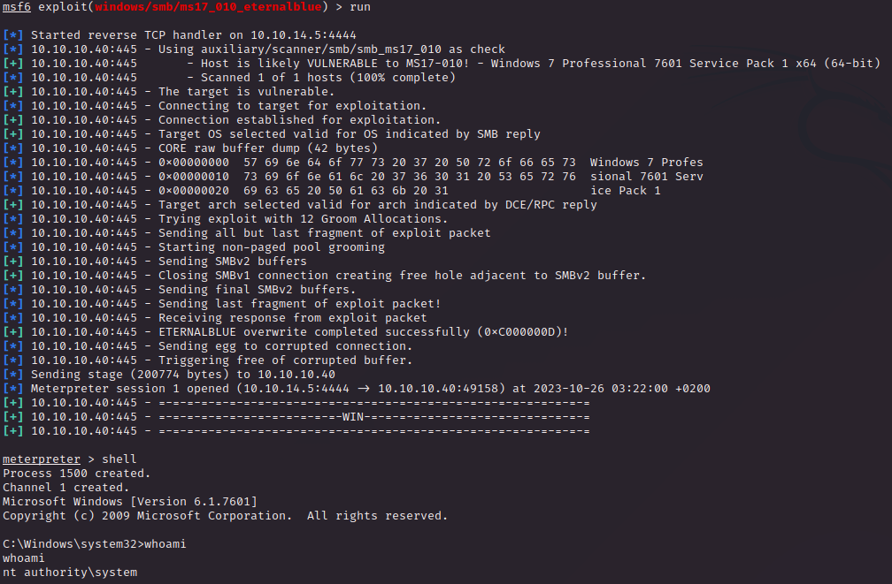

# PORT SCAN
* **135** &#8594; Microsoft RPC
* **139** &#8594; Netbios-ssn
* **445** &#8594; SMB (Wndows 7 Professional, `HARIS-PC`) 

   

# ENUMERATION & USER/ROOT FLAG

Ok really simple machine in terms of open port and apparently no Active Directory implemented. Then name of the box suggest me `EternalBlue` but don't rush to much and start enumerating.

The SMB share availabl to reade are `Share` and `Users`

After some manual enumeration nothing cool has been found so now is time to check if the box is vulnerable to the wannacry enabler exploit, the `MS17-010` also called **<u>EternalBlue</u>**

I use the metasploit module `exploit/windows/smb/ms17_010_eternalblue`  to get the shell as `NT AUTHORITY/System`

And actually is done, we can take both flag and we are good to go!

   

# ETERNALBLUE EXPLANATION
Since this box is based on a single command and I don't like to pass as a simple script kiddy I want to make some notes about how eternalblue work and why is so powerfull in unpatched system, I will not talk about the history and motivation behind which NSA created this I wanna stay as technical as possible.

The vulnerable version are `Windows 7`, `Windows Server 2008 R2`, `Windows XP` and some version of `Windows 10`. Actually anything that use Microsoft SMBv1 protocol (like siemens medical equipment) is vulnerable to [CVE-2017-0144](https://cve.mitre.org/cgi-bin/cvename.cgi?name=CVE-2017-0144) 

There are 3 main bugs that have been exploited 

1) Cast error from OS/2 FEA (FileExtended Attribute) to NT FEA when determine how much memory allocate. This lead to a **integer overflow** allocating less memory expected, resulting in a **<u>buffer overflow</u>** (the function is called `srv!SrvOS2FeaListSizeToNt`). 
2) The second bug is based on the 2 subcommands `SMB_COM_TRANSACTION2` and `SMB_COM_NT_TRANSACT`. Both have the `_SECONDARY` command, called when too much memory is inside a single packet (like the overflow payload). The latter add double space of the former this mean that if we send `NT_TRANSACT` before `TRANSACTION2` the space assigned are based on `TRANSACTION2` which trigger the buffer overflow
3) **<u>SMBv1 heap spraying</u>** is what make possible to write and execute the shellcode (pool allocation bug) in a **non-paged kernel pool**

Linking togheter this 3 vulnerability allows to get a reverse shell as root with full permission without being authentcated

