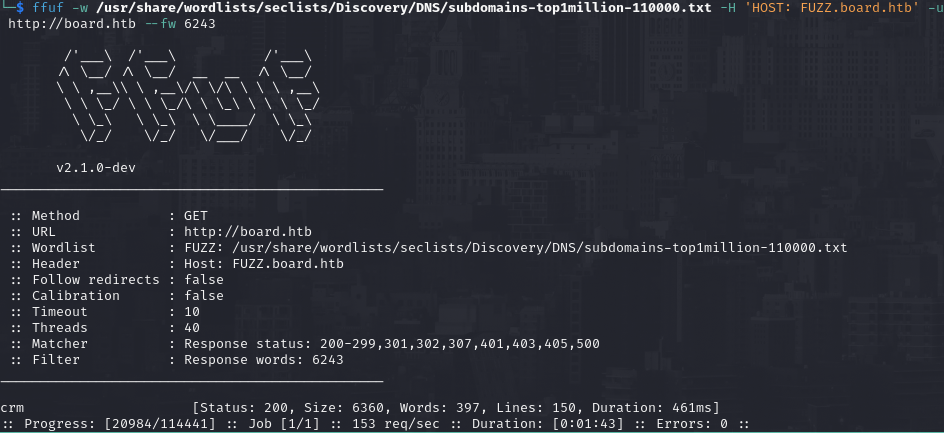
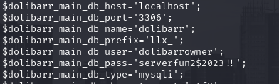
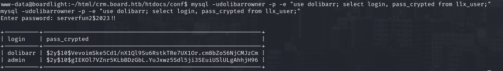

# PORT SCAN
* **22** &#8594; SSH
* **80** &#8594; HTTP (APACHE 2.4.41)

   

# ENUMERATION & USER FLAG

A really simple, traditional website on port 80

All the buttons redirect on this homepage (even the `contact us` section). No subdomain and dirbusting returned nothing usefull, uhm...
you can see on the very bottom on the footer that the real domain of the machine is **<u>board.htb</u>** so I re-tried subdoamin enumeration with this domain, this time we have something!

Into `crm.board.htb` we have **<u>Dolibarr</u>** (v17.0.0) instance. The credentials **admin:admin** worekd smoothly!

Here we are inside with Admin role but we with restricted access (Dolibarr have also SuperAdmin role above the Admin one), the only thing that we can do is creating and view a new website 

My idea was to inject sme PHP code but gets rejected because we have a lack of permissions but following this [guide](https://www.swascan.com/security-advisory-dolibarr-17-0-0/) I found there is a way to bypass this just making some difference to the php word.

Things like "Php", "PhP", ecc.. bypass the check, here below a result of a simple `whoami` command through PHP using this small trick

Last thing was just to inject a PHP reverse shell and finally we have a foothold.

I was seaerching for configuration files to get some password, I found the one with the DB that permitted me the access to Dollibar users hashes  

The hash of **dolibarr** user is with b2crypt so pretty long so while I was cracking I tried to access as the only user inside the machine called **<u>larissa</u>** using the DB password. Luckly it worked!

Now I just grabbed the flag and move on PE

   

# PRIVILEGE ESCALATION

Looking inside this machine I found that this specific binary `/usr/lib/x86_64-linux-gnu/enlightenment/utils/enlightenment_sys` hace the SUID bit set! The name is a hint looking back at the machine title and checking [this reference](https://securityonline.info/cve-2022-37706-privilege-escalation-flaw-in-enlightenment-desktop-for-linux/) contains also a PoC that we can use to abuse this vulnerable binary

