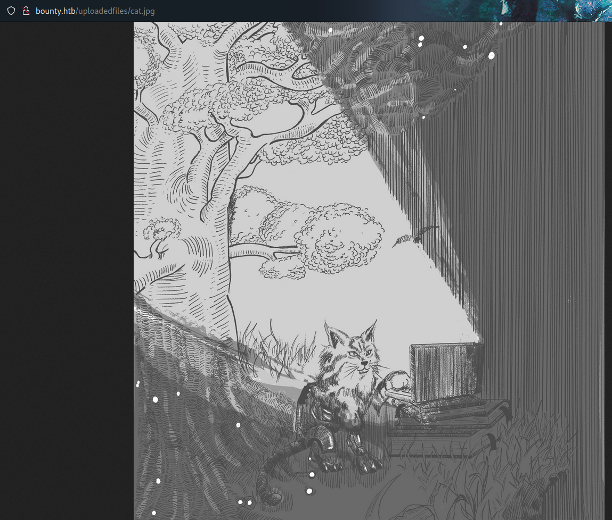

# PORT SCAN
* **80** &#8594; http (IIS)

# ENUMERATION & USER FLAG
LMAO this is the homepage

wtf, let's what we can do here. The server is `Microsoft IIS 7.5` and with little enumeration I found `/aspnet_client` and `/uploadedfiles` but return error 403 when try to access them

Internet suggest me to use the `auxiliary/scanner/http/iis_shortname_scanner` metasploit module in order to return potential files/direcotries

`/transfer.aspx` allows to upload files

Than I quickly discovered files are stored in `/uploadedfiles` and use my cat logo as example

Gottch'a, PHP files are not accepted and same for ASPX but **<u>config files are accepted</u>**

This article was very formative on how to run ASP code trough .config files and I used the first example to check if is working trying to executing this simple code `Response.write(1+2)`

It worked! now we can try to get a reverse shell abusing the `config` file like it follow

After few seconds I can enjoy my user shell!

   

# PRIVILEGE ESCALATION

We are inside as `merlin` user and we have the SeImpersonatePrivilege

We can use a Potato attack and I decided to use it through metasploit (I am trying to getmore familiare with it) which include the module `exploit/windows/local/ms16_075_reflection_juicy`.

Obviously I need to retrieve a meterpeter sessions in order to trigger the privilege escalation and is something pretty easy to achieve thanks to module `web delivery`. After triggering the meterpeter shell we are free to good and get out `nt authority\system` permission

Really normal machine a good amount of web, I learned about **<u>malicious config files</u>** and a pretty cool enumeration method for IIS
