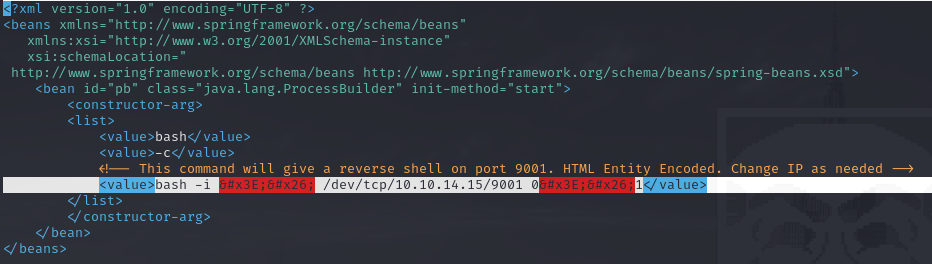
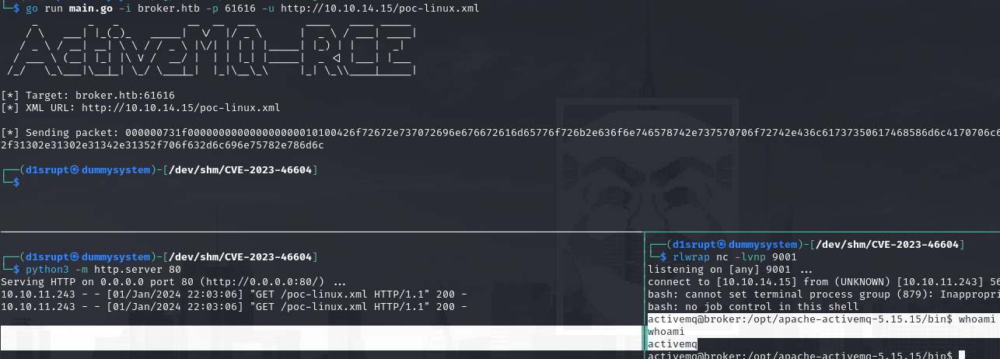
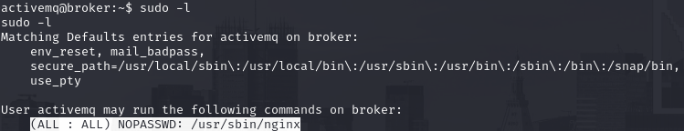
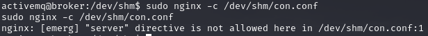
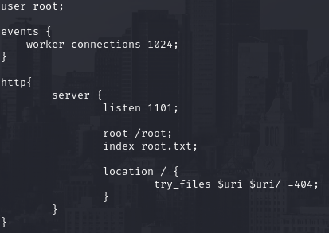
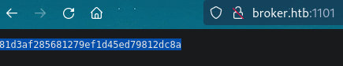
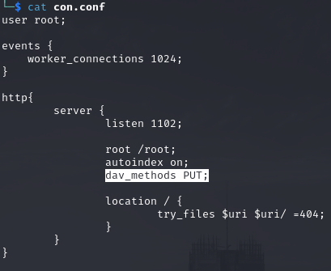
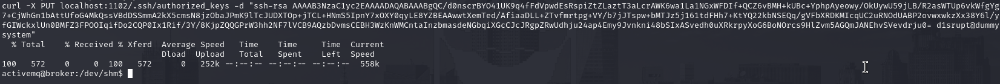
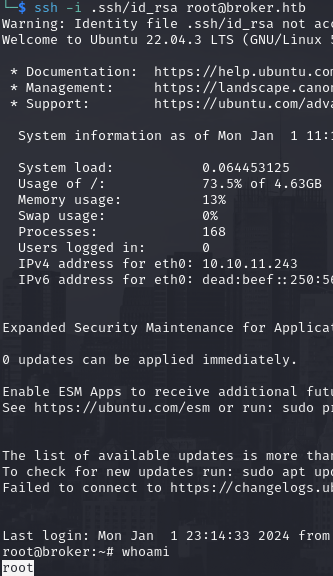

# PORT SCAN
* **22** &#8594; SSH
* **80** &#8594; HTTP (NGINX 1.18)
* **5672** &#8594; AMPQ (w/out TLS)
* **8161** &#8594; Jetty 9.4.39
* **61613** &#8594; Apache ActiveMQ
* **61614** &#8594; Jetty 9.4.39
* **61616** &#8594; ActiveMQ

   

# ENUMERATION & USER FLAG
That's a pretty confusing port scan right here but with some research and patience I know that the key service here is `Apache ActiveMQ` a message broker (similar to MQTT) based on Java, the version is **5.15.15** and is vulnerable to [CVE-2023-46604](https://www.rapid7.com/blog/post/2023/11/01/etr-suspected-exploitation-of-apache-activemq-cve-2023-46604/) which abuse a insecure deserialization to execute shell commands. I found [this PoC](https://github.com/rootsecdev/CVE-2023-46604) where use a special crafted XML file to execute the RCE as you can see here 

To run the exploit I have to change the IP on the XML to my local one, run a python server and NetCat. Fire up the GO script and the reverse shell will pop up! 

We can read `user.txt` and sumbit it!

   

# PRIVILEGE ESCALATION

With the user account we can use `sudo` on **<u>NGINX</u>**

Our objective is the root flag, having access as root as **nginx** is a good thing because we can feed it with a costum configuration file with `server` directive but I returned an error

I changed the default one a little bit with this final configuration file 

Now if I visit the target port `1101` will return the root flag as homepage

That's cool now we have done our homework but as good student as I am I wanted full access with a shell so I need to PUT some files on the webserver, Again we need a small tuning to the **configuration** file

With `PUT` we can append data and with the root permissions we an do it inside the `/root` and the write inside the `.ssh` files cam be really dangerous! So I wirte my ssh public key to the authorized keys

Now we can login with SSh freerly and have access as root!

