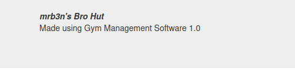
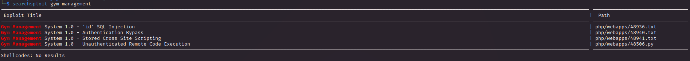
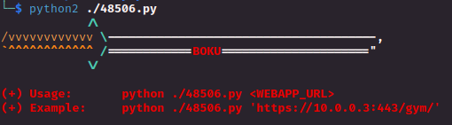
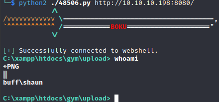
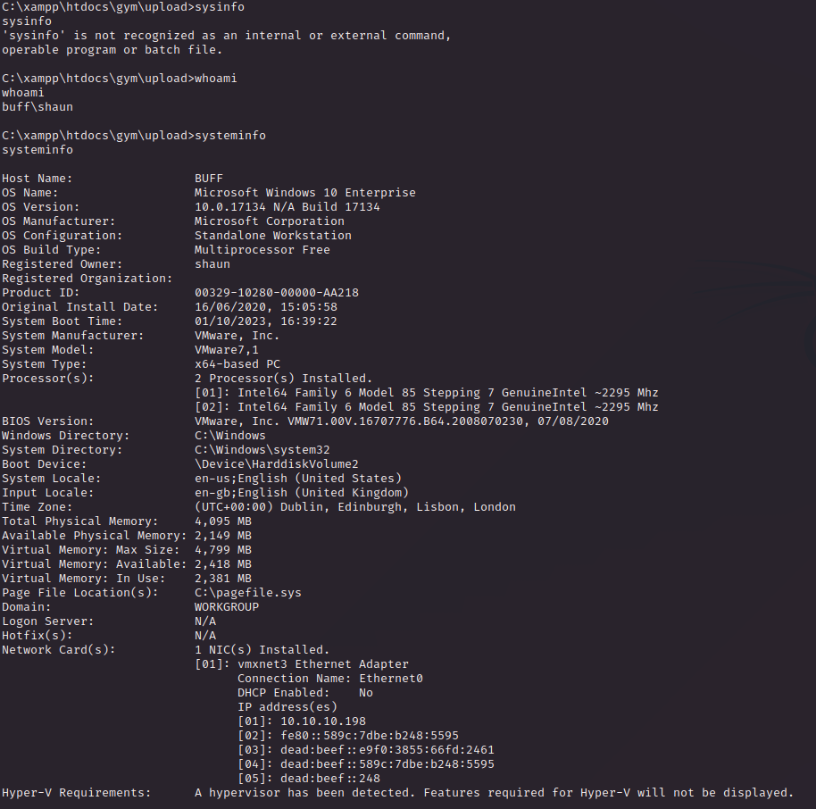
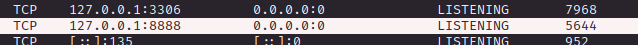
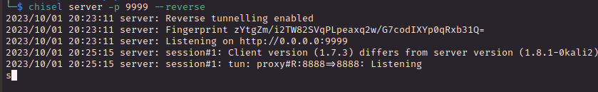
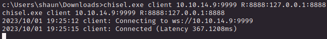
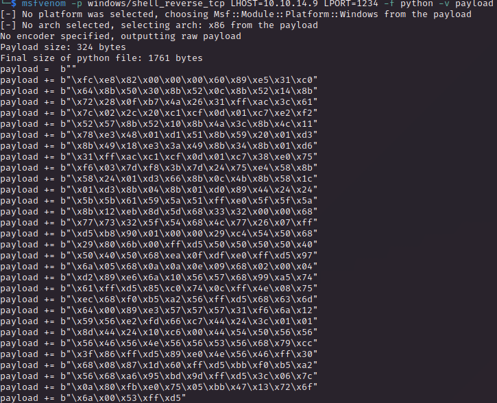
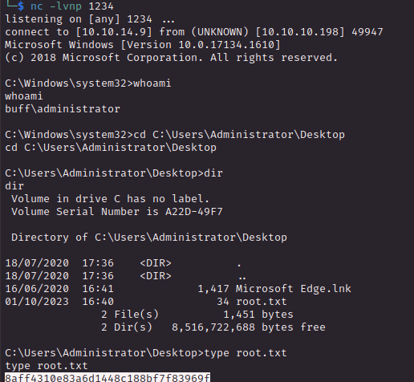

# PORT SCAN
* **7680** &#8594; pando-pub / Windows Update Delivery Optimization (?)
* **8080** &#8594; HTTP

   

# ENUMERATION & USER FLAG

This is the homepage, the other panels are useless and give information about the facilities and services given about the gyms.

But here we go, on `/contact.php` we have info about the software used

Using searchsploit we know this is vulnerable to differens exploits

Cool I will start using the **<u>Unauthenticated Remote Code Execution</u>**

The script bypass the image upload filter and allows an unauthenticated user to upload a malicious php file

Really cool, really easy but the shell is really unstable so I upload netcat and use the multi handler to catch the a stable shell

Let's grab the flag!

   

# PRIVILEGE ESCALATION

Inside the `/Downloads` folder we have a `CloudMe_1112.exe`, I have executed and no output return back to us, so let's see what is happening behind the curtains

Searching the name of the exe I have discovered it is vulnerable to [stack overflow](https://www.exploit-db.com/exploits/48389) (here a interesting [blog article](https://bufferoverflows.net/practical-exploitation-part-1-cloudme-sync-1-11-2-bufferoverflow-seh/) on how it was discovered) plus it listen on port `8888` by default

Ok cool, first of all let's use chisel to make a tunneling so we are able to connect on the CloudMe application

 

On the attacker machine

On the victim

Now I can download the exploit on exploit-db and makes the right changes, especially the payload

Than just launch the scripts et voila' we are `Administrator` in a blink of an eye

