# PORT SCAN

* **22** [ssh]
* **80** [http] &#8594; redirect to `http://searcher.htb`

  

# ENUMERATION & FOOTHOLD

In the bootom the website told us is made with flask and all the research are made with [Searchor 2.4.0](https://github.com/ArjunSharda/Searchor) which is vulnerable to [RCE](https://security.snyk.io/vuln/SNYK-PYTHON-SEARCHOR-3166303) thanks to a unsafe implementation of `eval()`

So sounds great starting from this and try to access our first foothold using this [PoC](https://github.com/V35HR4J/Searchor-2.4.1-RCE/blob/main/exploit.py) and try a few commands actually it works!

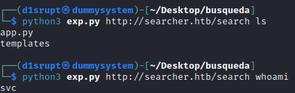

I used to retrieve immediately the user flag

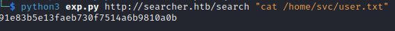

We can try to get a revere shell (the PoC suggest to use a base64 encode in order to avoid character that can break the attack flow)

I tried with different payload but I wasn't able to get a reverse shell in this way so I changed the PoC and I found this [one](https://github.com/jonnyzar/POC-Searchor-2.4.2) where we can get a reverse shell injecting in the ` What do you want to search for` section the python code for the shell

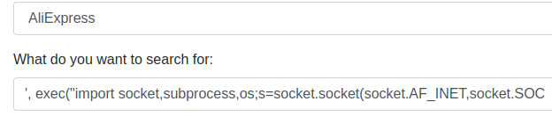

  

# PRIVILEGE ESCALATION
We have no interesting stuff inside this machine but looking at the network information we have something interestings

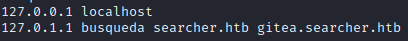

I add the `gitea.searcher.htb` in the **/etc/hosts** file and visited the site which run `Gitea`

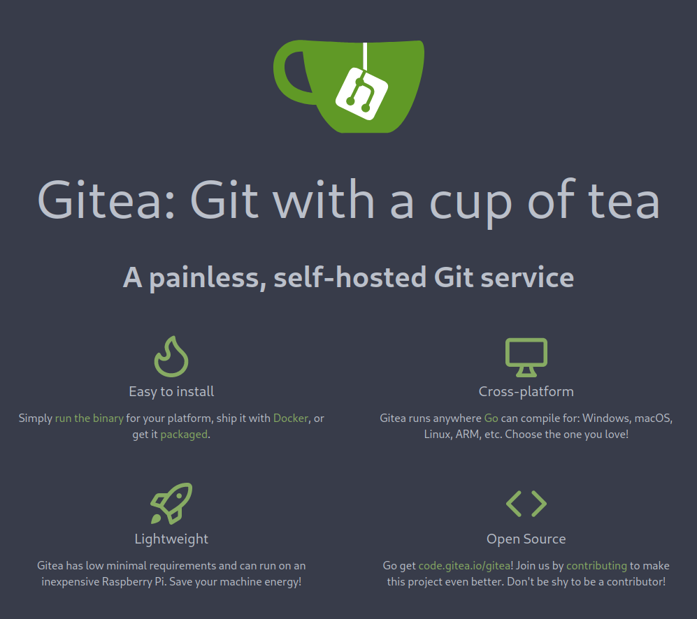

This a self-hosted version of git and unless some user we have no repository inside

Also an `API` section

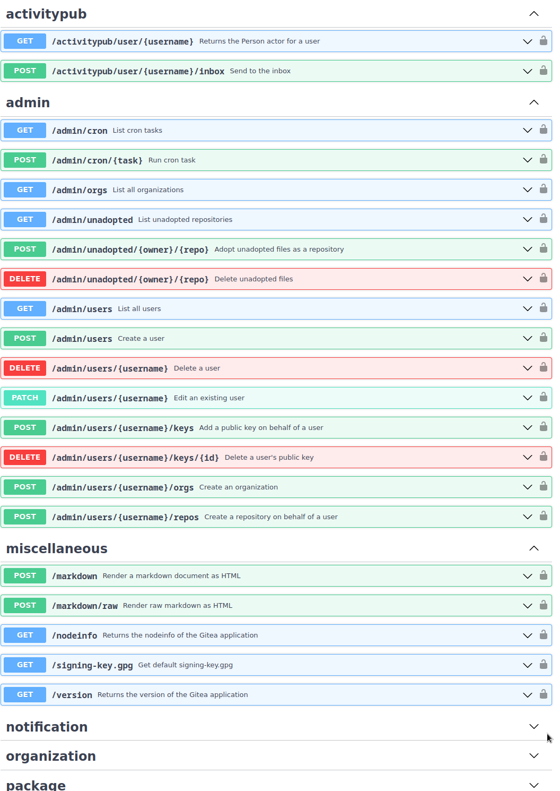

Inside the directory `/var/www/app` we have **.git** directory were we can find credentials of **Cody** user

And we can login inside **Gitea** 

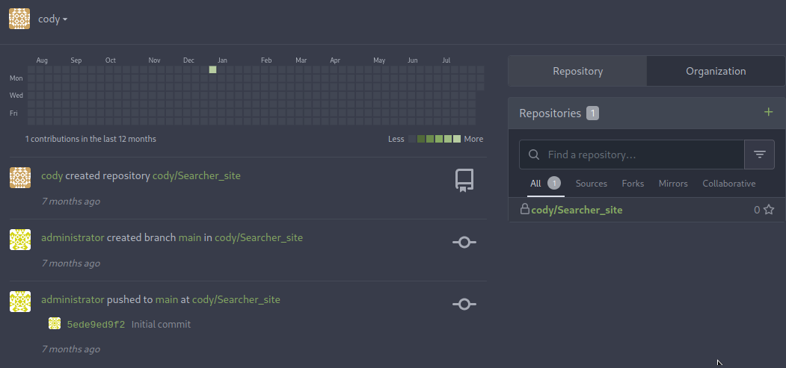

The only repositroy we can access is the python code which run the previous webapp (and we can not some commit made by the administrator)

The same password can be used by the local user which we get teh reverse shell, so we can try and check the **sudo permission**

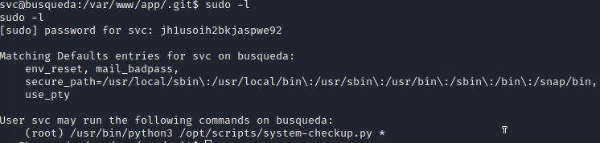

So we can just use python3 and run a specific script with this usage

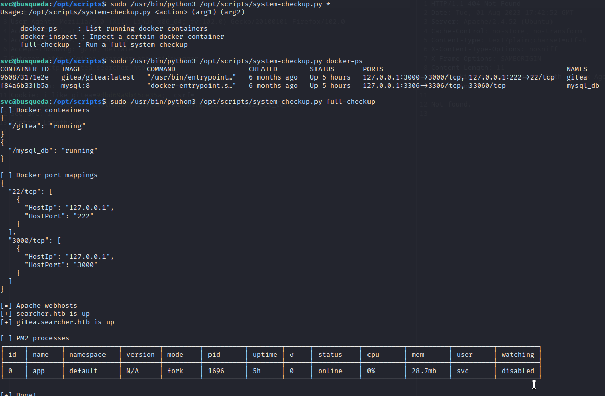

The interesting stuff here is the `docker-inspect` command which need 2 parameters : the format and the name of the container

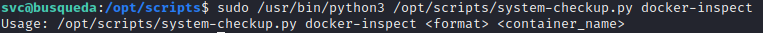

I check online what type of format can be used ([documentation](https://docs.docker.com/engine/reference/commandline/inspect/)) and I decide for `{{json .Config}}`. This leak some credentials

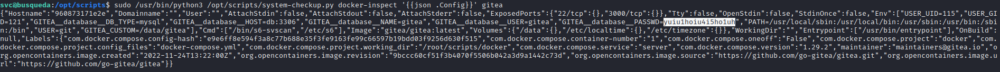

With this credential we can acces the **MySql** database and we can retrieve the hash (and the algorithm) for every user

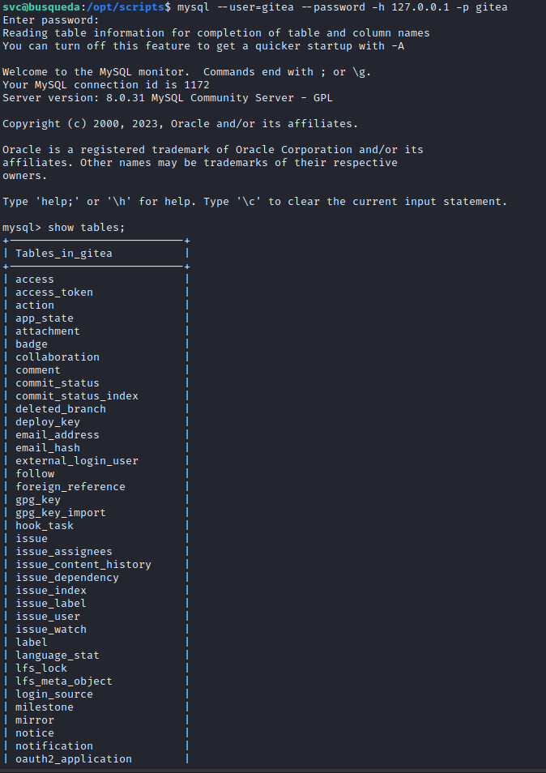

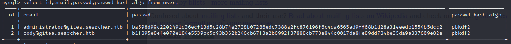

I can't figure out the way to crack this password yet and since we had to reuse a password once I tried to use this credentials as `administrator` user on Gitea.

I was right and we can see the code of the python script on Gitea.

The logic vulnerability inolved is on the **full-checkup** option which use **./full-checkup**. Is a relative path not a absolute 

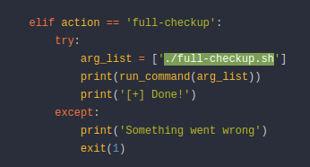

I went on **/tmp** and create the script with the same name that will add teh SUID at `/bin/bash` after that we just need to run **/bin/bash -p** and we rooted the box!

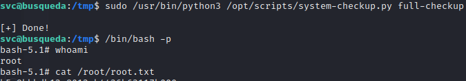

 
