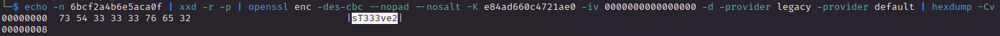
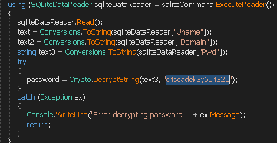

# PORT SCAN
* **53** &#8594; DNS
* **88** &#8594; KERBEROS
* **135** &#8594; MSRPC
* **139 / 445** &#8594; SMB
* **389 / 636** &#8594; LDAP
* **5985** &#8594; WinRM

<br><br><br>

# ENUMERATION & USER FLAG
Cool, Active Directory here! I started with some RID bruteforce in order to retrieve a list of potential users


Also LDAP accept anonymous user and we can use it to retrieve more specific information about users like the descriptions or other metadata.

We have a legacy password for `r.thompson` user


I used the password on crackmapexec to be sure this user or someone else use this password decode from the base64 format which gave us the plaintext `rY4n5eva`


Gottch'a, inside SMB folder we have this cool email ready to be read 


But that's not everything we also have a `VNC registry` of **s.smith**


Cool we have a password and [here](https://github.com/billchaison/VNCDecrypt) is given a one liner to decrypt it



Cool stuff, we have the password of `s.smith` and work with WinRM, that's mean the user flag is ours!

<br><br><br>

# PRIVILEGE ESCALATION
Actually there is nothing usefull inside the machine but on SMB we can access `NETLOGON` directory which is used as script a **Logon Script**


We have something about a `.network` object which is actually what the email and is stored inside `AUDIT$` and the s.smith user have access to it where inside we have the `RunAudit.bat`


Cool, inside the db file we have a base64 encoded password for user `ArkSvc`


But we are unlucky because the password doesn't seems right for now


I think we need to investigate more the `CascAudit.exe` which is compiled with .NET
After decompiling the .exe file wecan cleary see the hardcoded key used for encrpytion



Look up at the DLL we have a simple (thanks to the hardcoded IV) decryption algorithm


Just using a .NET online decompiler is enough to get the plaintext password for the user 


Now we are inside as `ArkSvc` and look here, is cool, we are part of a new group called **<u>AD Recycle Bin</u>** and remember the email found before? It was talking about a temporary account that after the use is going to be deleted, as part of this group we can read deleted objects using a simple one liner

```Get-ADObject -filter 'isDeleted -eq $true' -includeDeletedObjects -Properties *```

and yes sir, we have the password of `TempAdmin`


At first I tought it was in plaintext but in reality was decoded with base64 and the real password is `baCT3r1aN00dles` which fit for the Administrator user, we rooted it!
