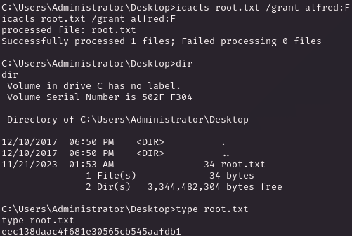

# PORT SCAN
* **135** &#8594; msrpc
* **139 / 445** &#8594; SMB
* **9255 / 9256** &#8594; A-chat

   

# ENUMERATION & USER FLAG
SMB seems pretty unbreachable but we have the 2 `A-CHAT` ports that are pretty uncommon, this is our way in for sure!

Prtty cool ah? I have checked and the latest version is the 0.150 and guess waht? is vulnerable to stack overflow 

What's cool here is that we need to inject a msfvenom shellcode but for some reason a direct reverse shell don't work we can only execute remote command. I create a oneline reverse shell and hosted in a loca http server and create a shell code that download and execute the script in order to retrieve a shell

Easy and smooth we got a shell and user flag (strange this should be a medium lol)

   

# PRIVILEGE ESCALATION

Inside `Program FIles` there is `DVD Maker` directory corresponding to the well known software, we have to find the vulnerable version in order to check some well known exploit but actually nothing works so after some enumeration I found out that the `Administrator` directory cannot be read but we have full permissions on it 

Simple and direct, we can change permissions (we have full permissions on it) in order to read file inside 

More an easy than a medium one, lol
