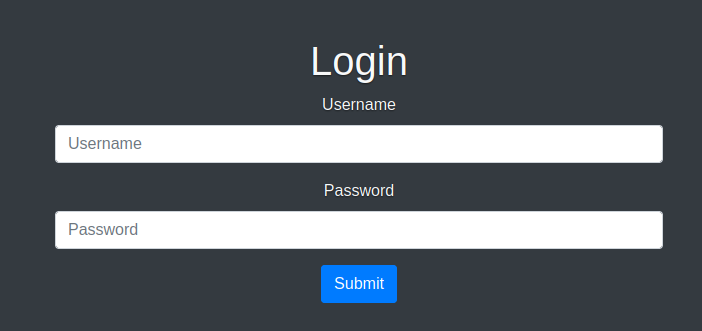
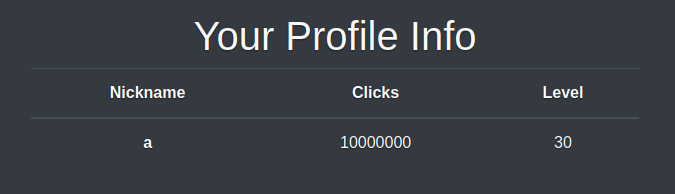
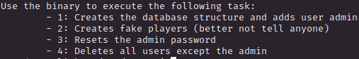

# PORT SCAN
* **22** &#8594; SSH
* **80** &#8594; HTTP (Apache 2.4.52)
* **111** &#8594; RPC


 


<br><br>

# ENUMERATION & FOOTHOLD
The webpage is acting as a click-game


We have a **login** and a **register** page




Before try to use the webapp register a new account eccetera I want to take a look at the **nfs** of the server


Cool a backup file let's take a look at the contents and we have a `.zip` file, interesting! We have the full code of the webapp


Ok I have made a quick analysis and now I am ready to create an account, than I logged in with my brand new profile I have  new pages available

`/profile`


`/play`


I've started to understand how this page works and if there is a way to abuse it. When we **save & close** this is the request


We can both change the click and the level in whatever value we want, pretty bad game design here



Cool we can play with the parameters and apparently we can add whatever arguments we want, check this line in the `save_game.php` file that is inside the nfs


Ok we can't become directly **admin** but we can add costum arguments (apparently). Finally I found something, follow me!


The code use `/db_utils.php` especially the function `save_profile()`


Here we are, in short the function take the `$_GET[]` and create the `$setSTR` like this (take for instance the parameter in the upper image)

```
click = '21',level = '0'
```

Than use this string to create the following SQL statement

```
UPDATE players SET $setStr WHERE username = :player
```

So we will have this statement following the example

```
UPDATE players SET click = '21',level = '0' WHERE username = :player

```

Cool we can hijack the SQL statement in order to become admin, note that `/save_game.php` check if the key is equal to "admin" but not the value, make sense we have a way!

Setting click parameter to `2'+,+role+=+'Admin` I returned this


COOL! But somehow is not interpreting the second part as part of the SQL query but as string and this is not what I want....uhmmmm

Whatever other type of injection is not working, that's because `pdo ->prepare()`, I'm pretty sure about it

<br>

So if we can't do it with the values the only way is to inject with the key (I was wrong about my first assumption) but we had to bypass this `if` statement


Tria and error, trial and error, trial and error,........(2 hours later)....and I gotta it! Add a `%0A` (which is a newline URL encoded) befoe `role` and we will achieve 2 things :
1) Bypass the IF statement (because the `%0A` is interpreted as a normal string)
2) `%0A` in the SQL statement will act like a simple new line, will not broke the SQL query and **set role as Admin !**

We have a new section now ehehehehe


Afer we press "Export" we can access teh save data in a predefined URL


This is the request


We can change the extension freely (for instance, PDF will return an empty PDF) and the filename is created like this `top_players_[random].[extension]`, what's cool here is that the extension is not sanitized! I can't figure out what threshold is being used for, a quick check on the code and I had the answer


1) Here the php code set the variable if is numeric and call `get_top_players()`


2) `get_top_players()` will return all user with number of clicks >= threshold value


<br>

Well the most important thing is that we can **<u>set whatever extension we want</u>** like PHP and because a bad implementation of the `if` statement that handle the different extension we have control on what we cn put inside in case we decide to make extension in PHP


Cool using the `/save_game.php` I changed the **nickname** value (clicks is needed as numeric because the threshold check and level must be numeric) in a PHP RCE (URL encoded) and now I can execute whatever command I need after I access the php file in the export phase


Now I simply uploaded and execute a reverse shel and I am in :)


<br><br><br>

# USER FLAG
We have a single user inside the home directory called **jack**, let's hunt this guy :)

Checking the SUID binary I am interested in this 


I am pretty sure that the jack's SUID in bash is a consequence of a successfull explotation done by another player so I will avoid to take advantage on this, sounds like cheating. On the other hand we have an unknown binary also with jack SUID let's take a look at `/opt/manage/`

We have a `README.txt`

\

Nothing more I can do about it if not use **<u>Ghidra</u>** and decompile the binary

<br>

First we have a switch case with a **default case** 


This is cool we have a case which is not listed in the README file 


Cool cool cool stuff! It save in a variable called `pcVar3` the argument after the number, I discovered (with just my thinking gonna be honest I was not able to understand in the decompiled code itself, at least at the start. I'm a noob loool) that if we use a random parameter we get the error (like image above) but when we choose one of the switch case we obtain a legit output


After that we have a check using `access()`


**local_98**, **local_90** and **local_88** seems to be to the path `/home/jack/queries`


While the variable after the `if` statement is the line of bash that call mysql with parameters (username, password and database, the same in the php files) and concat the string with the file provided

`/usr/bin/mysql -u clicker_db_user --password='clicker_db_password' clicker -v < [file]`

Makes sense since every sql file (inside `/home/jack/queries`) contain a SQL statement

First thing I get is this making the obvious thing I can think about


Cool is taking the directory `/home/jack/queries/../` and use it successfully as parameter for MySQL, I tried directly with the flag but we can't use it this is probabably for `access(_dest,4)` the second parameter is the mode a XOR sum about the 3 type of access bit and if I am not wrong the flag can't be changed this is why the error occurs


But we can have the ssh private key :)


Just copy the key (I had to fix the hypens, easily recognize that comparing a brand new generated key with this one) and use it to log in

I have the flag!


<br><br><br>

# PRIVILEGE ESCALATION
We are `sudoers` with jack so obv `sudo -l` is a must


This is the `monitor.sh`


Finally I dicovered what the diagnostic PHP page is used for I know have to be used somehow. Btw this is the output we have


The script force the PATH variable and unset PERL library, makes sense since `xml_pp` use PERL and **<u>we have the possibility to set a variable before running the script</u>**.
This mean **<u>enviroment hijacking</u>** so the question is : which enviroment variable?

My way to solve this was this

1) Set the NOSAVE variable equal to true so will hit the `exit` bash function
2) Change the enviroment variable `BASH_FUNC_exit%%=() { id;}` so we can change the behaviourof `exit` and will execute command as root


Well, simply we can spawn a bash right now, let's take the root flag and finally this box has been pwned!


