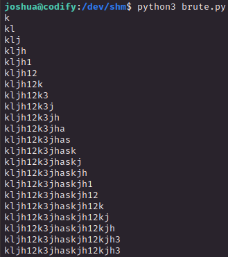

# PORT SCAN
* **22** &#8594;  SHH
* **80** &#8594; HTTP (Apache)

   

# ENUMERATION & USER FLAG

Thi is the homepage of the website and is just a interpeter for node JS in a sandbox (at least is what is written here).

Before press the `"Try it now"` I want to check the <u>**limitations**</u> page 

Ok, we have a defined set of modules that can be used on the sandbox now is time to abuse this and try to bypass the `child_process` and `fs` limitation

In `/about` we have some information about the code editor

especially the **<u>vm2</u>** version which is `3.9.16` and, good thing for us, vulnerable to [CVE-2023-29199](https://nvd.nist.gov/vuln/detail/CVE-2023-29199). This vulnerability allows to escape the sandbox and if we accomplish that we will be able to execute the reverse shell using `child_process` or `fs`

Here we have the [PoC](https://gist.github.com/leesh3288/f05730165799bf56d70391f3d9ea187c) but let's be a little be superior than the avarage script kiddie and try to understand what we are abusing here.

In this case the vm2 sandbox doesn't properly manage exceptions causing leak of unsanitized host exceptions that are used to escape the sandbox and run arbitary code <u>**without limitation**</u> .
Simple and smooth, we can force an error, catch the exception and run our code

The function `stack()` repeatedly call itself causing and error and we run the whole code in a VM2 instance and exploit the vulnerability injecting our no-constraint code obviously to get a reverse shell

We have access as `svc` user so we need some horizzontal move to get the user flag that is probably inside the `joshua` home folder.

Inside `/var/www/contact` we have the <u>**tickets.db**</u> file which is used for helpdesk support ticket (lol I found no good way to explain that), the file contain an encrypted password

The password appear to be encrypted through `bcrypt` (`-m 3200` with hashcat)

After the cracking we know that joshua is a nickelodeon fan

Now we can move on an grab the flag

   

# PRIVILEGE ESCALATION
This sounds easy, with `sudo -l` we have something

We can't modify the scipt but we can take a look inside it

This is a simple SQL backup which can lead us to get the root password, the simple sh script doesn't seems to have some vulnerability or something to abuse so the only way is to brute force the root password but how to check when we are on the good path in the bruteforce?

Well actually we have a vulnerability which was something new for me so very very cool check this out.

Look closely at the conditional where the the password is checked

Is within **<u>double-bracket</u>** and not single bracket and bash script treat the conditional inside differently than single bracket ([this resource](https://tldp.org/LDP/abs/html/comparison-ops.html) was really usefull)

Double bracket conditional is more "powerfull" becasue support logical operator like `&&`, `||` and most importantly `*`. Like the example above we can check if the password start with some text, for instance if retrun true to `[[ PASSWORD == a* ]]` means the password start with `a`, smooth and clear.

If we insert just `*` as password we get true as output and makes sense so we can iterate this behaviour to bruteforce the root password with a small script.

Lesson of today, be very carefull when you create conditional with bash script, please.

Beautiful let's try this password to get root privileges

GOTCH'A!
