# PORT SCAN
* **22** &#8594; SSH
* **80** &#8594; HTTP (APACHE 2.4.29)

   

# ENUMERATION & USER FLAG
Nmap scan return that the website is done with **<u>Joomla (3.8)</u>**

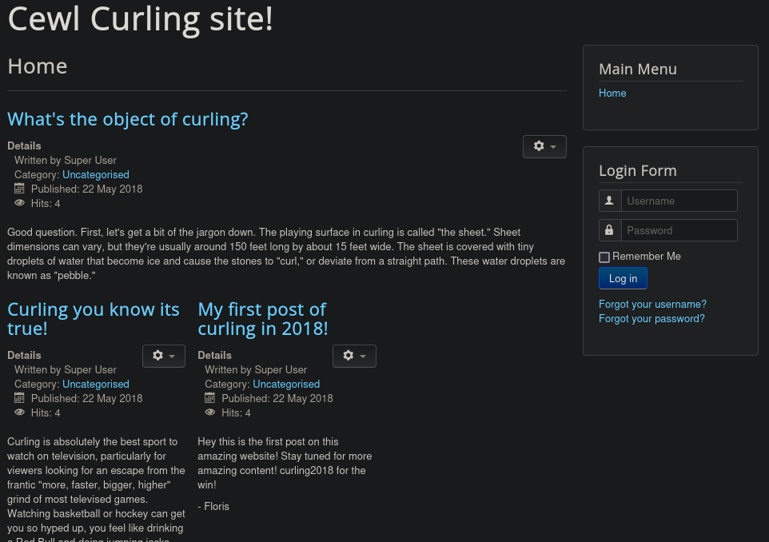

Lol `CEWL` sound exactly like a hint but before trying something I want to enumerate and after a while gobust found `/secret.txt`, yeah....a secret....

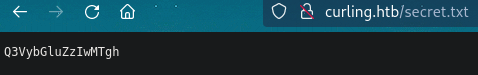

If we decode it we have the plaintext which is `Curling2018!`, now believe me or not while I was enumerating I saw this blog post and I tried to use a similar word as password for `floris`

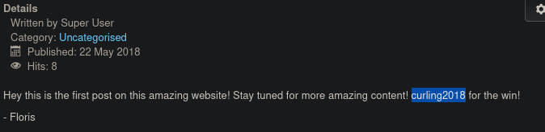

Well what's important here now is that we have access, through `/administrator`, in the Joomla admin panel. That's cool!

I have fuzzed and mess around a little bit and when was the turn of `Templates` we have one setted as default on all pages

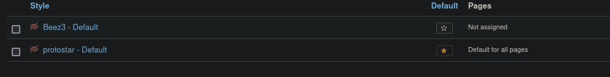

We can chooseto costumise the template now and this would be really easy and straightforward path to RCE and we can change whatever PHP file we want to a reverse shell (I used the Ivan Sincek one). In my case I changed the `offline.php` file

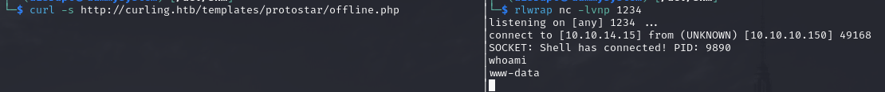

Our job is not ended here because we don't haveenough privilege to read the flag on `floris` home directory (I tried the same password hoping for the reuse but this was not the case). As always we have some hardcoded database credential in **configuration.php** but actually nothing interesting where found inside. Pretty bad :(

Returning back to floris home directory we ca read some files despite the lock on the user flag
The file `password_backup` is a pretty interesting hex file 

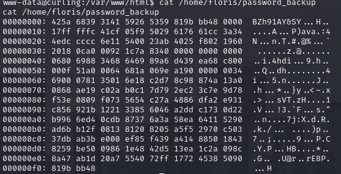

When I try to reverse it it looks like a zipped file

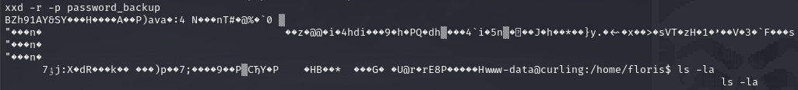

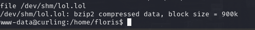

Boom, was right! Playing with it I discover that password was the file inside it, by the way there is a tra in a bzip in a gzip in a bzip. Yeah I amnot joking lol, is pretty confusin to see but here the process lol

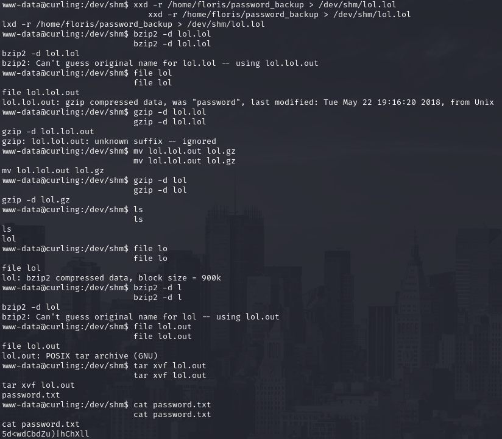

Now we have both access to SSH and user flag!

   

# PRIVILEGE ESCALATION
We are not in the sudoers but we have a cronjob running as **root**

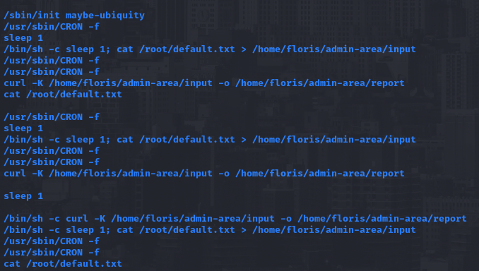

Interesting we have controll on the configuration file used by **curl** (`-K`) it take a good 15 minutes to understand how I can exploit this butafterall is a configuration file and we have full controll on how to send the HTTP request.

For instance we can send to our machine the root flag that will be delivered

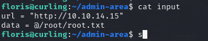

To received I used at first the simple HTTP server of python but raise an error because POST request were not supported so back to the basics, NetCat is the swissknif for something right?

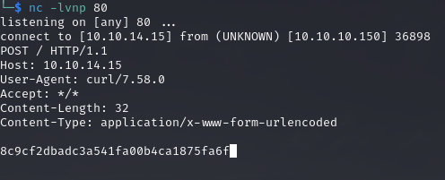

Cool stuff!
