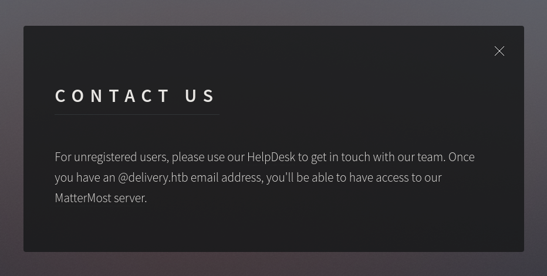
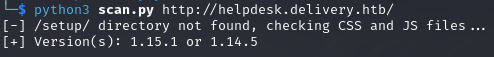
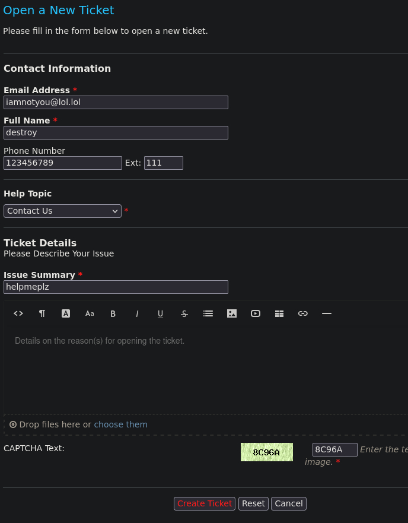
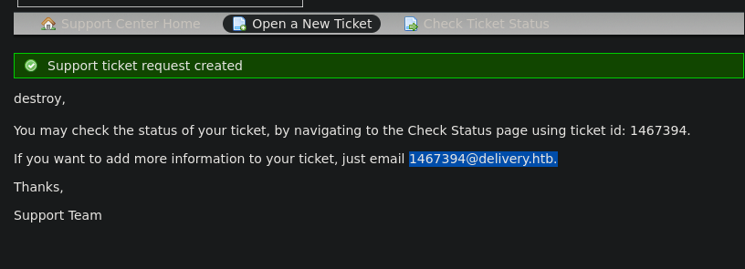
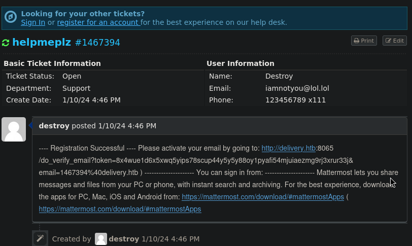
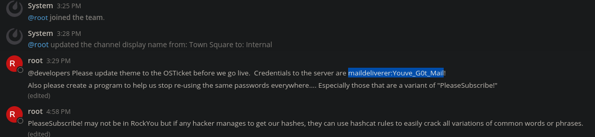
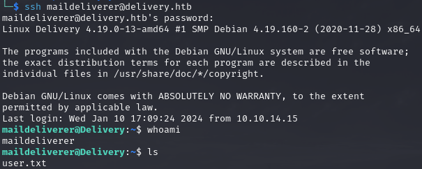
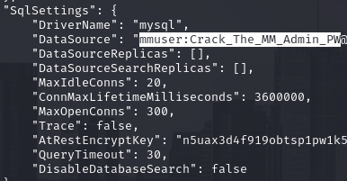
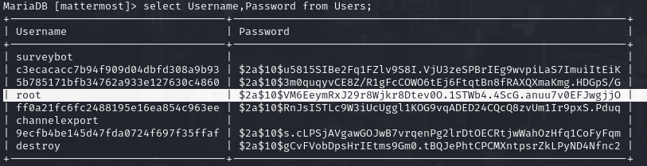
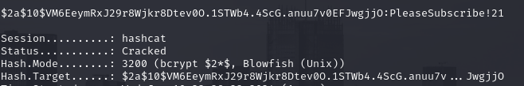

# PORT SCAN
* **22** &#8594; SSH
* **80** &#8594; HTTP (NGINX 1.14.2)
* **8065** &#8594; MATTERMOST

   

# ENUMERATION & USER FLAG
MatterMost service need some credentials or more info to build a costum wordlist for password/usernames.
The HTTP page is made by a single page with info about the purpose of MM.

Well the helpdesk is under `helpdesk.delivery.htb` so I add it to hosts file and visited it. Is a subdomain powered by [OSTicket](https://osticket.com/) and I use [this script](https://github.com/Legoclones/pentesting-osTicket/blob/main/ostVersionScanner.py) to get exfiltrate the version of the software

At first I tought to abuse a SQL injection that affects this 2 specific version but was not working so since we don't need to be authenticated to request ticket I started creating a new one, hopefully we should have a email address

Gotcha, now we can use the new email address to create a new account and an email address need to be verified but if we go to the ticket status (we need to enter the email address used for the ticket request and Ticket ID) the email body is sent directly on the ticket status

Now we are to login on the mattermost server! Thiss "attack" is called [Ticket Trick](https://medium.com/intigriti/how-i-hacked-hundreds-of-companies-through-their-helpdesk-b7680ddc2d4c) and the main issue is that we don't have to verify email address to see the ticket queue/status resulting on verification email appended on the issue list. Pretty powerfull and is not something that can be fixed (at least, for now) and affect a good number of companies according to the creator of the attack.

Having access to development team chat is not a good thing for victims thing like credentials can be found, like in this case

We can use this credential into SSH and get the user flag!

   

# PRIVILEGE ESCALATION
The user we have access to is not inside the sudoers group so no way to use `sudo` but another user that is not root have terminal access : **mattermost**

Since I am not sure 100% that we need to pivot on the mattermost user to get root is worth trying to lookup at `/opt/mattermost` directory for some configuration file or similar (if nothing is found here the next target is `/var/www/html`)
Pretty easy, we have credentials of **MySQL**

Useless to say that there wasa table called `Users` where root hash is stored

Now we have a good hint on the MM chat, we can use a rule file with hashcat on the string `PleasSubscribe!`. This is something that should be done on this specific hash because is **bcrypt** which is really really slow to crack especially with a long passwordlist. I tried with the [sparcflow file-rule](https://github.com/sparcflow/HackLikeALegend/blob/master/corporate.rule) on the base word tha we know and after a few seconds we have our plaintext

We can use it with `su` and have access to root flag!
