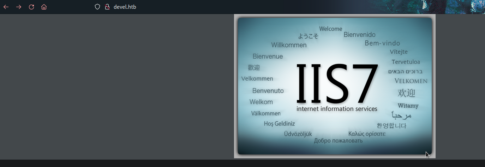
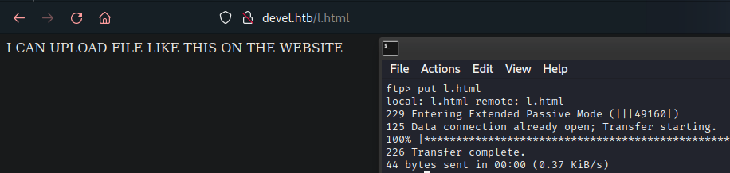
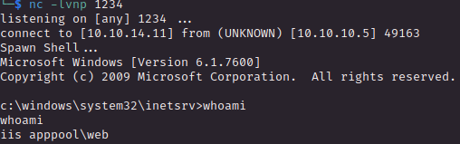
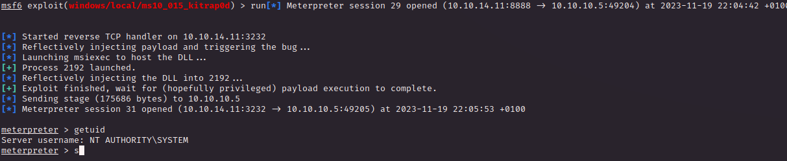

# PORT SCAN
* **21** &#8594; FTP
* **80** &#8594; HTTP (IIS 7.5)

# USER FLAG & ROOT FLAG
Let's jump in FTP since it accept anonymous login and we don't have much just the content of the website, lol

Easy, we can upload file remotely and include it on the website directory

Thanks to the anonymous login I can see the aspnet client so I try with a reverse shell in aspx which worked perfectly

Thi should be easy, I have done the same reverse shell but with meterpeter and than executed the exploit suggester (we have a Windows 7 Server 2008 R2, pretty outdated) and wehave the `MS10-015` vulnerability ready to be exploited, the well known kitrap0d hit again

This is also called [CVE-2020-0232](https://vk9-sec.com/kitrap0d-windows-kernel-could-allow-elevation-of-privilege-ms10-015-cve-2010-0232/) and exploit the fact that when accessing 16-bit application (when allowed) on a 32-bit platform doenst proper validate BIOS call and allowed unprivileged user to RCE as SYSTEM
