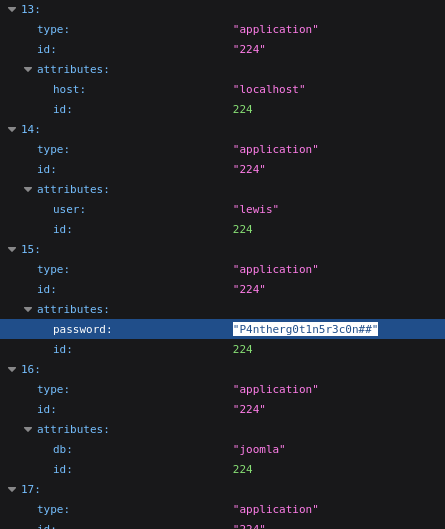

# PORT SCAN 
* **22** &#8594; SSH
* **80** &#8594; HTTP (NGINX 1.18)

   

# ENUMERATION & USER FLAG
The webpage is a static brochure for the website development company, littl enumeration and we found a subdomain `dev.devvortex.htb` where
we can access the `README.txt file`

And the `robots.txt`

WIth more enumeration thanks to `droopescan` I was able to retrieve the exact versions of Joomla which is the 4.2.6 which is vulnerable to [CVE-2023-23752](https://www.exploit-db.com/exploits/51334) but we don't need a exploit to run to get the info we need, simply this version of Joomla have a information disclousure at `/api/index.php/v1/config/apllication?public=true` 

We have the lewis account password, cool we can use it on the joomla login form at `/administrator` and we have access as **SuperUser**

Now the path is pretty straightforward, we go in configuration and select the template to target (we have just **cassiopeia** in the box), we select a php files to edit like **<u>error.php</u>** and put our reverse shell, easy and smooth we have our shell as `ww-data`.

Inside the directory of the webapp we have the `configuration.php` files that doesn't contain credentials for SSH but have some info about the DB...

We can get what we need easily

We have just `logan` home directory so I get the hash (b2crypt) and used hascat to retrieve the plaintext, we have success in a few second

We can access on SSH and take the user flag!

   

# PRIVILEGE ESCALATION
We can run `SUDO` on the following command

Apport use less as standard pager, this means we can spawn a shell within less as root, now I need to understand how to make it works

Cool we can choose whatever command we want and use `less`

Now we can view the report with `V` and we are inside less with root priv, just a simple `!/bin/bash` and we are done!

