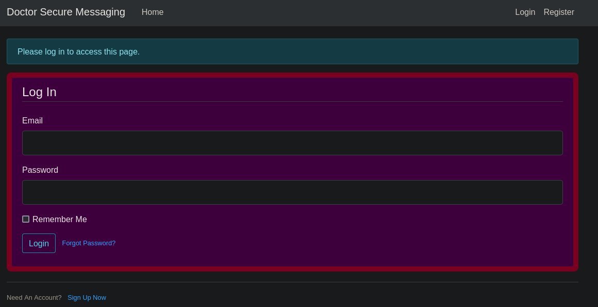

# PORT SCAN
* **22** &#8594; SSH
* **80** &#8594; APACHE (2.4.41)
* **8089** &#8594; SPLUNK (HTTPD)

   

# USER & ROOT FLAG

We have a static website acting as a health solution (makes sense with the machine name lool) on port 80, pretty boring nothin in here obviously Splunk service might help us more!

In splunk we have 4 links 

The firt and last one are empty while the 2 in the middle needs credential through HTML Basic Authentication so creds are needed.
To find something usefull was pretty tricky, there is an email on the HTTP page named `info@doctors.htb` and not `info@doctor.htb` so I added `doctors.htb` in my host file and we have something new, a website made with Flask!

I created a new account (but just after I checked some basic SQL injection) and there is one of my favorite web vulnerability that can be used, **<u>SSTI</u>**.

While I was working on SSTI I noted that every new message post created will be saved in `/post/[ID]` and my first post was saved with ID equals to 2. So I tried to access directly the post with ID 1 and we have discovered a username named admin exist!

Other than this no way to make the SSTI work, this is because I run blindly directo to attack forgetting to enumerate this new VHOST and after fixing my stupidity something pop up reallty quickly

The `/archive` is somthing I wasn't able to see before and I was pretty dissapointing on wat I found, is just an empty page. What the hell! I look through the page source and there is the title of my last post I created

So maybe now I can create a new post and instead of checking the contents directly from there (where I have already checked that no SSTI is working) I can use this `/archive` endpoint. I used the title `${{7*7}}` but the archive page tell us something different!

Hell yeah now we can make this SSTI work and with [this](https://book.hacktricks.xyz/pentesting-web/ssti-server-side-template-injection#python) we can get a reverse shell!

Inside the system I found a database file containing a bcrypt hashfor admin locate at `/home/web/blog/flaskblog/site.db`

This type of hash is really slow to crack so probably this is not the way to get the user flag. We get the shell as `web` user and we are inside the **<u>adm</u>** group so we access `/var/log`, this sounds better than wait a huge amount of time to crack a hard hash!
I don't want to spend more than a day to look through all he files stored inside the log so with the power of `grep` I was able to find a possible password used during a reset

I tried to use it on SSH using the otheruser presnet in the home directory called `shaun` but no way to make it work. Makes sense we didn't even touch splunk, maybe here the credentials can work...and did it smoothly!

While we inside the authenticated section of splunk is just a collection of empty records so I decided to search for some wel known vulnerability that maybe can help us to get a user shell!
With some research I was able to find this cool repository about [SplunkWhisperer2](https://github.com/cnotin/SplunkWhisperer2/blob/master/PySplunkWhisperer2/PySplunkWhisperer2_remote.py) and with this I was able to perform some RCE, I tried at first just pingin my machine

Instad of using just a normal ping I used a simpla bash reverse shell and surprise surprise we get access but as root!

