# PORT SCAN
* **22** &#8594; SSH
* **80** &#8594; HTTP (nginx/1.18.0)
**3000** &#8594; ppp

<br><br><br>

# ENUMERATION & FOOTHOLD

Port 3000 with service **PPP** is something new for me, **<u>Point-to-Point Protocol</u>** (PPP) work at level 2 and is used for serial communication establishment and management.


This is the website and is acting like a Google Drive clone, we have some names of the team that can be turned to potential target but nothing more. We can also **login** or **register** to the webservice.

But before that if we press on HOME we can hav something interesting

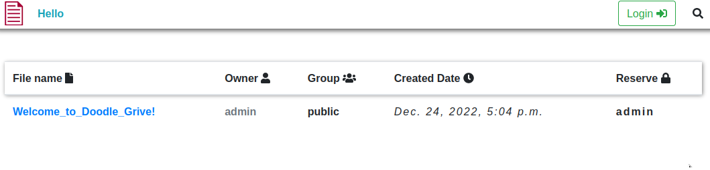

To access it we need an account so I created one in order to access to this file and we have just a welcome message

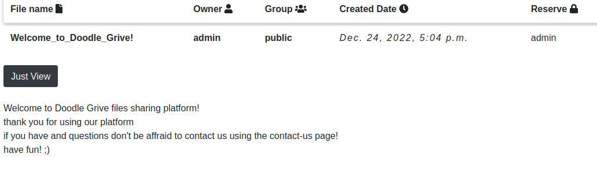

This is the upload page,I have played a lot with it trying different extension and common bypass but none works 

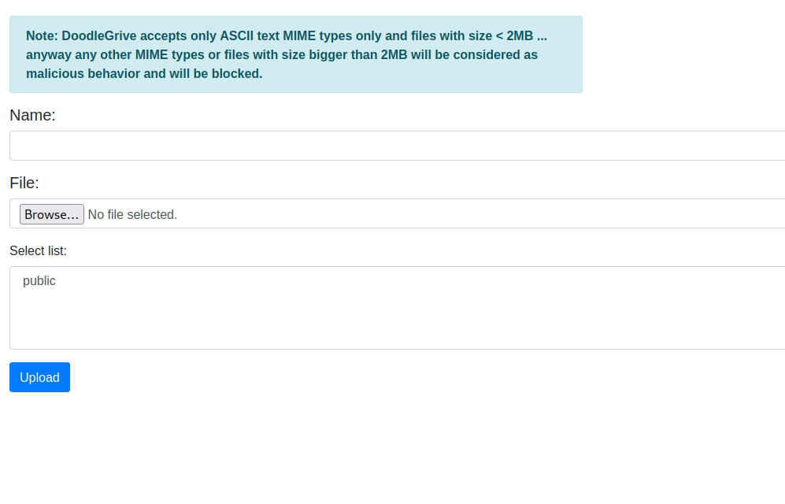

<br>

So the options here are various :
1) Try to upload something like a php rev shell, but seems something really hard to achieve since the webapp accept only MIME text file
2)  Somehow get access of another group and check some sensitive file or directly access file that I am not able to see right now
3)  Find a way to get access as admin user

So I decide to focus on **[2]**, when we access a document we send a reqeust like `/[document_id]/GetFileDetail` and we are returned with a HTML page with title `getFileDetail id [document_id]`. I created a quick and dirty python script to bruteforce some integer and if we are lucky enough we can access to some files (even if I was pretty sure nothing usefull will come as output was worth a least a try)


```{python3}
#!/usr/bin/python3

import requests
keyword = "getFileDetail id"


for inc_int in range(1, 10000):  
    url = f"http://drive.htb/{inc_int}/getFileDetail/"

    cookies = {"csrftoken": "TbyPOTOHNU43f4XQGWr8l6yEhh3cjQXq","sessionid": "iz9sohj9auvz6apff0pbpqdbntlsoqjd"}


    response = requests.get(url, cookies=cookies)
    if keyword in response.text:
        print("SUCCES "+ url)
```

Unlucky we have returned back just the welcome file and 3 files that I have personally uploaded nothing interesting, rip!

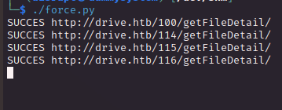

NULL BYTE injection doesn't work, same thing for the contact-us page which appear to be just a rabbit-hole

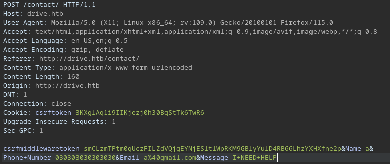

<br><br>

Fine, let's take a few steps back
We are dealing with a store file services, this is just my assumption but probably what the webapp do is to create a directory named with the user account and here is where file are stored. My assumption has been confirmed when I try a path traversal on the filename

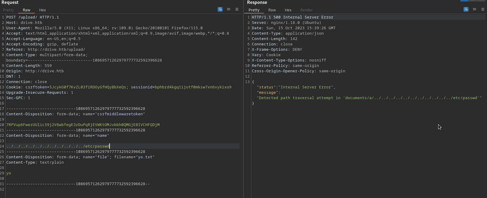

Cool, we can also have a list of file that we can "Reserve" (block) at `/blockFile` sending a request as `/[document_id]/block`

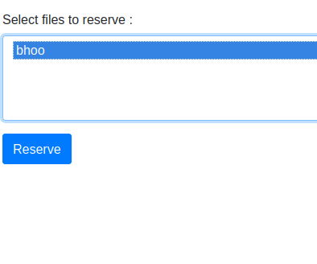

So I can do the same fuzzing (this time I used wufzz) on the document ID and we have some results (I have deleted previous uploaded documents)

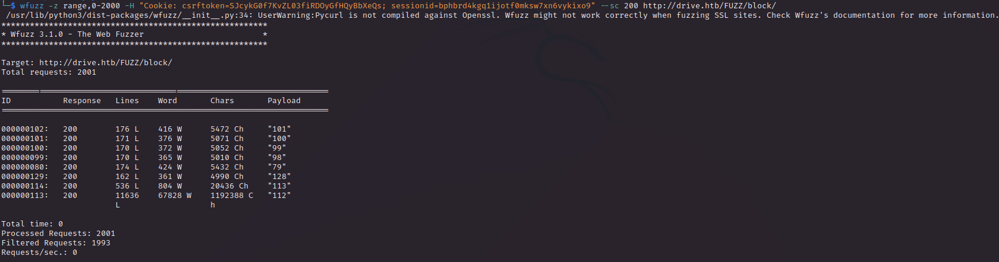

Cool stuff, now in UnReserve section we have some more interesing files

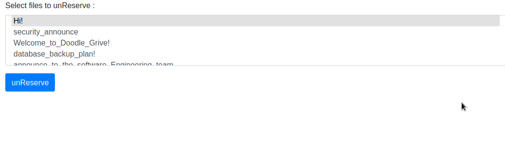

Cool now we can unreserve this cool files but I can't access it at the moment (not present on the show file list). 

But what about groups? I created a groups called **Admin** and when I go to edit the group `/47/editGroup` we have list of users 

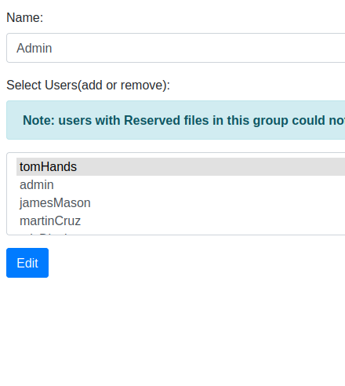

There is nothing more we can do actually. There is something that I missed, **I have not check the URL where wfuz returned 200** (I get angry with myself but fine we can now see the results)

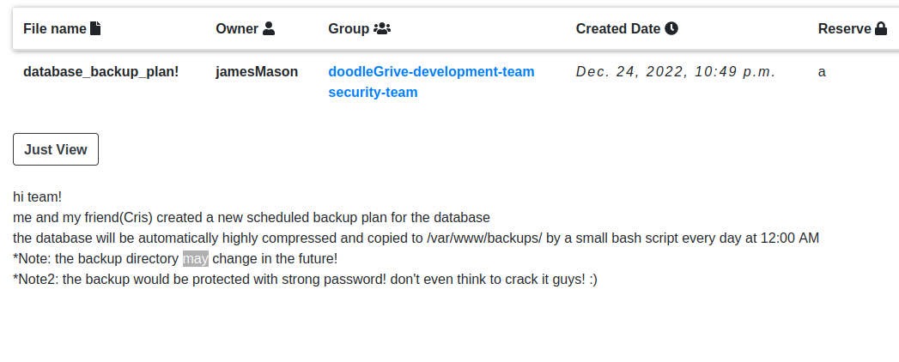

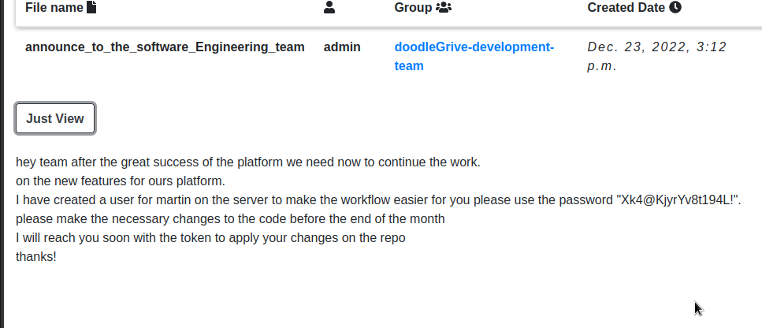

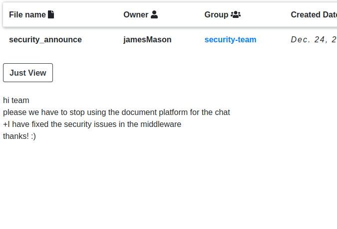

We have a set of credentials and we can try on SSH. 

Finally we are in

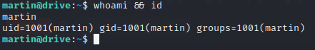

<br><br><br>

# USER FLAG
The machine is running gitea on port 3000, I make a tunnel with SSH and try with the the credentials already available but no access. I decide to check which users are available on gitea and instead of `martin` we should use `martinCruz` (we also have some email addresses)

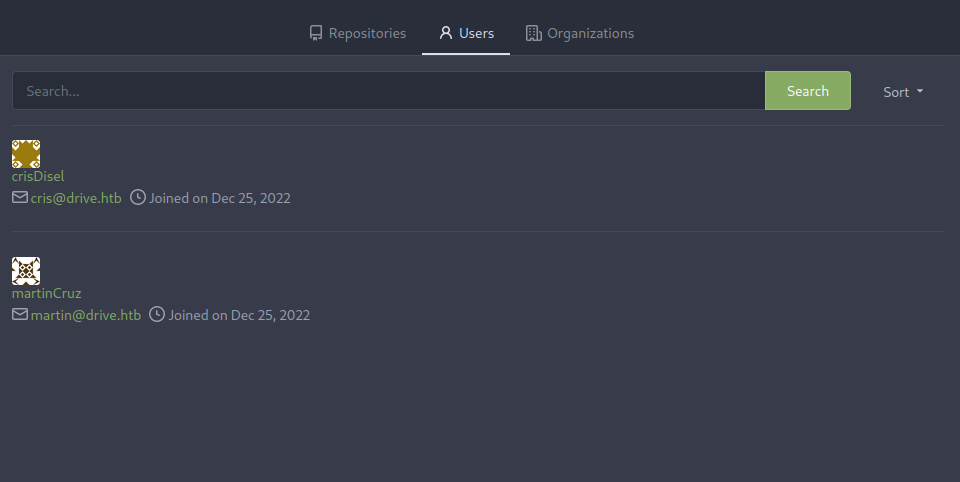

The only repository available is the source code of the webapp

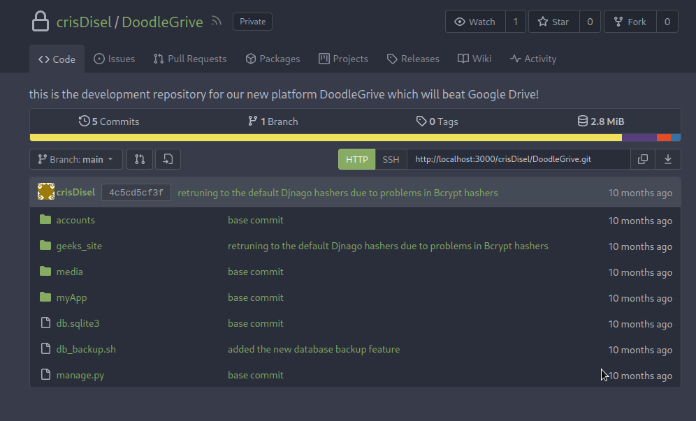

Inside we have the `db_backup.sh` cited in the files retrieved before on the webapp, what's cool here is there is an hardcoded password

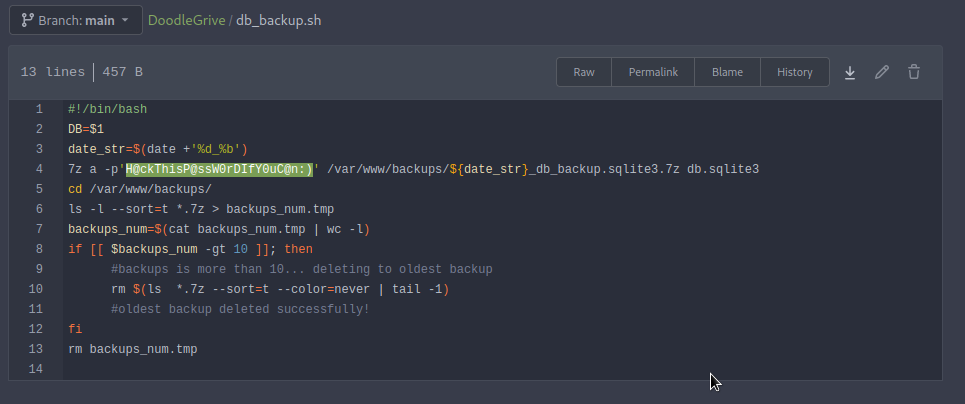

I was able to crack the tom password (extracting the dbbackups) and I was able to SSH as `Tom` user, where is home folder store the user flag

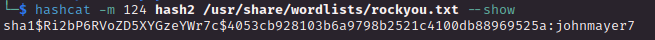

<br><br><br>

# PRIVILEGE ESCALATION
Inside the home folder we have a cool file that can be used

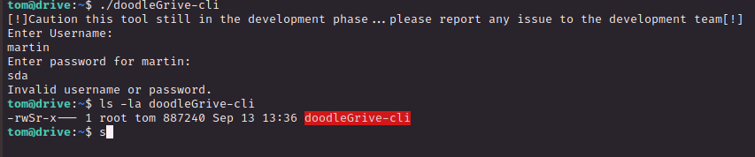

Cool, binary exploitation let's upload it and use **Ghidra**, we have a huge binary right here!

Luckly we have some hardcoded credentials. 

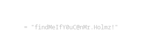


Let's use it to unlock the binary

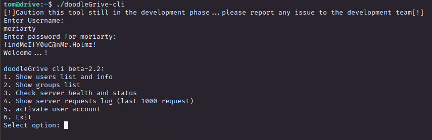

The options number 5 allows to insert a usernam as input, interesting probably is working with database and SQLi is possibile

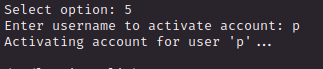

Looking back at Ghidra, the options 5 is calling the `activate_user_account()` function and we can clearly see the SQL statement

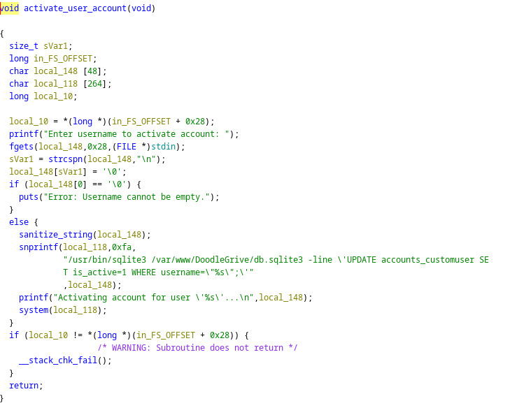

Obviously will not be that simple (we are adealing with an hard machine after all), look closely there is `sanitize_string()` function

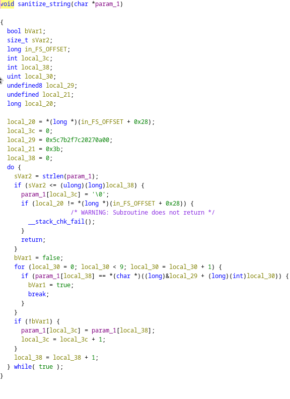

First thing first, the string injected will be struncated at 35 char and every special character removed (`\{/|';`, `[SPACE]` and `[NULL]`)

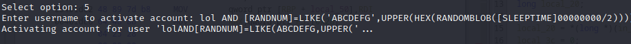

<br><br><br>

Summarize what we need to get user, first to execute some commands I am gonna use the `edit()` function in sqlite3 and we can gain RCE like this `edit("","sh -c whoami")`

We can use tab to get rid of the [SPACE] sanitization

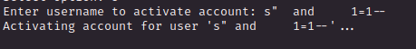

So I have tried something like this but is not working

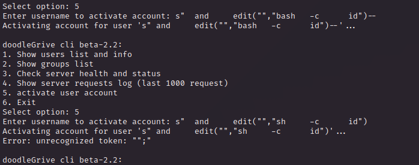

Probablly some issue with PATH, somehow sqlite cannot call without full path whatever command we need.

I copied in `./w` the `nano` tool so we can use the escape to get a shell and use the `char()` SQL statement to bypass the sanitization but still now working

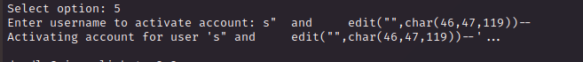

After some trying and error (I also tried with VIM and use the `/tmp` folder with no results at all) I decide to change attack vector and use the `load_extension`

I created a `.so` with the following C code

```{c}
#include <stdlib.h>
#include <unistd.h>

void _init() {
    setuid(0);
    setgid(0);
    system("/usr/bin/chmod +s /bin/bash");
}
```

Than I found this cool method to inject and load our code, using the `+` and close the quotes in this case we don't need comments, this is probably why it wasn't working the comment was destroyng the `;` char. Plus no TAB needed

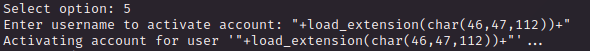

We got what we want, the SUID on the bash binary

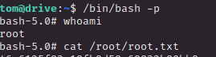

