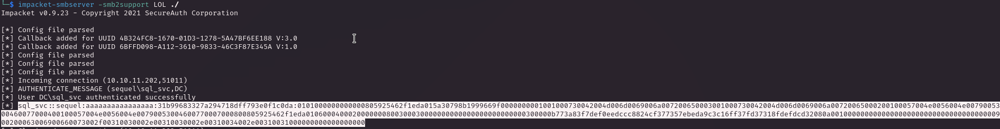
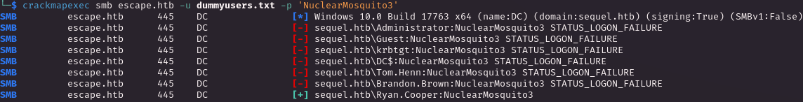
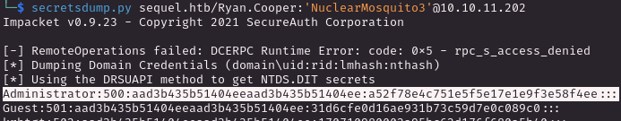

# PORT SCAN
* **53** &#8594; DNS
* **88** &#8594; KERBEROS
* **135** &#8594; MSRPC
* **139 / 445** &#8594; SMB
* **389 / 636** &#8594; LDAP
* **593** &#8594; RPC over TCP
* **1433** &#8594; MSSQL (2019 RTM 10.0.17763)
* **5985** &#8594; WinRM

   

# ENUMERATION & USER FLAG
This is a Domain Controller and looking the scripts output the domain is `sequel.htb`, tried with RID bruteforce but we can't as anonymous user. Talking about anonymous we have no anonymous bind on LDAP so another hole in the water but things changed with **<u>anonymous login on SMB</u>** where we have access on `Public` directory with an interesting file insides

The content sounds fun!

We have some usernames (already checked as write it down and seems not working so maybe we will need to add something on the raw name), we know there is a mock instance on the DC and is not removed, the email `brandon.brown@sequel.htb` (and a potential username) and most important a **<u>public user credentials for MSSQL</u>** used by brand new hired.

So I logged in, with success, and the first thing I did was retrieve a list of users which is something fast and simple for **metasploit**

Saved the users on a file, tried AS-REP roasting but unsuccess here so I moved with manual enumeration and this strange things popout checking for **linked server**

After that there is not much we can do, so I checked if `xp_dirtree` was available and it was, used to capture the hash on my machine and we captured the `sql_svc user hash`

hashcat is our best friend here :)

Cool, now we have a shell through EvilWinRM and obviously no flag, apparently is inside `Ryan.Cooper` directory. With some little enumeration we have a log file at `C:\SQLServer\logs` called **<u>ERRORLOG.BAK</u>** which contain a potential password

Nice I can try some password spraying and fit perfectly with ryan cooper user 

Quick as I can I get the flag log in as our friend Ryan

   

# PRIVILEGE ESCALATION
The thing that caught my eye immediatly was the permission `BUILTIN\Certificate Service DCOM Access` on Ryan user. Certify can help us to understand if there is a vulnerable template, in this case we can enroll a certificate which is owned by `Administrator`

Now this one is vulnerable to **<u>ESC1</u> (name spoofing)** attack path 

1) We has **low priv user** can request a certificate of a higher privilege user
2) **Manager Approval DIsabled** and **no need of Authrizated Signatures**
3) **ENROLEE_SUPPLIES_SUBJECT** set meaning we can freely request the certificate with a specific `AltName` (like Administrator!)

What all of this means togheter is that requiring this certificate we can do it as `Administrator`, game over bitch!

First thing first is requesting the template as Administrator

Than I saved the certificate (RSA + CERTIFICATE) locally and converted as `pfx`

Now the most common exploit is to use the certificate to authenticate with certipy but something went wrong...

Now this error can occur for different reasons (I am pretty sure the format is fine so I will remove that from the possible cause) but what is important here is that, somehow, the KDC `doesn't support the Protected Authentication Data`.

We have an obstacle but I found out a way to bypass that, what we have is a **<u>valid Administrator certificate</u>** and we can't use it to authenticate but maybe we can leverage our permissions (on Ryan Cooper) in order to perform **DCSYNC**, this is called `Pass-The-Cert` [1](https://github.com/AlmondOffSec/PassTheCert/tree/main/Python) aka my favorite certificate abuse.

We need to "unpack" the certificate in order to retrieve 2 files with the key and certificate separated by each other 

Now we use `passthecert.py` in order to modify the user and elevate his privilege grabtubg **DCSYNC right**

Now is simple, `secretsdump.py` and we have our rewards

We won! Pass-The-Cert is cool!

