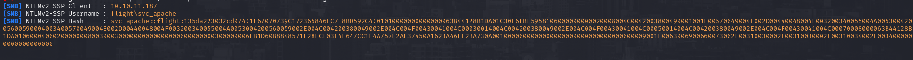

# PORT SCAN
* **53** &#8594; DNS
* **80** &#8594; HTTP (APACHE 2.4.52)
* **88** &#8594; KERBEROS
* **135** &#8594; MS-RPC
* **139 / 445** &#8594; SMB
* **389 / 636** &#8594; LDAP
* **5985** &#8594; WINRM

   

# ENUMERATION & USER FLAG
Active Directory here...let's rock!

This is the main page, nothing interesting and nothing interractive...I don't like this page ;(. With `ffuf` I discover the **<u>school.flight.htb</u>** here we have more thing to play with!

The index.php work with this link (eg:/ for the **home.html**) : `http://school.flight.htb/index.php?view=home.html`. Well what does this means? LFI!

I tried to inject on the `?view=` variable with `../../../../../../../../../win/win.ini`. Well it ""worked""...

Ok cool! My idea is to first trying to bypass this error and then try to perform RFI where I will grab the NTLM hash through Responder. This was easier than expect usually to connect into a remote SMB folder we will use `\\[IP]\[FOLDER]` but obviously gets rejected. If we change the `\` with `/` we will have the same results but without being blocked!

Hashcat time! After some minutes I get the plaintext **S@Ss!K@\*t13** for the user `SVC_APACHE`. Luckly we have access into SMB with this account and we hav an interesting table called **<u>Users</u>**

The only interesting thing that I found is the User with the flag is potentially `C.Bum` but we can't do anything with just hte user. With `rpcclient` and the **<u>SVC_APACHE</u> credentials** I was able to get a full list of the user inside the domain.

Now I can save this users into a file for future use, `S.Moon` have the same password we have retrieved before!

This is cool, this user have the same permissions than the one before but he can write into `Shared` folder. My idea now is to upload something (that hopefully would be openened by someone) to steal the NTLM hash. I was pretty confused but than I decide to use the **<u>badpdf</u>** metasploit module (learnt from the Zephyr ProLab) but I cannot upload **.pdf** files. Well no dramma just chenge the extension to something basic like **.ini** and after uploading it in the **Shared** folder someone opened it and we have the NTLM hash back to responder!

Meow meow...you already know the tool eheheh. `Tikkycoll_431012284` is the plaintext of **C.Bum**. We cannot spawn a interactive shell yet (not even WinRM) but we can grab the flag directly with SMB (The **Users** folder is linked with **C:\Users** path).

Time to get Administrator now!

   

# PRIVILEGE ESCALATION
My bad I know I know...We can write inside the <u>`Web` **folder in SMB**</u>, well nothing better could be asked! I can write a PHP reverse shell and finally get a stable shell!

The first thing I did was to spawn a meterpeter shell with the `web_delivery` metasploit module. Than just boring things with **RunasCS** to get the meterpeter shell as <u>**C.Bum**</u>. No way to make ingestors work for bloodhound, unlucky! ;(

Well some manual enumeration and time would fix this. While I was watching the open ports I have noted something interesting, port `8000` is open! We have a similar webpage to the one we visited at the start.

Let's try the same trick writing inside the web directory to grab another reverse shell but with this internal service. `C.Bum` is part of the **<u>WebDevs</u>** so probably would not be a problem. This internal service rely on `C:\inetpub\development\` path, let's upload the reverse shell and get it on our machine (PHP doesn't work so we need to use [ASPX](https://github.com/borjmz/aspx-reverse-shell/blob/master/shell.aspx))

Game over! Why?
Well this service account (actually **<u>Windows Virtual Account</u>**) and this specific account when need to authenticate to remote service (eg:/ remote SMB) use the service machine directly (you can check it trying to access a remote SMB with responder). This mean that this service is allowed to delegate as the machine account and we can grab the ticket using [Rubeus](https://github.com/GhostPack/Rubeus). I use the simple command and specifying the Domain Controller FQDN

`.\Rubeus.exe tgtdeleg /nowrap /domain:G0.flight.htb`

Now we can use `klist` to check the ticket is now cached inside the powershell session

Nice, we can now upload the ticket on our machine and use `kirbi2cache` translating the ticket in a format readable by impacket scripts. Than we just need to set up the time deamon correctly in order to avoid the clock skew and then we arefree to get Administrator hash!

Time to get the flag!

