# PORT SCAN
* **22** [ssh]
* **80** [http] &#8594; app.microblog.htb

<br><br>

# ENUMARATION

The default redirect on port 80 is `app.microblog.htb`

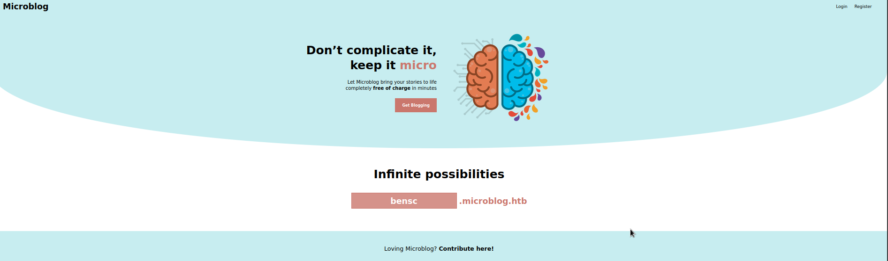


What I've found clicking the link and some <u>directory busting</u> is :

1) `/login` 

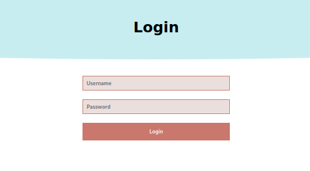

2) `/register`

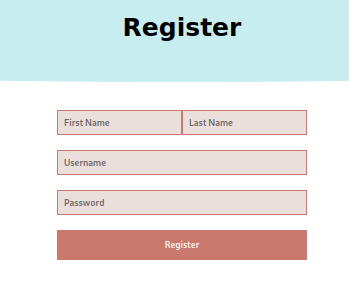

3) `/dashboard`
Redirect at /login for now, probably we need to be authenticated to access this page


Make sense here to run an instance of som subdomain enumaration and here the results

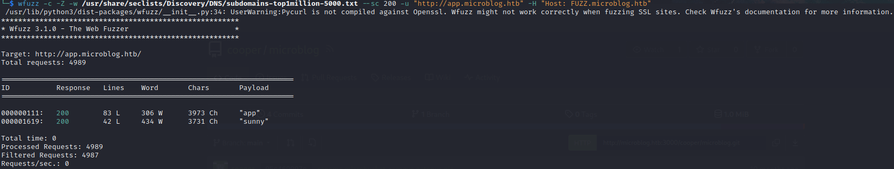

`/sunny`

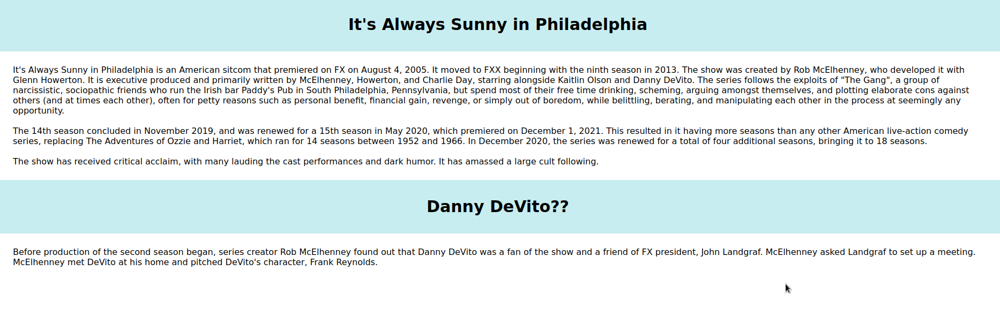

also we have `microblog.htb` available clicking on **<u>Contribute here!</u>** on the homepage running an instance of **Gitea** (light selfhosted git service) with a potential user called **cooper**

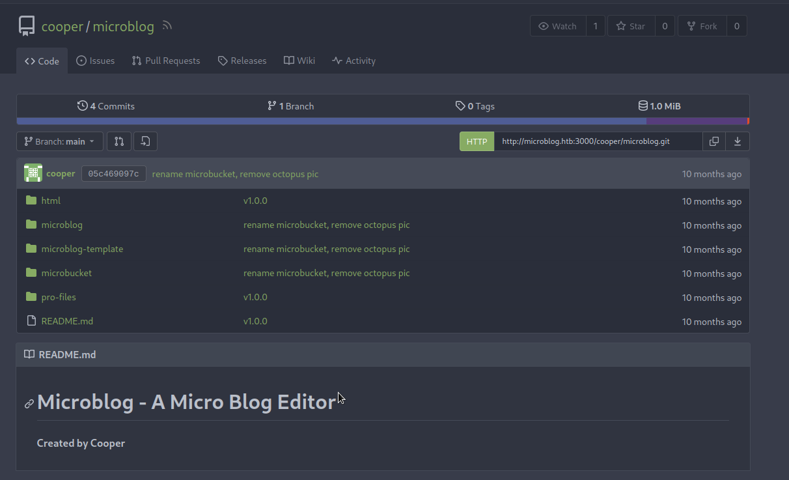

<br><br>

I registered a brand new account and we are redirect at `/dashboard`

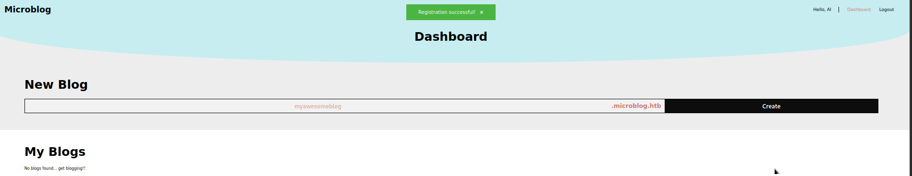

we can create a subdomain with a name by our choice, this would be our blog 

After created it we can visit it or edit it (just add text or header) but we can't upload file at all or something similar but something get my attention


<br>

So if we wanna upload images we need to get a Pro Account but we don't wanna pay 5$ a month don't ya?

Looking at the source code provided by Gitea I've discovered  the use of **Redis Database** (REmote DIctionary Server, NoSql) as backend 

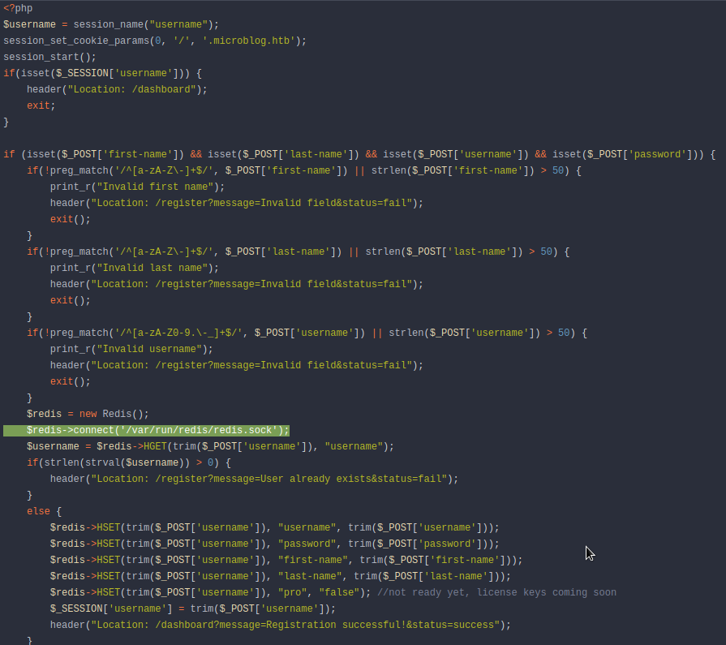

The port is obviously closed so we can approach directly with redis but we can take a look how the login process interract with redis 

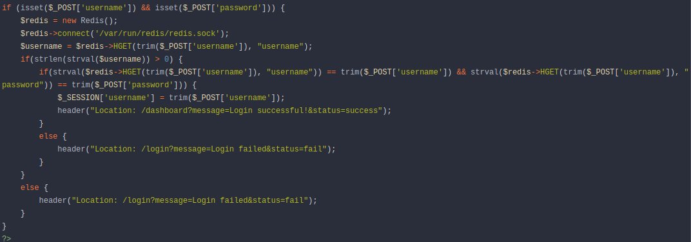

`HGET` is a function which **returns the value at a given field** so is pretty clear now how is used in the login process. Is also used to check if a user is (or not) pro

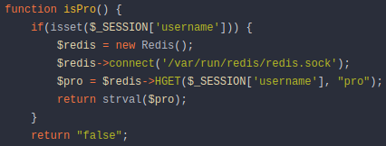

`HSET` opposite set at given field the value provided and is used in the registration php code

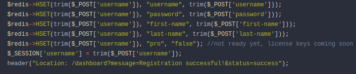

<br><br>

The first idea I get in mind was to find a way to set manually (in registration phase) the **pro field to true** with a NoSQL injection but we are not using directly the query (text format for redis actually) and the error ar e costum and not native of redis so we can't achieve such objective in this way

I have played with the all possible field of every POST request I can achieve as normal user (the HTB forum users suggest to work on nginx and redis) and I found a **<u>LFI</u>** vulnerability on the `id` parameter when we edit the blog we previously created

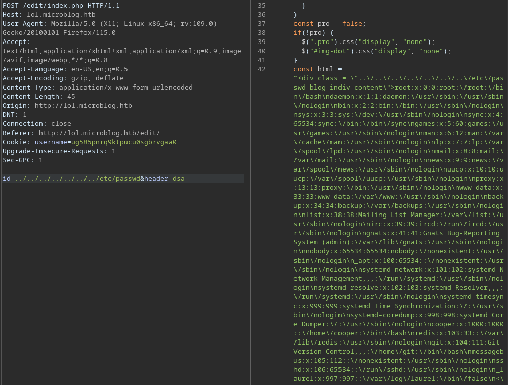

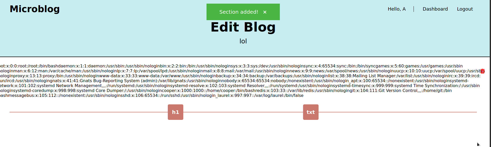

I don't think is really usefull for our objective but we enumarate some users and services running on the machine

<br>

To become pro we can use this bash command, to make a redis query and setting ourselves as pro

```
curl -X HSET "http://microblog.htb/static/unix:%2Fvar%2Frun%2Fredis%2Fredis.sock:[USERNAME]%20pro%20true%20/b"
```

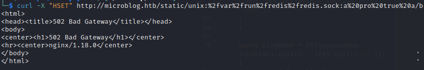


Cool now we can investigate and check what is new as Pro user!

<br><br>

# FOOTHOLD & USER FLAG

Cool, the first difference we have here is that we can edit the blog adding image 

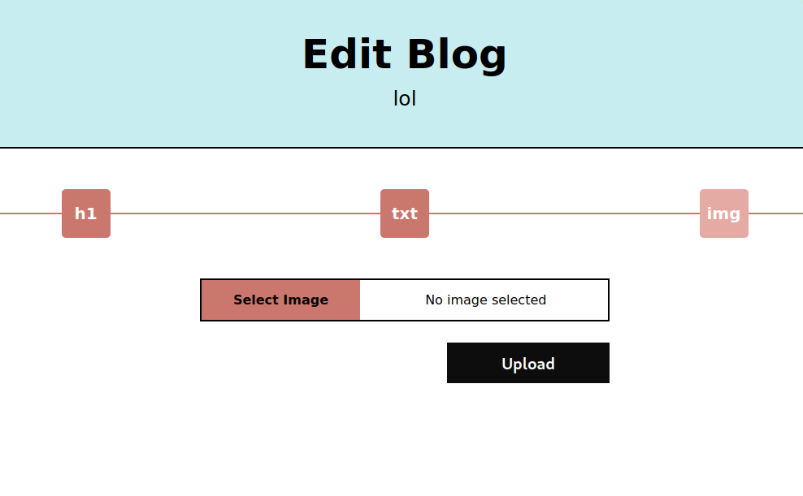

But something more is happening behind the curtains

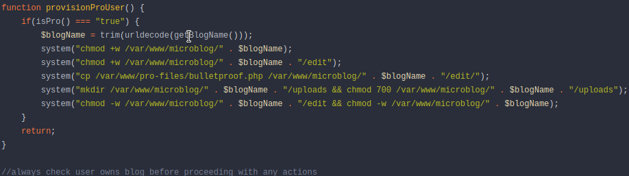

The webapp add the `/uploads` at the created blog this is fine because w can access all the uploads directly (don't mind at the img was the first I had available and I'm a ex-otaku lol)

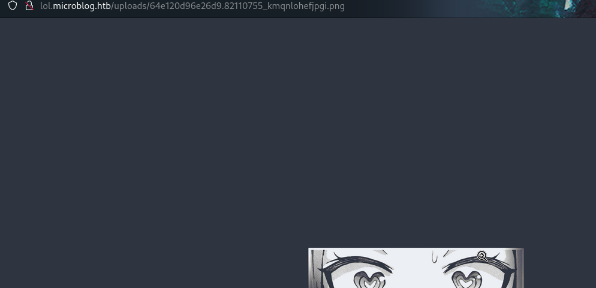

In the **Gitea** instance we can checkl the contents of `pro-files/bulletproof.php`. This is the file which controll some constraints and set a temporary name at the image we have uploaded

The vulnerability here is a recall of the **<u>LFI</u>** we have found before, wecan change the **ID** to the path of the upload file (so we can circumnavigate the random name and choose the one we decided) and the header will be the php code of the reverse shell 

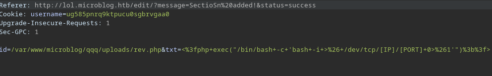

Now just visit the path provided to trigger the reverse shell

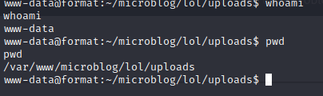

Now we can access to **redis database** directly and if we are lucky enough we can get the cooper password which is `zooperdoopercooper`, Now we can access with SSH and retrieve the user flag!

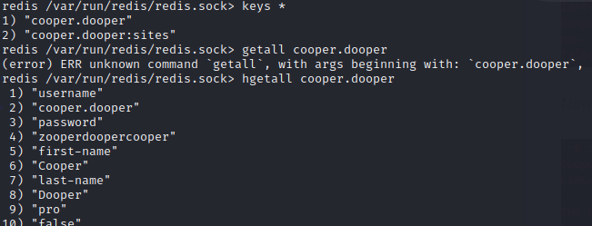

<br><br>

# PRIVILEGE ESCALATION
For now nothing I have done is related to the name of the box "**FORMAT**" so I expect to see something correlated in privilege escalation

First of all I found a new port open with the number **9000** which is just the Gitea instance running with the user cooper so we can see the branches and the chnges that unlucky are not usefull at all. I've checked with tunneling using chisel

Maybe is the dumbest thing I have ever done but with a quick research online with the keywords `format vulnerability pentest` I found a possible candidate **<u>[String Format Vulnerabiliy](https://owasp.org/www-community/attacks/Format_string_attack)</u>**

I'm gonna try to explain it in a few words so I can understand-by-explain 

Here an example of safe line 

```{c}
printf("%s", argv[1]);
```

This line is safe because we handle the first argument inside a **<u>Format String</u>** (the `%s` which indicate the type of format to give at the value provided)

A wrong and vulnerable line will be

```{c}
printf(argv[1]);
```

Why? Because we can "inject" some format string and for example get the contents of the stack with the format chracter `%p`

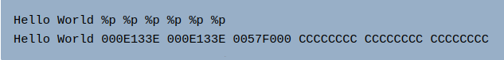

Now let's see what we can do and if I'm wrong and we can't use this vulnerability...well I have learned something new so is a win-win situation for me!

<br><br><br>

With `sudo -l` I discover we can run a command as root user

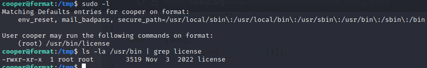

This python script is the feature, which is not available but we have bypassed successfully, to provide the license at a user for the pro account upgrade. We have 3 flag **provisioning**, **deprovisioning** (which is not available) and **check**

<br>

For both **provisioning** and **deprovisioning** we need to give a valid username like `cooper.dooper` (this user have already a license code)

FOr the **check** options we need to give as parameter the (encrypted) code in order to be checked and return a feedback (valid/invalid)

Obviously for check the username use the redis database again and here I think about something....

First of all, since the user cooper already have a license code is pretty a hint we should create another user to interract with it

Second we need to know what to discover and looking at the code this is probably the way

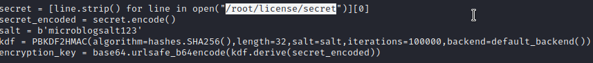

Obviously is encrypted BUT would be returned in plaintext when we provide a license to someone

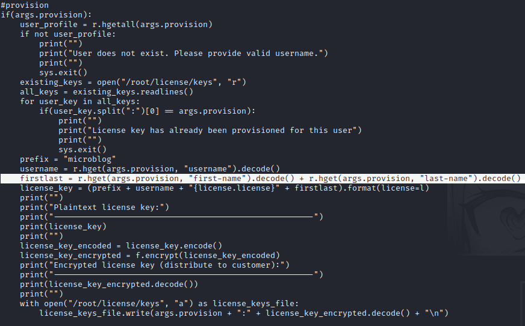

Look at the highlighted code, this is JUICY and COOL!
The `first name` and `last name` value of the records retrieved through the key value (username) inside redis are decoded....

This is clear, `FORMAT+DECODE` what if we name firstname (or last name) something which can be decoded by the `decode()`  

And why not the secret itself? Sounds resonable we need to set as first name this variable here 

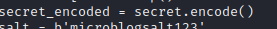

Something like this will be good

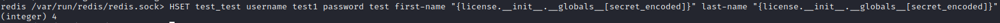

The string `"{license.__init__.__globals__[secret_encoded]}"` will be the FORMAT which python will understand as the `secret_encode` variable, which will be decoded and if everything goes smooth printed as plain-text (I've setted both for first and last name in order to be sure).

Just run the script with the provisioning flag with the malicious user created, the magic will happen

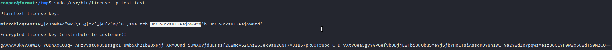

Now the highlighted text is the secret we have gain back, I tried to use it as password for root in ssh. Cool we pawned this machine


Pretty hard and a lot on effort on it but the essence have been assimilited really cool box!

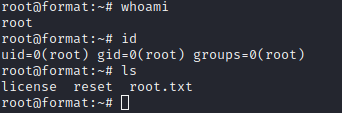

